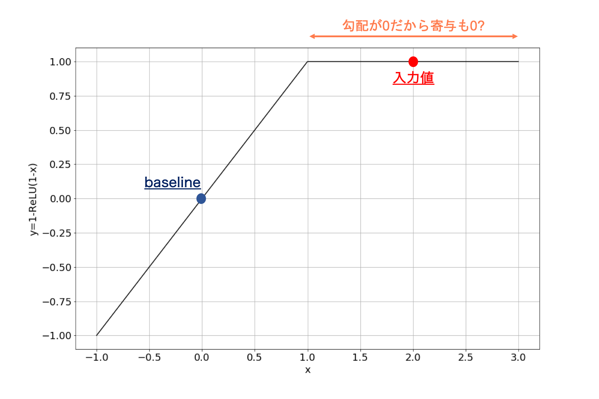
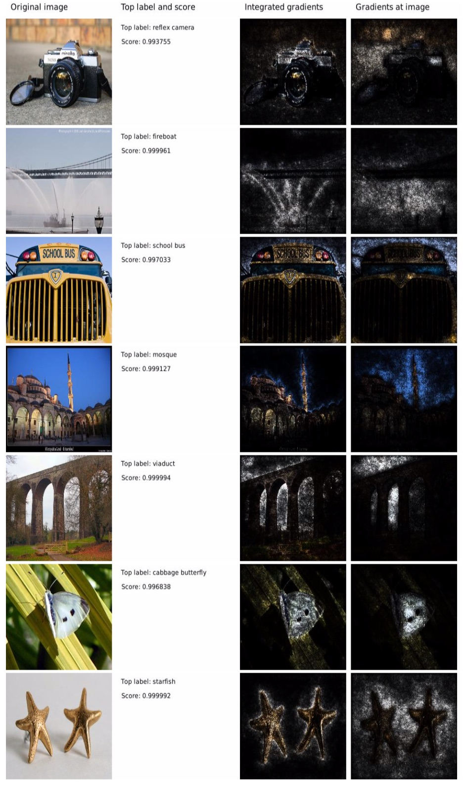

本記事はQrunchからの転載です。
___

機械学習のモデルの出力に対する入力された特徴量の寄与を求める手法の1つに、Integrated Gradientsというものがあります。
Integrated Gradientsはディープラーニング向けの手法ですが、他のディープラーニング向けの手法では満たしていない公理（性質）をいくつも満たしているという点で優れています。
今回はそんなIntegrated Gradientsを解説します。

参考論文：[Axiomatic Attribution for Deep Networks](https://arxiv.org/abs/1703.01365)

# 先にbaselineのお話
本題に入る前に、大事な考え方であるbaselineを説明しておきます。

人間が何か起こったことに対して原因を考えるとき、何かの基準となる事がその人の中にはあり、それに比べ、「ここが良くない」とか「ここが良かったから結果としてこういう結果になったんだな」、と考えるんじゃないでしょうか。
Integrated Gradientsの場合もその考え方を用います。
先程の例の基準がbaselineと呼ばれ、画像のタスクでは例えば真っ黒の画像が使われたり、自然言語のタスクではすべてを0にしたembeddingが使われたりします（これは手法によって異なります）。つまり、真っ黒の何も写っていない画像に比べて猫の写った画像はこういう風に異なるから、これは猫の画像と判断したんだな、というように考えていくことになります。

# 2つの公理
特徴量の寄与を求める既存手法の中でも勾配を用いた手法というのは多いです。しかしながら、論文中では勾配を用いた既存手法には問題があると指摘しています。
例えばGuided back-propagationは次のSensitivity(a)を満たしていませんし、DeepLiftはImplementation Invarianceを満たしていません。

## Sensitivity(a)
Sensitivity(a)の定義は以下のとおりです（ちなみにaと書いてあるのはbもあるということです。詳しく知りたい方は論文を参照ください）。
> Sensitivity(a): 入力値に対する出力がbaselineの出力と異なったとき、baselineと異なる値をもつ入力の特徴量の寄与は非ゼロである。

次のような例を考えると、勾配を用いる手法におけるSensitivity(a)の必要性がわかります。
$f(x) = 1 - {\rm Relu}(1-x)$というネットワークを考えます。baselineが$x=0$、入力値が$x=2$とします。$f(0)=0$、$f(2)=1$となりますのでbaselineとは出力値が変わっています。しかしながら、$x=2$では勾配が$0$になりますので、例えば「勾配×入力値」で寄与を求める場合、寄与も$0$になります。
baselineに比べて出力値が変わったのに、寄与が$0$というのはおかしい結果だというのは納得いく話かなと思います。
このため、Sensitivity(a)は寄与を求める手法として満たすべきものだと著者は主張しています。

## Implementation Invariance
Implementation Invarianceの定義は以下のとおりです。
> Implementation Invariance: 実装方法が異なっていても、同じ入力に対しては求まる寄与値は等しい。

具体例を次に示します。

<u>Implementation Invarianceの例</u>
例えば勾配${\partial f}/{\partial x}$を計算する手法の場合、この計算は隠れ層の出力$h$を使って、 $$\frac{\partial f}{\partial x} = \frac{\partial f}{\partial h}\frac{\partial h}{\partial x}$$
とあらわせます。
勾配を求める際に${\partial f}/{\partial x}$を直接計算しても、連鎖律を使って右辺の計算を用いても結果は一緒になります。
このケースはImplementation Invarianceを満たします。

<u>Implementation Invarianceではない例</u>
DeepLiftの場合は離散化した勾配を用いて寄与を計算します。
連続値を扱っている限りは連鎖律が成り立ちますが、離散化すると連鎖律が成り立たなくなります。
つまり、
$$ \frac{f(x_1) - f(x_0)}{x_1 - x_0} \neq \frac{f(x_1) - f(x_0)}{h(x_1) - h(x_0)} \frac{h(x_1) - h(x_0)}{x_1 -x_0}$$
となります。
このように計算方法（実装方法）によって結果が変わる場合はImplementation Invarianceを満たしません。

###  Implementation Invarianceを満たさないことの問題点
Implementation Invarianceを満たさないことの問題点って何なんでしょうか。論文中で指摘されているのは次のようなケースです。
あるモデルのパラメータ数が多いなどが理由で、自由度が非常に高いモデルがあるとします。このモデルを学習した結果として、同じ入力に対して出力が同じになるが、パラメータの値が異なる組み合わせであるような学習済みモデル1とモデル2の2つが得られたとします。
このような状況で2つのモデルに対する離散化された勾配は、モデル1の隠れ層を$h_1$、モデル2の隠れ層を$h_2$としたとき、
$$ \frac{f(x_1) - f(x_0)}{h_1(x_1) - h_1(x_0)} \frac{h_1(x_1) - h_1(x_0)}{x_1 -x_0} \neq \frac{f(x_1) - f(x_0)}{h_2(x_1) - h_2(x_0)} \frac{h_2(x_1) - h_2(x_0)}{x_1 -x_0}$$
となりえます。なぜかといえば、Implementation Invarianceではないので、どちらも$ {f(x_1) - f(x_0)}/{x_1 - x_0}$とは異なる何らかの値になるためです。
入力と出力が同じであるのに、モデルによって寄与が異なるというのは確かに違和感がありますね。たしかにImplementation Invarianceも満たすべきであるといえそうです。

# Integrated  Gradients
Integrated Gradientsは前述した2つの公理を満たす手法になります。
## アルゴリズム
手法は単純で、また実装も簡単です。
Integrated Gradientsではbaseline $x'$から入力$x$までの勾配を積分し、入力とbaselineとの差と積を取るだけです。式であらわすと以下のようになります。
$$ {\rm Integrated\ Gradients} = (x - x') \int_{0}^{1} \nabla F(x' + \alpha(x - x')){\rm d} \alpha .$$

上記のように勾配の積分を寄与とすることで、baselineから入力$x$までの勾配をすべて考慮することができ、その結果としてSensitivity(a)を満たすことになります。またIntegrated Gradientsは勾配と積分から成りますので、Implementation Invarianceも満たされます。

コンピュータ上では上記の積分をそのまま実行することはできませんので、実際には数値積分をして、近似値を求めることになります。数値積分を厳密にやろうとするほど、計算量が多く掛かることに注意してください。

# Integrated Gradientsの適用結果
## 画像の分類問題の例
GoogleNetを使って画像の分類問題を学習させ、それにIntegrated Gradientsを適用した結果が以下のとおりです。

一番左が入力画像で、その隣にラベルとスコアが書いてあり、3列目がIntegrated Gradients×入力画像、4列目が勾配×入力画像です。
これを見ると、単に勾配を用いる場合に比べて、物体を認識するのに必要そうな箇所が寄与していると判定されていることがわかります。例えば、2行目のfireboatは勾配の場合よりも、Integrated Gradientsのほうがより水しぶきの細かい部分に着目していると判定できています。

## テキストの分類問題の例
次にテキストの分類問題の例です。
質問の答えがどういった種類の回答かを予測する問題です。例えば答えが数値なのか、日付なのかなどを予測します。

下が予測モデルにIntegrated Gradientsを適用した結果です。

赤いほど予測への寄与が大きい単語となっています。
結果を見てみると、疑問詞やyearなどに着目していることがわかります。それらしい結果になっていますね。

# おわりに
Integrated GradientsではDeepLiftのココがダメと言及している一方で、DeepLiftはIntegrated Gradientsの性能が低いと指摘しています。使う側は難しいですね。
