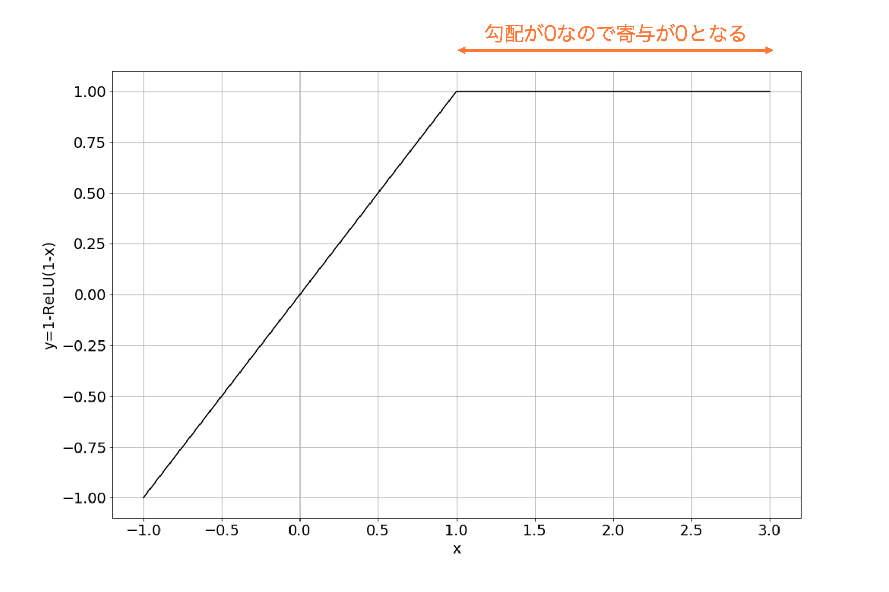
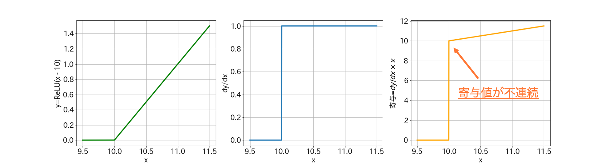
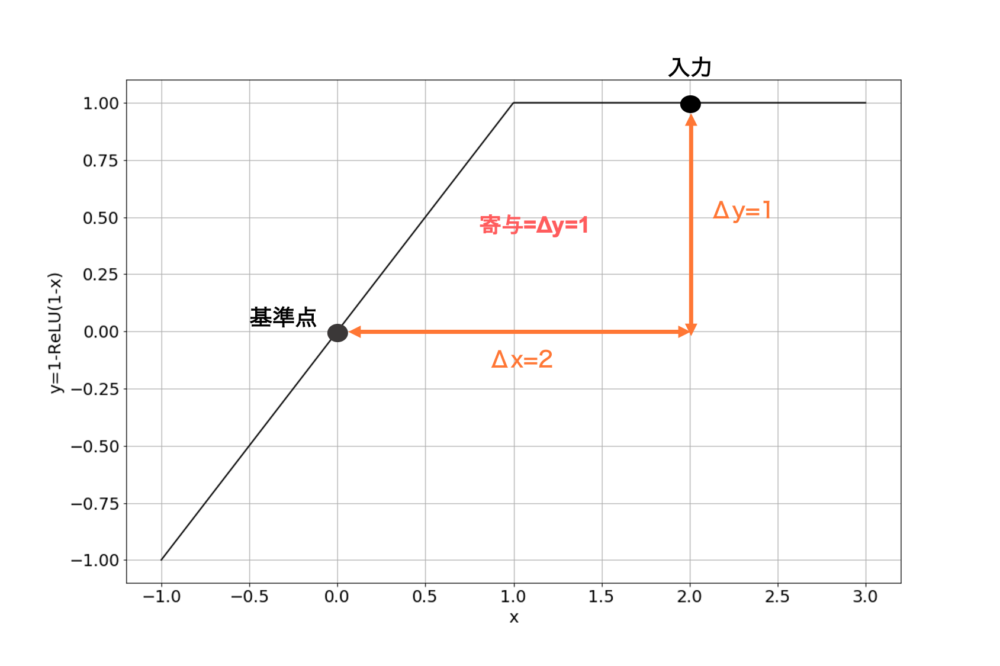
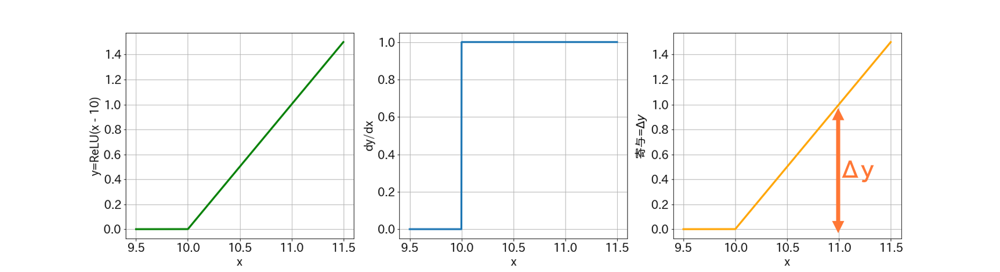
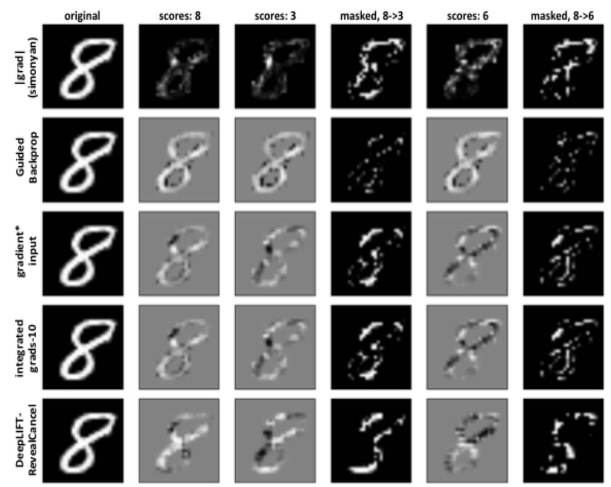

本記事はQrunchからの転載です。
___

ディープラーニングのモデルに対する特徴量の寄与を求める方法の1つである、DeepLiftについて今回は説明します。

参考文献：[Learning Important Features Through Propagating Activation Differences](https://arxiv.org/pdf/1704.02685.pdf)

# 従来法の問題点
DeepLiftを提案している論文では、以下の2つが従来手法の問題点として挙げられています。
## saturation problem
saturation problemは勾配が0であるような区間では寄与が0になってしまう問題です。
従来手法には勾配を利用する手法が多いですが、そのような手法ではsaturation problemが発生してしまいます。
以下の図をご覧ください。

図中の関数は$y = 1 - {\rm ReLU(1 - x)}$で、この関数を1つのネットワークとして考えてみます。
この関数では$x < 1$では勾配が$1$となり、$x>1$では勾配が$0$になります。
入力が$x=0$の場合に比べれば、$x=2$の場合は出力値が1だけ大きくなるため、寄与は$x=0$の場合よりも大きくなって欲しいです。しかしながら、寄与=勾配$\times$入力とする寄与の計算方法の場合、
$x = 0 $では残念ながら寄与が等しく0になってしまいます。
このようにReLUによって勾配が0になってしまうことは、Integrated Gradientsの提案論文のなかでも同様に問題として挙げられています。

## discontinuous gradients
2つ目に挙げられている問題がdiscontinuous gradientsです。これも下図をご覧ください。

左から、ネットワークをあらわしている関数$y={\rm ReLU(x - 10)}$、その勾配、寄与=勾配$\times $入力です。 
このような関数に対しては計算される寄与値が$x=10$で不連続となり、$x=10$までは寄与が全く無いのに、$x=10$を超えると突然寄与の値が$10$を超えるようになります。
入力値のちょっとした差で寄与が大きく変わるのは良くないですね。
# DeepLift
前述した2つの問題を解決するDeepLiftのアイディアと適用結果について述べていきます。DeepLift以外にも、[Integrated Gradients](https://qrunch.net/@opqrstuvcut/entries/FKxqQpXc0lhh3LMn)がこれら2つの問題を解決していますが、求まった寄与が直感的ではない場合があります。このことは適用結果で示します。

なお、DeepLiftで利用されているアイディアの1つとして、RevealCancel Ruleというものがありますが、書くのが大変になりそうなので省略します。
## DeepLiftのアイディア
DeepLiftはIntegrated GradientsやSHAPと同様に、基準となる点を決めておき、そこから入力$x$がどれだけ異なるか、また基準点と$x$のネットワークの出力がどれだけ異なるかをもとにして寄与値を計算していきます。
この基準となる点を$x_1^0, \cdots, x_n^0$としておきます。

ディープラーニングで使われる計算は線形変換と非線形変換の2つに分けられ、DeepLiftではこれによって次のように寄与の計算方法が変わってきます。
### Linear Rule
まず線形変換の方からです。線形変換には全結合層、畳み込み層が該当します。

入力（あるいはある隠れ層の出力）$x_1,\cdots, x_n$から次の層のあるニューロン$y$が、重み$w_i$とバイバス$b$を用いて次のようにあらわされるとします。
$$y =  \sum_{i=1}^N w_i x_i + b$$
基準点$x_1^0, \cdots, x_n^0$でも同様に
$$y^0 =  \sum_{i=1}^N w_i x_i^0 + b$$
となります。

このとき、基準点$x_1^0, \cdots, x_n^0$に対して、$x_1,\cdots, x_n$における$y$の変化量は
$$ \Delta y =\sum_{i=1}^N w_i  \Delta x_i $$
となります。ここで$\Delta y = y - y^0, \Delta x_i = x_i - x_i^0$です。

DeepLiftではこの変化量に着目し、各入力$x_i$に対する$y$への寄与度$C_{\Delta x_i \Delta y} $を計算していきます。具体的には次のようになります。
$$ C_{\Delta x_i \Delta y} = w_i \Delta x_i .$$

つまり、入力$x_i$が基準点に比べてどれだけ$y$の変化に影響を及ぼしたかによって寄与が決まります。

### Rescale Rule
次に活性化関数で用いられる非線形変換を扱っていきます。
非線形変換のときも線形変換の場合と同様にして考え、基準点に対するニューロンの出力からどれだけ変化を及ぼしたかによって、寄与を決定します。
ただしReLUやtanhなどは1変数$x$を入力としますから、線形変換の場合とは異なり、
$$C_{\Delta x \Delta y} = \Delta y $$です。

## saturation problemとdiscontinuous gradientsの解決
Linear RuleとRescale Ruleの2つを定義しましたが、このルールに則って寄与を計算することで、前述した2つの問題を解決することができます（どちらもRescale Rule絡みになりますが）。

<u>saturation problem</u>
以下の図のように、DeepLiftでは勾配が0になる状況でも寄与は0になりません。

<u>discontinuous gradients</u>
以下の3列目がDeepLiftでの寄与をあらわしたグラフです。DeepLiftでは寄与が不連続になりません。

非常に単純なアイディアですが、問題にあがっていた2つを解決することができました。
## 連鎖律
ここまでで扱ってきた内容は、入力を線形変換したときの寄与、あるいは入力を非線形変換したときの寄与の計算になります。
それでは、入力に線形変換と非線形変換を順番に適用するときには、入力の最終的な出力に対する寄与はどのようにして求めると良いでしょうか。またディープラーニングのように層が複数あるようなケースではどうやって計算すれば良いでしょうか。
DeepLiftでは次のmultiplierとそれに対する連鎖律を導入することで、この計算を可能にしています。

まず、multiplier $m_{\Delta x \Delta y}$の定義は以下のようになります。
$$ m_{\Delta x \Delta y} = \frac {C_{\Delta x \Delta y}}{\Delta x}.$$ 
これは$\partial y/ \partial x$と似たような形式になっています。特にRescale ruleのときには$C_{\Delta x \Delta y}=\Delta y$ですから、意味合いは近いものがあります。

次に連鎖律の定義です。
ネットワークへの入力を$x_1,\cdots,x_n$、隠れ層のニューロンを$y_1,\cdots, y_\ell$、出力層のある1つのニューロンを$z$とします。このとき、multiplierに対して次のように連鎖律を定義します。
$$ m_{\Delta x_i \Delta z} = \sum_{j=1}^\ell m_{\Delta x_i \Delta y_j} m_{\Delta y_j \Delta z}.$$

これは丁度ディープラーニングでの計算で使われる連鎖律と同じものです。つまり、
$$ \frac{\partial z}{\partial x_i} = \sum_{j=1}^\ell \frac{\partial z}{\partial y_j}  \frac{\partial y_j}{\partial x_i} $$
と同じ形式です。
ただし、multiplierの連鎖律は導かれるものではなく、定義であることに注意が必要です。

multiplierの連鎖律を使うことで、backpropagationのようにして任意の層に対する任意の層へのmultiplierが求まります。こうして求まったmultiplierに対して基準点からの差をかけ合わせれば寄与が求まります。さきほどの連鎖律の話に出てきた変数の定義をそのまま使うと、
$$ C_{\Delta x_i \Delta z} = m_{\Delta x_i \Delta z}   \Delta x_i $$
が$x_i$が$z$への寄与になります。
## DeepLiftの適用結果
MNISTに適用した結果を示します。

1つの行が1つの手法をあらわしています（DeepLiftはRevealCancelとありますが、これは今回説明を省いたアイディアです）。1列目がオリジナルの画像で、2列目がCNNによって計算された「8」である確率への寄与でをあらわします。明るい部分が正の寄与で、暗いところが負の寄与になります。ちなみに基準点となる入力は全ピクセル値を0とした真っ黒な画像です。3列目は「3」である確率への寄与です。また4列目はオリジナルの画像から「3」である確率への寄与が高いピクセルを抜き出しているものです。
上2つの手法はピクセル間での寄与の差があまり明確ではありません。また4列目をみてみると、勾配と入力の積を寄与とした方法やIntegrated Gradientsよりも、「3」と判定するために必要なピクセルへはっきりと高い寄与を割り当てることができています。

# DeepLiftとIntegrated Gradients
DeepLiftとIntegrated Gradientsは論文の中でお互いの問題点を指摘しあっています。

>DeepLiftの提案論文の主張：
Integrated Gradientsは直感的でない寄与の割当がおこる。

>Integrated Gradientsの提案論文の主張：
DeepLiftはmultiplierの連鎖律の部分が数学的に問題がある。

SHAPでも上記2つの手法を利用した計算が可能です。どちらが良いのかは悩ましいですが、結果が直感的になりやすいのはDeepLift、数学的に理論がしっかりしているのがIntegrated Gradientsという感じでしょうか（あとは実装しやすいのはIntegrated Gradientsとか計算量が少ないのはDeepLiftなどの観点もありますね）。

