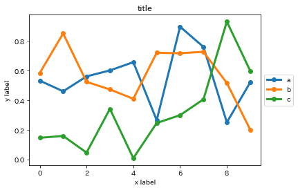
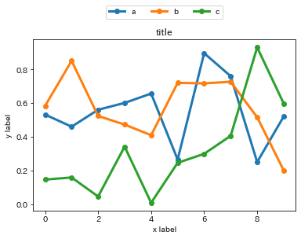
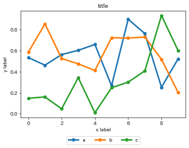

本記事はQrunchからの転載です。
___

Matplotlibの凡例を外側に出したい人用に色々な例を書いておきます。

次のような凡例の位置をいじらずに表示した状態からいじっていきます。

```python
data = np.random.rand(10, 3)
labels = ["a", "b", "c"]

plt.plot(range(10), data, marker="o", linewidth=3)
plt.legend(labels)
plt.title("title")
plt.ylabel("y label")
plt.xlabel("x label")
plt.show()
```


### 右上に表示
凡例の枠の上部をグラフの枠の上部にあわせて、右上に表示するときは以下のようにします。
```python
plt.legend(labels, loc='upper left', bbox_to_anchor=(1, 1))
```
 

### 右中央に表示
凡例の上下の位置をグラフと揃えて、右に表示するときは以下のようにします。
```python
plt.legend(labels, loc='center left', bbox_to_anchor=(1., .5))
```


### 上に表示
凡例の左右の位置をグラフと揃えて、上に表示するときは以下のようにします。
ncol=3とすることで横一列に3つ分のグラフの凡例を表示できます。
```python
plt.legend(labels, loc='lower center', bbox_to_anchor=(.5, 1.1), ncol=3)
```


### 下に表示
凡例の左右の位置をグラフと揃えて、下に表示するときは以下のようにします。
```python
plt.legend(labels, loc='upper center', bbox_to_anchor=(.5, -.15), ncol=3)
```


### 理屈
plt.legendの引数の**loc**に指定した凡例の箇所が**bbox_to_anchor**で指定した座標になるように位置が調整されます。ここで、座標はグラフの枠の左下が(0,0)で右上が(1,1)となります。


<u>例1</u>
 loc='upper left'、bbox_to_anchor=(1, 1)であるときには、凡例の枠の**左上**（locがupper leftなので）が(1,1)になるように凡例が配置されます。

<u>例2</u>
 loc='lower center'、bbox_to_anchor=(0.5, 1.1)であるときには、凡例の枠の**中央下**（locがlower centerなので）が(0.5,1.1)になるように凡例が配置されます。


