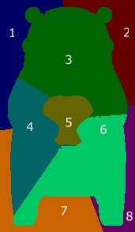

本記事はQrunchからの転載です。
___

モデルの予測結果を説明する方法として**LIME**があります。
LIMEはディープラーニングに限らず、任意のモデルに対して予測結果を適用することができます。
また手法としては結構有名かと思います。

今回はそんなLIMEの理論について説明します。

論文：[“Why Should I Trust You?” Explaining the Predictions of Any Classifie](https://www.kdd.org/kdd2016/papers/files/rfp0573-ribeiroA.pdf)

# LIMEの戦略
任意のモデル$f$に入力$x \in \mathbb{R}^d$が与えられたときの予測結果$f(x)$への特徴量の寄与を求めることを考えます。

LIMEでは$x$近傍（近傍については後述）に対しては$f$と同じような予測をすることができる、かつ解釈が容易なモデル$g$を求めます。
例えば$g$が線形モデルの場合には、$g$の各係数を見ることで特徴量の寄与を得ることが可能です。あるいは$g$が決定木であれば、人間でもある程度容易にモデルの解釈が可能です。ですから、このようなモデル$g$を$f$の代わりに使って、予測結果の解釈をしようというモチベーションです。
ただし、LIMEでは$g$には特徴量の値が$0$か$1$となるベクトル$x'$が入力として与えられるものとします。これは何らかのルールで$x$の要素と$x'$の要素が対応づいているとします。ここも詳細をあとで述べます。
以上のように、解釈が難しいモデル$f$を解釈が容易なモデル$g$に落とし込むことがLIMEのやりたいことになります。

実際にどうやって$g$を求めるのかといえば、次式のようになります。
$${\rm argmin_{g \in G}} \ L(f, g, \pi_x) + \Omega(g).$$

ここで、
* $L$は損失関数です。$x$近傍で$g$の予測値が$f$の予測値に近いと、小さくなるように$L$を定義します。
* $\pi_x$は損失関数で使われる重みで、$x$の近傍点が$x$から遠いほど小さい値を取るようにします。詳細は後述する線形モデルの項を参照。
* $\Omega$はモデルの複雑さとなります。決定木を使う場合には木の深さであったり、線形モデルの場合には非ゼロの重みの数になります。モデルを解釈するためには、モデルはシンプルな方が良いため、$\Omega$を加えることで$g$をなるべく人間にやさしいモデルにしてあげます。

まだ色々と詳細を述べていないため、わからないところは多々あると思いますが、上式は**なるべくシンプルなモデルで$x$の近傍で$f$と近似する$g$を見つける**といったことを意味します。
この局所的に近似された$g$が得られれば、$x$近傍での特徴量が$g$へ与える寄与がわかる、つまり$f$へ与える寄与が近似的にはわかります。

次に画像の場合のケースについて、詳細に踏み込みます。
# 画像に対する線形モデルでのLIME

## superpixel
画像にLIMEを適用する場合、まず次のように入力画像をsuperpixelに分割し、領域ごとに寄与を求めていきます。

> 
引用元：https://towardsdatascience.com/understanding-how-lime-explains-predictions-d404e5d1829c

実際には上記のようにある程度細かく領域を分けますが、以下では例として扱いやすいように次のような画像を考えて、粗く領域を分けていきます（左がオリジナルのくまモンで、右がsuperpixelに分割されたくまモンです）。

各領域を$g$に与える入力$x'$の各要素に対応させます。例えば1番の領域が$x'$の1番目の要素、2番が2番目の要素のようにします。その上で、$x'$の各要素が1のときには対応する領域のピクセルが$x$と同じピクセル値、0のときにはその領域がグレーで埋められた画像と対応していると考えます。
具体的には
$$x' = [0, 0, 1, 1, 0,0,0,0]$$
としたとき、3番目と4番目だけが1ですので、この$x'$に対応した画像は次のようになります。

## 近傍のサンプリング
LIMEでは $x$の近傍のサンプリングをおこないます。
画像の場合に近傍とはどうなるんでしょうか？直感的には謎じゃないでしょうか。

LIMEの場合には分割された領域のうち、適当な個数（個数もランダムに決めますが、個数の下限は決めておきます）をそのままにし、それ以外をグレーに置き換える処理をします。
$x'$の話でいえば、適当な個数の要素については1とし、それ以外は0とする処理に等しいです。

このようにして得られた画像を$x$の近傍として扱います。またこのようにして近傍を得ることを、近傍のサンプリングとします。
先程示した$x'$に対応した画像も$x$の近傍になります。

## 線形モデルのケース
$g$が線形モデルの場合には$g(z')$は次のようになります。

線形モデルの係数（寄与）を求めるため、次のように損失関数$L$を定義します。
$$  L(f, g, \pi_x) = \sum_{z,z'∈Z}\pi_x(z) (f(z) − g(z'))^2.$$
ここで$\pi_x$は以下のとおりです。
$$ \pi_x = \exp(−D(x, z)^2/\sigma^2).$$ 
$z$は$x$近傍の画像をあらわし、$z'$は先程まで説明していた（$z$に対応する）$x'$と同じものです。$Z$はサンプリングされた$z$と$z'$のペアになります。

上式の意味合いとしては、近傍画像$z$の学習済みモデルでの予測値$f(z)$と解釈が容易なモデル$g(z')$が近い値になるように$g$を学習していきます。

また、$\pi_x$の存在のため、$z$が$x$に近ければ（=近傍が入力画像に近い）二乗誤差$(f(z) − g(z'))^2$が$L$に与える影響は大きいですが、一方で$z$が$x$と大きく異なれば（=近傍が入力画像と大きく異なる）、$(f(z) − g(z'))^2$が$L$に与える影響が小さくなります。
より$x$に近い$z$に関しては$g(z')$が良く$f(x)$に近似されるべきですので、このように重み付けされているのは分かる話かと思います。

なお論文中ではLasso回帰として${\rm argmin_{g \in G}} \ L(f, g, \pi_x) + \Omega(g)$を解いています。

# LIMEの実験結果
実験結果は他の方のブログなどで散々書かれていますので、そちらを参考ください（力尽きました）。
