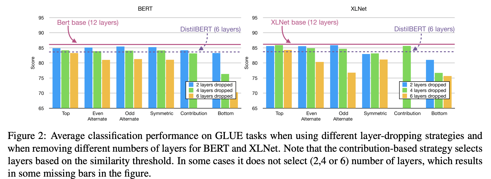

本記事はQrunchからの転載です。
___

最近自然言語処理をよくやっていて、BERTを使うことも多いです。
BERTの性能は高く素晴らしいのですが、実際使う上では、私のような計算リソース弱者には辛いところがあります。

例えば、BERTは非常にパラメータ数が多いことで有名ですが、パラメータが多いと、fine-tuningでの学習や推論の時間がかかることや大きめのメモリが積んであるGPUがないと学習ができない、といった部分がネックになりえます。

BERTのパラメータ数を減らす試みとしてはTinyBERTやDistilBERTによる蒸留を使った手法がありますが、今回紹介する[Poor Man’s BERT: Smaller and Faster Transformer Models](https://arxiv.org/abs/2004.03844)ではBERTのTransformerの数を単純に減らすことでパラメータ数を減らしています。

実際にTinyBERTやDistilBERTと同じことをするのは難しいですが、今回のように層を減らして学習するのは容易にできますので、とても実用性があるのではないかと思います。

# 比較実験
論文では12層のTransformerをもつBERTモデルから色々な方法でTransformerを減らし、性能比較をおこなっています。24層をもつ、いわゆるBERT-Largeは、貧乏人にはメモリが足らずにfine-tuningも難しいのです。

次の図がTransformer層の減らし方の一覧です。

各方法の詳細は以下のとおりです。
## Top-Layer Dropping
先行研究によると、BERTの後ろの層は目的関数に特化したような重みになっているようです。つまり、BERTで汎用的に使えるように学習されている部分は前の層ということになります。
このため、後ろの層に関しては減らしても性能がそんなに悪化しないんじゃないかという仮定のもと、BERTの最後から4つあるいは6つのTransformerを削除します。

## Even Alternate Dropping、Odd Alternate Dropping
先行研究によると、BERTの各層では冗長性があります。つまり、隣り合った層の出力は似ているということです。
このため、1個おきにTransformerを削除します。

## Contribution based Dropping
Alternate Droppingと少し似ていますが、入力と出力があまり変わらないような層を削除するような方法です。
各Transformer層のなかで[CLS]の入力と出力のcosine類似度が大きい傾向にある層をあらかじめ見つけておき、それを削除します。

## Symmetric Dropping
もしかすると、12層のTransformerのうち、真ん中のあたりはあまり重要じゃないかもしれません。
ということで、前と後ろは残して真ん中付近のTransformerを削除します。

## Bottom-Layer Dropping
BERTの最初のほうの層が文脈の理解に重要といわれており、最初のほうを消す理論的な理由はないですが、年のために最初のほうのTransformerを削除したモデルも試します。

# 実験
## 手法間の性能比較
先程示した方法とDistilBERTをGLUEタスクのスコアで比較した結果が以下になります。BERTだけではなくXLNetでも実験してくれています。

これから以下のことが分かります。
* 各方法のスコアは12層あるBertには劣る。
* 4層減らす分にはBottom-Layer Dropping以外の方法ではそれほど性能に差がでないが、6層減らす場合にはTop-Layer Dropping（最後の6層を消す）が性能劣化が小さい。
* Top-Layer Droppingの6層を消した場合はDistilBERTと似たような性能になっている。学習の手間はDistilBERTのほうが圧倒的に大きいので、性能が同程度、計算時間も同程度ならば本手法を使うメリットが大きいです。
* XLNetの場合には最後の4層を消したモデルでも12層あるXLNetとほぼ同じ性能が出せる（＝性能劣化が少ない）。

## タスクごとの性能変化の検証
次にタスクごとの性能の変化を見ていきます。前の実験から後ろの層を消していくTop-Layer Droppingが良いとわかっているため、Top-Layer Droppingに限って実験がされています。

問題によっては6層消してもほとんど変化がなかったりします。

余談ですが、私が自分で試したある問題では6層消して8ポイント分、4層消して4ポイント分の性能劣化、2層消して2ポイント分の性能劣化になりました。

## タスクごとの性能劣化がおこる層数の検証
タスクごとに後ろを何層削ると1%、2%、3%の性能劣化がおこるのかを示した表です。

ビックリしますが、XLNetは結構層を消しても性能劣化が起こりづらいですね。

## パラメータ数や計算時間比較
学習時間・推論時間は削った層の割合だけおおよそ減ることが予想されますが、実際に計算時間がどれくらい変わったかを示したのが以下の表です。

6層削ったモデルでは学習時間・推論時間の両方でだいたい半分くらいになってますね。

## BERTとXLNetの層数での比較
BERTとXLNetのTransformerの数を変えると、どう性能が変化するかを示したのが以下の図です。

なんとXLNetは7層にするあたりまではほどんど性能の変化がありません。BERTは層を減らすと順調に性能が悪化します。

上記の話には実験的な根拠があり、それを示したのが以下の図です。

これはBERTとXLNetの事前学習モデルとfine-tunedモデル間で同じ層同士の出力のcosine類似度を計算した結果になります。つまり、小さい値になっているほど、fine-tuningで出力が大きく変わるような学習がおこなわれたことになります。
BERTの場合には後ろの層ほど大きな変化があることがわかります。またfine-tuningしても前の方の層はほとんど変わっていませんね。
一方でXLNetの場合には前の層の変化がないのはBERTと一緒ですが、後ろの層に関してもあまり変化がありません（もちろん12層目だけは大きく変わります）。つまり、問題を解くときにあまり8層以降は重要じゃないのではと考えられます。

# 感想
私のような貧乏人には大変ありがたい論文でした。
計算リソースがあまりない方は使ってみましょう！
