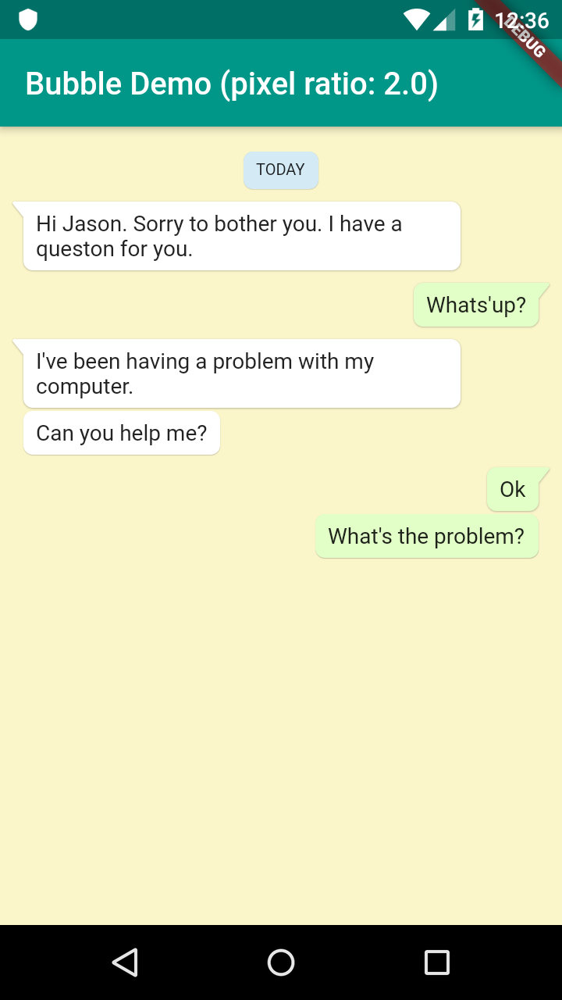

本記事はQrunchからの転載です。
___
# 吹き出しのライブラリ
Flutterで吹き出しを出すためのライブラリとして[Bubble](https://github.com/vi-k/bubble)があります。こちらを使うと吹き出しを簡単に表示できます。
もう一つ[SpeechBubble](https://github.com/NilsBacke/PHSpeechBubble)というライブラリもありますが、Bubbleのほうが色々オプションが設定できます。

# Bubble
Bubbleを使うと以下のような吹き出しが簡単に表示できます。
> 


最もシンプルな吹き出しの作り方は以下のようになります。
``` Dart
Bubble(
  nip: BubbleNip.leftTop,
  child: Text('Hi, developer!'),
)
```
# Bubbleのオプション
Bubbleでは次がオプションとして選べます。
* 吹き出しの色
* 吹き出しの形状
* 吹き出しからちょこんと出ているところの位置
* 影
* マージン、パディング

欲しい機能は一通り揃っていてとても便利です。詳細は[Bubble](https://github.com/vi-k/bubble)のgithubのページをご覧ください。

# Bubbleの不満
素晴らしいライブラリなのですが、ちょっとだけ不満があります。
吹き出しからちょこんと出ているやつ（なんというか知らないんですが）の位置が現状は左上、左下、右上、右下しか選べません。

なので、forkして左中央に位置を指定できるようにしてみました。
https://github.com/opqrstuvcut/bubble

こちらを使うと次のように吹き出しの左中央からちょこんとあれが出せます。




コードは以下の通り。

``` Dart
Bubble(
  nip: BubbleNip.leftCenter,
  child: Text('ちょこんとでるのが左中央だよ'),
)
```
