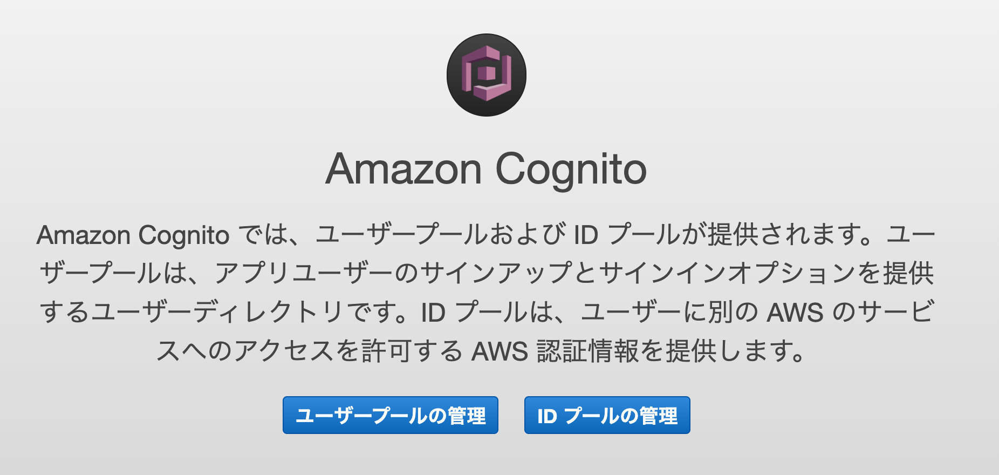
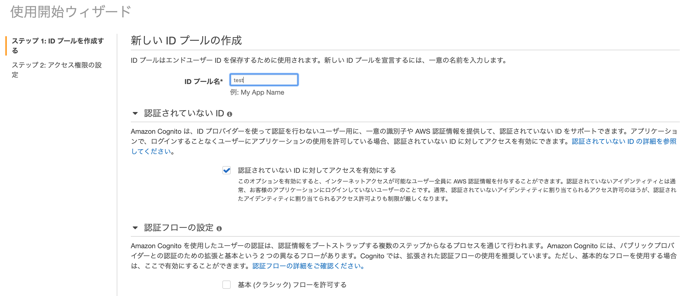

本記事はQrunchからの転載です。
___

FlutterでS3へファイルをアップロードするための公式のライブラリはありませんが、有志によるライブラリ[amazon_s3_cognito](https://pub.dev/packages/amazon_s3_cognito)があります。
今回はこちらの紹介+forkしてちょっと修正したのでよければ使ってねという話になります。

# 事前準備
AWS cognitoでIDプールを作っておく必要があります。
cognitoのページを開くと以下のような表示がされるので、「IDプールの管理」を押します。


新しいIDプールの作成を押し、以下のような感じで設定をします。


次のページでRoleのポリシーの設定ができますので、「詳細を表示」 -> 「ポリシードキュメントを表示」 からポリシーを編集します。Uauthと書いてある方だけ編集すればOKです。


ポリシーは以下のようにすれば大丈夫ですが、バケット名は自分で適当なものに変更してください。
```
{
    "Version": "2012-10-17",
    "Statement": [
        {
            "Sid": "VisualEditor0",
            "Effect": "Allow",
            "Action": [
                "mobileanalytics:PutEvents",
                "cognito-sync:*"
            ],
            "Resource": "*"
        },
        {
            "Sid": "VisualEditor1",
            "Effect": "Allow",
            "Action": "s3:*Object",
            "Resource": "arn:aws:s3:::(バケット名)*"
        }
    ]
}
```

おそらくこれでAWS側の設定は大丈夫かと思います。

# Flutter側からファイルを送信する
amazon_s3_cognitoをpubspec.yamlに追加して、flutter pub getしたら使う準備はできました。
次のようなコードでファイルをS3に送ることができます。
```
import 'package:amazon_s3_cognito/amazon_s3_cognito.dart';
import 'package:amazon_s3_cognito/aws_region.dart';

String uploadedImageUrl = await AmazonS3Cognito.upload(
            imagePath,
            BUCKET_NAME,
            IDENTITY_POOL_ID,
            IMAGE_NAME,
            AwsRegion.AP_NORTHEAST_1,
            AwsRegion.AP_NORTHEAST_1)
```
* imagePathはスマートフォン内の送りたいファイルのパスを指定します。
* BUCKET_NAMEはS3のバケット名を指定します。
* IDENTITY_POOL_IDはさきほど設定したAWS cognitoから次のような詳細ページにいくことで、取得できます。以下のIDプールのIDと書かれている行のダブルクォーテーションの部分をコピペすればOKです。

* IMAGE_NAMEはS3のバケット以下のファイルの保存先のパスを指定します。
* AwsRegion.AP_NORTHEAST_1はregionを指定しています。2つ目はsub region？の設定らしいですが、なければ同じもので特に問題ありません。

返り値はS3上の保存先のファイルパスになります。失敗したときは"Failed"だったり空のパスが渡ってきます。

## あれ、iOSでは失敗する…
Androidではここまでの設定等でうまくいったのですが、iOSでは常にうまく送信できませんし、空のパスが返り値として受け取られます。
実はこれはアクセス権の問題でうまく動きませんでした。iOS版の実装をみると、publicなバケットにしかファイルを送れないようになっていました。
というわけで、amazon_s3_cognitoのレポジトリをforkして、privateなバケットにもファイルを送れるように修正しましたので、よければ使ってみてください。
https://github.com/opqrstuvcut/amazon_s3_cognito

pubspec.yamlには以下のようにかけばOKです。
```
  amazon_s3_cognito:
      git:
        url: https://github.com/opqrstuvcut/amazon_s3_cognito
```

