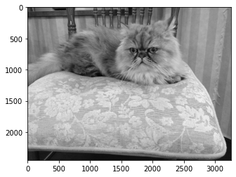
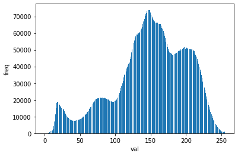

本記事はQrunchからの転載です。
___
画像処理や集計、機械学習では何かとヒストグラムを計算するケースがありますね。

これに伴い、ヒストグラムを計算できるライブラリは色々あるかと思いますが、OpenCVでもヒストグラムを計算する機能をもっています。
**NumPyでもヒストグラムの計算できるじゃない**、と思いますが、実はOpenCVの方がNumPyのヒストグラムよりも断然速いです。今回はその辺りの比較もおこなっていきます。

# OpenCVのヒストグラム
せっかくOpenCVを使うので、以下の画像の画素値のヒストグラムを計算してみます。  


OpenCVでのヒストグラムの計算は以下のようにおこなえます。
```Python
hist = cv2.calcHist(images=[img], 
                    channels=[0], 
                    mask=None,
                    histSize=[256],
                    ranges=(0, 256))
```
* imagesにはヒストグラムの計算のもととなる画像をリストの形式で渡します。
* channelsには画像のチャネルのうち、どれを用いてヒストグラムを計算するかを指定します。いまはグレースケールで1チャネルしかないため、0を指定しています。カラー画像のときにはBGRの3チャネルなので、channelに対応する0~2のどれかを指定します。
* maskには画像と同じサイズの1チャネルのマスクを与えることで、ヒストグラムを計算する領域を制限できます。
* histSizeにはヒストグラムのbinの数を与えます。
* rangesにはヒストグラムの下限と上限を指定します。厳密には(0,256)を与えるということは$[0, 256)$のような区間をあらわすことに注意してください。

結果を以下のように描画してみます。

``` Python
plt.bar(range(len(hist)), hist.ravel())
plt.ylabel("freq")
plt.xlabel("val")
plt.show()
```  


# NumPyとの比較
cv2.calcHistによって得たヒストグラムと全く同じヒストグラムをNumPyを用いて得ることができます。
具体的には次のようにします。

```Python
numpy_hist, bin_edges = np.histogram(img.ravel(), 
                                     bins=256, 
                                     range=(0, 255))
```

さて、速度はどれくらい違うかという話になりますが、%%timeitによって測定した結果が以下のとおりです。

| 方法 | timeitの結果 |
|----|----|
| cv2.calcHist | 2.95 ms ± 186 µs per loop |
| np.histogram |109 ms ± 7.22 ms per loop |
 
36倍程度OpenCVのほうが速いことがわかります。
全然違うのでびっくりしますね。
