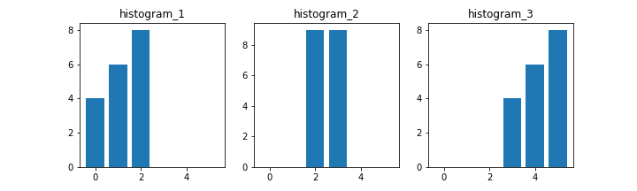

本記事はQrunchからの転載です。
___
画像処理の領域では画像から特徴量をあらわすヒストグラムを生成することがよくあります。
特徴量としてヒストグラムを生成するということは、比較をすることもよくあるということで、今回はヒストグラムの比較を扱います。

# compHistによるヒストグラムの比較の仕方
次のようにしてヒストグラムの比較をおこないます。

``` Python
cv2.compareHist(hist_1, hist_2, method)
```
hist_1とhist_2はヒストグラムをあらわすNumPy arrayです。
methodは比較方法をあらわし、以下のようなものがあります。

| 方法 | 概要 |
|----|----|
| cv2.HISTCMP_CORREL | ピアソンの相関係数 |
| cv2.HISTCMP_CHISQR | カイ二乗検定 |
| cv2.HISTCMP_KL_DIV | KLダイバージェンス |
| cv2.HISTCMP_INTERSECT | 交差法 |
| cv2.HISTCMP_BHATTACHARYYA | バタチャリア距離 |

それぞれの違いは式を見ればわかるという話もありますが、ぱっと分かるように数値的な違いを見ていきます。

## 比較方法の一覧
次のようなヒストグラムを対象にして各比較方法の違いをみてみます。


結果は次のとおりです。


| 比較方法              |   2と2 |       1と2 |       2と1 |       2と3 |       1と3 |
|:----------------------|-------:|-----------:|-----------:|-----------:|-----------:|
|  HISTCMP_CORREL        |      1.0 |   0.22 |   0.22 |  -0.22 |  -0.87 |
|   HISTCMP_CHISQR        |      0.0 |  10.13   |   9.11  |  11.78  |  18.0        |
|   HISTCMP_KL_DIV        |      0.0 | 245.6   | 228.07    | 234.31    | 447.40    |
|  HISTCMP_INTERSECT     |     18.0 |   8.0        |   8.0        |   4.0        |   0.0        |
|   HISTCMP_BHATTACHARYYA |      0.0 |   0.73 |   0.73 |   0.82 |   1.0        |

手法によって、完全一致は大きい値になるのか、小さい値になるのか、また最大値と最小値はあるのかといったところも違うので、注意が必要です。

なお、利用したコードは以下のとおりです。
``` Python
import numpy as np
import pandas as pd
import matplotlib.pyplot as plt

hist_1 = np.array([4, 6, 8, 0, 0, 0], dtype=np.float32)
hist_2 = np.array([0, 0, 9, 9, 0, 0], dtype=np.float32)
hist_3 = np.array([0, 0, 0, 4, 6, 8], dtype=np.float32)

comp_1_2_results = []
comp_2_1_results = []
comp_2_3_results = []
comp_1_3_results = []
comp_2_2_results = []
methods = ["HISTCMP_CORREL", "HISTCMP_CHISQR", 
           "HISTCMP_KL_DIV", "HISTCMP_INTERSECT", 
           "HISTCMP_BHATTACHARYYA"]

for method_name in methods:
    method = getattr(cv2, method_name)
    comp_1_2_results.append(cv2.compareHist(hist_1, hist_2, method))
    comp_2_1_results.append(cv2.compareHist(hist_2, hist_1, method))
    comp_2_3_results.append(cv2.compareHist(hist_2, hist_3, method))
    comp_1_3_results.append(cv2.compareHist(hist_1, hist_3, method))
    comp_2_2_results.append(cv2.compareHist(hist_2, hist_2, method))
    
res_df = pd.DataFrame({"比較方法": methods,
                       "2と2": comp_2_2_results,
                       "1と2": comp_1_2_results,
                       "2と1": comp_2_1_results,
                       "2と3": comp_2_3_results,
                       "1と3": comp_1_3_results,
                      })
```
