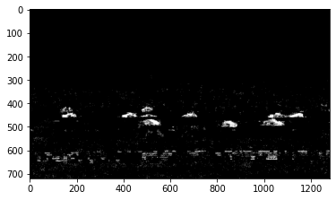

本記事はQrunchからの転載です。
___
画像から前景と背景を分けるのは以前に取り上げたのですが、動画でもOpenCVで前景と背景をわけることが可能です。ここでいう前景は動いている物体を指します。

# 前景と背景を分離する難しさ
動画から前景と背景を分離するアルゴリズムを自分で実装するのは結構大変です。
最も単純なアルゴリズムは背景だけが写っている画像を撮っておいて、運用時には背景画像とリアルタイムに取得された画像との差分を取るというのが考えられます。
ただしこのやり方だと照明環境は一定にしないといけないのですが、問題設定によってはそうできなかったりします。また背景だけの画像を撮るのが難しい場合もあります。

問題の難しさから、リッチな処理をしたくなるのですが、変に処理をすると計算時間が伸びていく可能性もあります。

# OpenCVでやってみる
OpenCVの**BackgroundSubtractorMOG2**を使うと、簡単に照明の変化にも適応する手法を利用できます。背景画像を撮る必要もありません。
BackgroundSubtractorMOG2では背景と前景を分離するために混合ガウス分布を利用しています。
混合ガウス分布の学習はいつするの？という話ですが、これはリアルタイムに更新されていきます。リアルタイムで更新するので照明変化などにも対応できるわけですね。

今回のテスト用の動画として[こちら](https://pixabay.com/ja/videos/%E9%80%9A%E3%82%8A-%E3%83%88%E3%83%A9%E3%83%95%E3%82%A3%E3%83%83%E3%82%AF-%E9%89%84%E9%81%93-%E8%BB%8A-3572/)を利用させていただきました。
道路を車がビュンビュン走っています。

次のようにしてBackgroundSubtractorMOG2を利用できます。
``` Python
import cv2
import numpy as np

cap = cv2.VideoCapture("ex.mp4")
fgbg = cv2.createBackgroundSubtractorMOG2(history=60, 
                                          detectShadows=False)
masks = []
kernel = np.ones((5, 5), np.uint8)

while True:
    ret, frame = cap.read()
    if not ret:
        break
    fgmask = fgbg.apply(frame)
    fgmask = cv2.morphologyEx(fgmask, cv2.MORPH_OPEN, kernel)
    masks.append(fgmask)

cap.release()
cv2.destroyAllWindows()
```
createBackgroundSubtractorMOG2に渡している引数ですが、history=60とすることで、直近の60フレームだけをモデルに考慮させているようなイメージです（正確にそうなるわけではないはずですが）。
また、detectShadows=Trueの場合には影も検出できるのですが、不要なのでFalseにしています。この機能を切っておいたほうが少し早くなります。

fgbg.apply(frame)の返り値が前景の検出結果（mask画像）になります。
ちなみに、検出された結果にオープニング処理を入れてノイズを減らしています。今回の動画ではオープニング処理を入れないと次のように結構ノイズが拾われてしまいます。  
  
検出されたマスクにオープニング処理も入れた結果が次のとおりです（GIFが動かない場合はクリックしてみてください）。  


# コード全体

``` Python
import cv2
import numpy as np

cap = cv2.VideoCapture("ex.mp4")
fgbg = cv2.createBackgroundSubtractorMOG2(history=60,
                                          detectShadows=False)
masks = []
kernel = np.ones((5, 5), np.uint8)

while True:
    ret, frame = cap.read()
    if not ret:
        break
    fgmask = fgbg.apply(frame)
    fgmask = cv2.morphologyEx(fgmask, cv2.MORPH_OPEN, kernel)
    masks.append(fgmask)

    cv2.imshow('frame', fgmask)

    k = cv2.waitKey(30)
    if k == ord('q'):
        break

cap.release()
cv2.destroyAllWindows()

fourcc = cv2.VideoWriter_fourcc("m", "p", "4", "v")
writer = cv2.VideoWriter("res.mp4",
                         fourcc,
                         30,
                         tuple(masks[0].shape[::-1]),
                         0)
for mask in masks:
    writer.write(mask)

writer.release()

```
