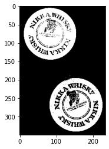
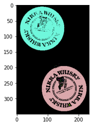

本記事はQrunchからの転載です。
___
OpenCVでは二値画像から結合している領域の抽出をおこなうことができます。
こういうのは自分で実装すると大変なので、大変助かりますね。

# connectedComponets
次の二値画像を考えます。

領域として取り出したいのは2つの白い部分です。

connectedComponetsを使って簡単にこの2つの領域を抽出できます。
```Python
n_labels, labels = cv2.connectedComponents(bi_img)
```
n_labelsはラベル付けされた領域の数です。
labelsには入力画像と同じサイズの行列が入っており、それぞれの座標の値がその位置での領域のラベルをあらわします。

ラベルごとに色付けしてみると、次のようになります。
```Python
colored_img = np.zeros(bi_img.shape + (3,), dtype=np.uint8)
for i in range(1, n_labels):
    colored_img[labels == i] = [np.random.randint(0, 256), 
                                np.random.randint(0, 256), 
                                np.random.randint(0, 256)] 

plt.imshow(colored_img)
plt.show()
```

