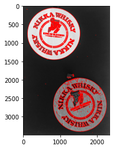

本記事はQrunchからの転載です。
___
OpenCVのfindContoursで見つけた輪郭はdrawContoursで簡単に描画できます。
次のようにして使えます。

```Python
drawed = cv2.drawContours(img, 
                          contours=contours,
                          contourIdx=-1,
                          color=(255, 0, 0),
                          thickness=10,
                          lineType=8,
                          hierarchy=hierarcies,
                          maxLevel=1)
```

引数の意味はそれぞれ次のとおりです。必須なのはcolorまでです。

| 引数       | 意味                                                         |
| ---------- | ------------------------------------------------------------ |
| contours   | findContoursで見つかった輪郭                                 |
| contourIdx | 描画する輪郭のインデックスを指定する（-1だと全て描画）             |
| color      | 描画する輪郭の色                                             |
| thickness  | 描画する輪郭の太さ                                           |
| lineType   | 4、8、cv2.LINE_AAのどれかを指定し、後のほうがきれいに描画される |
| hierarchy  | findContoursで見つかった輪郭の階層構造                       |
| maxLevel   | 描画する最大の階層を指定する                                 |

maxLevelを1にしたときと、2にしたときの違いを次に示します。

<u>maxLevel=1</u>　　　　　　　　<u>maxLevel=2</u>

maxLevelが2のときには外側の輪郭の中まで輪郭が描画されていますね。
