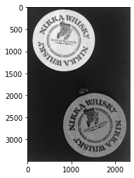

本記事はQrunchからの転載です。
___
画像から物体の輪郭を見つけたくなることが多々あります。
そんなときにもOpenCVを利用することができます。
#  findContoursで輪郭抽出

次の画像から輪郭の抽出をおこなうことを考えます。

最初に次のように二値化しておきます。
```Python
_, bi_img = cv2.threshold(img, 0, 255, cv2.THRESH_BINARY + cv2.THRESH_OTSU)
```

これに対して次のようにfindContoursを適用します。

```Python
contours, hierarcies = cv2.findContours(bi_img, 
                                        cv2.RETR_EXTERNAL,
                                        cv2.CHAIN_APPROX_NONE)
```
* 第二引数は輪郭の取り出し方を指定しており、cv2.RETR_EXTERNALは一番外側の輪郭だけを取り出します。ここに指定できる方法の比較は後でおこないます。
* 第三引数は輪郭の近似方法をあらわします。例えば、cv2.CHAIN_APPROX_SIMPLEにすると、返ってくる点の数が大きく減ります。cv2.CHAIN_APPROX_TC89_L1にすると返ってくる点の数をうまい具合に減らしてくれますが、他に比べると計算量がかかります。
* 返り値の1つめが輪郭を格納したリストです。２つめが輪郭の階層構造をあらわしています。
  * 細かく言うと、輪郭の方は、点のリストが1つの輪郭をあらわし、それらのリストが格納されています。
  * 階層構造の方は、輪郭ごとに１つの階層構造をあらわす4つの要素をもつリストが存在します。各要素の0番目は次の輪郭のインデックス、1番目は前の輪郭のインデックス、2番目は子の輪郭のなかで1番目のインデックス、3番目は親の輪郭のインデックスをあらわします。親と子が何かといえば、親はみている輪郭を囲んでいる輪郭のことで、子は中にある輪郭のことです。

見つかった輪郭を次のように描画してみます。

```Python
drawed = cv2.drawContours(np.stack([img, img, img], axis=-1), 
                          contours,
                          -1,
                          (255, 0, 0),
                           10)
plt.imshow(drawed)
plt.show()
```

# 輪郭の取り出し方を変えてみる

先程は輪郭の取り出し方にcv2.RETR_EXTERNALを指定しました。これは一番外側の輪郭しか取れません。
次にちゃんと階層構造をもった結果を返すようにしてみます。これにはcv2.RETR_TREEを指定します。

```Python
contours, hierarcies = cv2.findContours(bi_img, 
                                        cv2.RETR_TREE,
                                        cv2.CHAIN_APPROX_NONE)
```

他にもcv2.RETR_LISTやcv2.RETR_CCOMPなどがありますが、hierarciesの中の階層構造の情報の持ち方が変わってきます。
