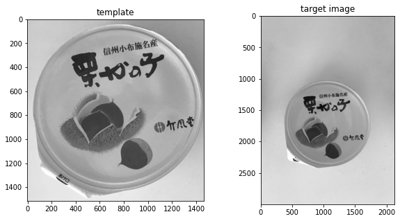
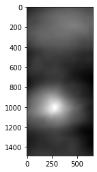
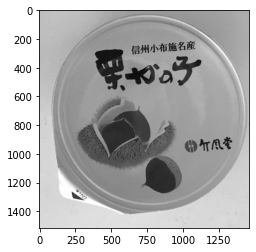

本記事はQrunchからの転載です。
___

カメラを固定しておいて、何らかの被写体を取り続けるということはよくある問題設定です。
ただし、被写体の位置が毎回少しズレるということも多々あります。
そんなときにテンプレートマッチングを使うことができます。

# テンプレートマッチングについて

テンプレートマッチングではテンプレート画像と呼ばれるものを事前に用意しておきます。
そして、検出したいものが写っている画像の左上の領域から順にテンプレート画像とどれくらい似ているかを計算していきます。
このようにして、テンプレート画像とよく似た領域を検出するというのがテンプレートマッチングです。

# OpenCVでテンプレートマッチング

次の左の画像をテンプレート画像として、右から同じ物体を検出してみます。  


テンプレートマッチングは次のようにしておこなえます。

``` Python
res = cv2.matchTemplate(img, template, cv2.TM_CCORR_NORMED)
```

 cv2.TM_CCORR_NORMEDは類似度の計算の方法です。
選択肢は複数あり、手法によって精度と計算時間が変わります。
詳細は[こちら](https://docs.opencv.org/3.0-beta/modules/imgproc/doc/object_detection.html?highlight=matchtemplate#cv2.matchTemplate)をご確認ください。

返り値には各位置での類似度が格納されています。  


TM_CCORR_NORMEDの場合には大きな値ほど、似ていますので明るい部分がもっともテンプレートとマッチしたことをあらわします。

この部分の画像を次のように切り抜いてみます。  

``` Python
_, max_val, _, max_loc = cv2.minMaxLoc(res)
height, width = template.shape
plt.imshow(img[max_loc[1]: max_loc[1] + height,
               max_loc[0]: max_loc[0] + width])
plt.show()
```
結果は以下のとおりです。
バッチリできていることがわかります。  
  

