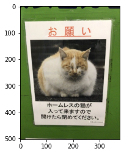
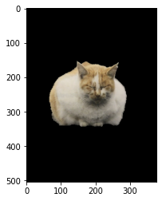
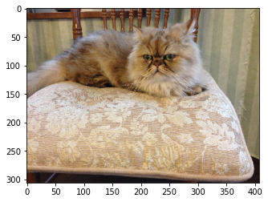
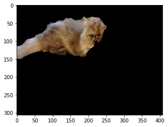

本記事はQrunchからの転載です。
___
次のような画像があったとします。


ここから猫だけ抽出したいときに、ツールを使えば少し手間はかかりますが、切り取れると思います。
実はOpenCVのGrabcutsを使えば非常に簡単にそれが実現できます。
（ディープラーニング使えばできるよね？はおいておいて）

# Grabcutsを使ってみる
## 矩形を指定
最初に猫を囲うような矩形を指定する方法を試していきます。
OpenCVのGrabcutsは以下のように利用できます。

```Python
bgd_model = np.zeros((1, 65), np.float64)
fgd_model = np.zeros((1, 65), np.float64)

rect = (0, 30, 300, 120)
mask = np.zeros(img.shape[:2], np.uint8)
cv2.grabCut(img, mask, rect, 
            bgd_model, fgd_model, 10,
            cv2.GC_INIT_WITH_RECT)
```
各引数の意味は以下のとおりです。
* maskの詳細は一旦おいておきます。
* rectは猫を囲う矩形をあらわし、$(x,y,w,h)$の形式のタプルです。
* bgd_modelとfgd_modelは内部で利用する変数なのですが、わざわざ外から与える必要があります。
なぜかといえば、grabCut関数を適用したあとに、同じ画像に再度grabCutを適用したいケースがあるのですが、そういったときに**同じ**bgd_modelとfgd_modelを使い回す必要があるためです。
そのため、外から変数を与えられるようになっています。
* 6つめの引数の10とあるのは、アルゴリズムの反復回数です。
* 最後のcv2.GC_INIT_WITH_RECTは指定した**矩形**をもとに前景である猫を抽出してくださいと指定しているflagです。

分割された領域の情報はmaskに格納されます。
maskに格納される値は以下のような意味になります。
* 0は確実に背景
* 1は確実に前景
* 2は多分背景
* 3は多分前景

以下のようにして抽出された前景を抽出します。

``` Python
def plot_cut_image(img, mask):
    cut_img = img * np.where((mask==1) | (mask==3), 1, 0).astype(np.uint8)[:, :, np.newaxis]
    plt.imshow(cut_img[:, :, ::-1])
    plt.show()
```



上手く猫だけを抽出できていますね。

## maskを指定
次に下の画像から猫を抽出することを考えます。


まずは、さきほどと同じようにやってみます。
```Python
bgdModel = np.zeros((1,65),np.float64)
fgdModel = np.zeros((1,65),np.float64)

rect = (0, 30, 300, 120)
mask = np.zeros(img.shape[:2],np.uint8)
cv2.grabCut(img, mask, rect, 
            bgdModel, fgdModel, 10,
            cv2.GC_INIT_WITH_RECT)
```


椅子と猫の色味が似ているためか上手くいきません。

ここでmaskの出番です。
前景として扱いたい部分をmaskに指定してあげることができます。
猫の顔の右下の部分を前景としたいので、その部分のmaskの値を1にします。
また、grabCutの最後の引数もcv2.GC_INIT_WITH_MASKというflagに変えることで、maskを使えるようにします。

```Python
mask[100:130, 200:280] = 1
cv2.grabCut(img, mask, rect, 
            bgdModel, fgdModel, 10,
            cv2.GC_INIT_WITH_MASK)
```


いい感じです！
追加で猫の顔の右上もmaskに前景として指定します。
```Python
mask[50:100, 250:270] = 1
cv2.grabCut(img, mask, None, 
            bgdModel, fgdModel, 10,
            cv2.GC_INIT_WITH_MASK)
```


ほぼほぼ上手く猫が抽出できました！
