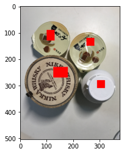

本記事はQrunchからの転載です。
___
Watershedと呼ばれる方法を使うと、指定したマーカーの情報と画像のエッジから画像中の領域の分割をおこなってくれます。
マーカーとしては、この位置は領域1、この位置は領域2それ以外は背景だよといった感じの情報を与えます。

実際にOpenCVでやってみましょう。

# OpenCVでWatershed
次の画像にWaterShedを適用してみます。  
  

いま、4つの物体が写っていますので、これを4つの領域と背景に分けることを考えます。
マーカーは以下のように指定します。

``` Python
marker = np.zeros((504, 378), np.int32)
marker[90:130, 100:130] = 1
marker[230:270, 125:180] = 2
marker[120:150, 250:280] = 3
marker[280:310, 290:320] = 4
```
markerに代入した1~4の値がそれぞれの物体上にくるようにしています。
マーカーの位置と画像を重ねると次のようになります。  


OpenCVのWatershedは次のようにして実行できます。

```Python
res = cv2.watershed(img, marker)
```
返り値には領域を分割した結果をあらわす行列が格納されています。
行列のサイズは画像と同じになっていて、各要素の値はその座標がどの領域かを示した値が入っています。
描画してみると以下のようになります。  
  
3つはちゃんと領域が分割できています。
白いボトルは上手くいきませんでした。エッジがあまり取れていないのかもしれないです。
