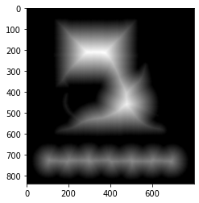

本記事はQrunchからの転載です。
___

画像に対する距離変換とは、グレースケールの画像において、ピクセルから最も近い0の値をもつピクセルまでの距離を求めたものです。

早速OpenCVで試してみます。

# OpenCVで距離変換

次のようにして距離変換をおこなえます。

``` Python
dist = cv2.distanceTransform(img,
                             distanceType=cv2.DIST_L2,
                             maskSize=5
                            )
```

distanceTypeに距離の計算方法を指定します。DIST_L2はユークリッド距離です。
maskSizeには最も近い0の値をもつピクセルまでの距離の近似値を計算するときに使うmaskの大きさを指定します。maskSize=5の例でいえば、maskをあらわす$5\times5$の行列の各要素にはmaskの中心からの距離が格納されています。このmaskを使うことで、正確に距離を計算するよりも速く距離（の近似値）が計算できます。

結果は以下のとおりです。

　　　　　　　　　入力画像　　　　　　　　　　　　　距離変換適用（明るいほど距離大）


背景が0の値をもつので、そこまでの距離が反映されています。窓の中心や、猫の顔の中心は背景から遠いので、大きな値をもっています。
