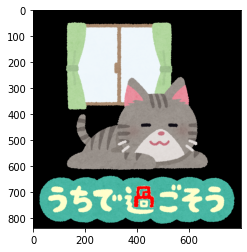

本記事はQrunchからの転載です。
___
OpenCVのfloodFillを使うことで、選んだ点の周辺の似たような色のピクセルを塗りつぶすことができます。

# 使い方

次のようにしてfloodFillを利用できます。

``` Python
mask = np.zeros((img.shape[0] + 2, img.shape[1] + 2),
                dtype=np.uint8)
res = cv2.floodFill(img, 
                    mask=mask,
                    seedPoint=(400, 700),
                    newVal=(0, 0, 255),
                    loDiff=30,
                    upDiff=30)
```

まずmaskですが、入力画像の$(x,y)$がmaskの$(x+1, y+1)$に対応し、maskの値が0でないところは塗りつぶされません。入力画像に比べて縦横が2ピクセルずつ大きいので、元の画像の周辺に1ピクセルずつpaddingができたようなイメージですね。
seedPointに指定した座標が塗りつぶしの処理の起点になります。
newValに塗りつぶす色を指定します。
seedPointに指定したピクセルの値からloDiffを引いた値とseedPointに指定したピクセルの値にupDiffを加えた値の間に入っているピクセルをseedPointの隣から順に塗りつぶしていきます。

結果は以下のとおりです。

　　　　　　　　入力画像　　　　　　　　　　　　　　　　　　floodFillの結果

