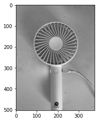
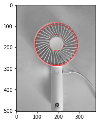

本記事はQrunchからの転載です。
___

Hough変換は直線を検出する方法として前回紹介したのですが、Hough変換を応用することで、円の検出も行えます。

# OpenCVで円の検出

次の画像から円を検出してみます。


円の検出は以下のようにおこないます。

```Python
hough_circle = cv2.HoughCircles(img, method=cv2.HOUGH_GRADIENT,
                                dp=1, minDist=5, 
                                param1=100, param2=80)

```

HoughLinesと異なり、画像はグレースケールの状態で渡せば、なかでエッジ検出をおこなってくれます。
methodには手法を指定しますが、HOUGH_GRADIENTしかないようです。
dpには分解能を指定しています。1にすると画像の解像度と同じ分解能をもちます。
minDistには円同士の最小の距離を指定します。これより近いと2つの円として認識されません。
param1はCanny法のしきい値の上限、param2は円上にあると判定されたエッジの点の数に対するしきい値です。

結果は以下のとおりです。

大まかには円が検出できていることがわかります。
