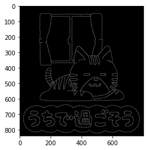
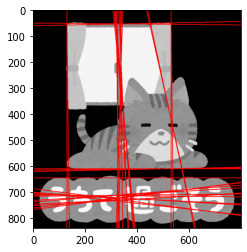

本記事はQrunchからの転載です。
___

Hough変換は画像から直線をみつける方法です。

# 簡単な原理

入力として2値画像を考えます。
Hough変換では候補となる直線を用意し、直線上にいくつ0でないピクセルがあるかを数えます。
このピクセルの個数が指定したしきい値以上であった場合、その候補の直線は正しい直線として扱います。

なお、OpenCVでは直線の候補は以下のように$(\rho, \theta)$による極座標系であらわされています。
$$ \rho = x \cos \theta + y \sin \theta .$$
$\rho$は原点からの直線の距離、$\theta$は直線の角度をあらわします。

$\theta$が0でないとしたとき、上式をちょっと変形することで見慣れた形の方程式になるかと思います。
$$ y = \frac{\rho}{\sin\theta} - x \frac{\cos \theta}{\sin \theta}. $$

わざわざ極座標系であらわす理由はなにかというと、$y=ax+b$ような直線に対してy軸に平行な直線を考えるときに、傾きが$\infty$の直線となり扱いづらくなることを防ぐためです。
極座標系ですと、無理なくy軸に平行な直線を扱うことができます。

# OpenCVで試してみる

次の画像に対してHough変換を適用します。

Hough変換にかける前に、Canny法でエッジを抽出しておきます。

```Python
canny = cv2.Canny(img, threshold1=50, threshold2=100, 
                  apertureSize=3, L2gradient=True)
```


Canny法の結果に対して、次のようにHough変換を適用できます。

``` Python
hough_lines = cv2.HoughLines(canny, rho=5, theta=0.01, 
                             threshold=300)
```

rhoとthetaはそれぞれの軸方向の直線の候補の分解能になります。小さいほどたくさんの直線が見つかるかと思います。thresholdに直線の候補を採用するかを決めるしきい値を指定します。
また、min_thetaとmax_thetaで見つかる直線のthetaの最小値、最大値を決めることもできます。

検出された直線のパラメータ$(\rho, \theta)$は以下のようにして変換して、画像に直線として書き込んでいます。

``` Python
t = 3000
for params in hough_lines:
    rho, theta = params[0]
    a = np.cos(theta)
    b = np.sin(theta)
    x0 = a * rho
    y0 = b * rho
    x1 = int(x0 - t * b) # 媒介変数表示
    y1 = int(y0 + t * a)
    x2 = int(x0 + t * b)
    y2 = int(y0 - t * a)
```

結果は以下のとおりです。

カーテンや窓、猫の底の部分が直線として検出されています。余計な直線も結構検出されています。
