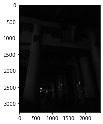
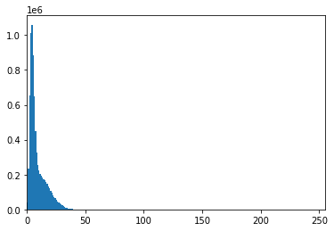
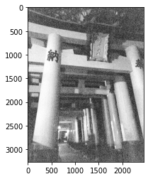
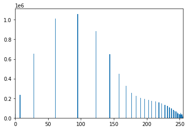

本記事はQrunchからの転載です。
___

今日はヒストグラム平坦化を扱います。

ヒストグラム平坦化はコントラストが偏っているような画像を補正します。
結果として、コントラストがある程度平坦化された結果が得られます。

処理の中身としては、実際には画像のピクセル値の累積分布関数で写像したうえで、最大値と最小値が広がるように調整してあげるというイメージです。

# OpenCVでヒストグラム平坦化

次の画像にヒストグラム平坦化を適用してみます。このままだと全くみえません。  


この画像の画素値のヒストグラムは以下のとおりです。だいぶ偏ってますね。  


ヒストグラム平坦化は次のようにしておこなえます。めちゃくちゃ簡単です。

```Python
res = cv2.equalizeHist(img)
```

  
ちゃんと見えるようになりましたね。

この画像の画素値のヒストグラムは以下のとおりです。  

