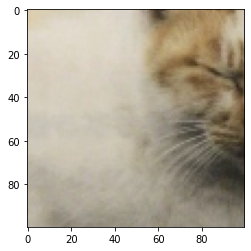
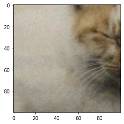

本記事はQrunchからの転載です。
___
# Non-Local Means Denoisingのアイデア

今回はノイズ除去を扱うのですが、特にガウスノイズを考えます。
これは平均が0となるノイズですので、着目しているピクセルにある意味で**似ている**ピクセルを画像中から探してきて、それらの平均を取れば、ノイズの影響が消えたピクセルが得られるはずです。
これがNon-Local Means Denoisingのアイデアになります。

# 似ているピクセルをどう定義するか

Non-Local Means Denoisingでは着目しているピクセルの値自体ではなく、着目しているピクセルの**周辺の値**同士の差分を取ることで、似ているかどうかを考えます。
この考えから定義されるピクセル$p$と$q$間の距離は以下のようになります。
$$ d^2(B(p, f), B(q,f)) = \frac{1}{3(2f + 1)^2} \sum_{c=1}^3 \sum_{j \in B(0, f)} (I_c(p+j) - I_c(q+j))^2. $$
ここで$B(p,f)$は着目しているピクセル$p$のサイズの周辺のピクセルで、サイズが$(2f + 1) \times (2f + 1)$となっています。$I_c(p+j)$が周辺ピクセルの$c$番目のchannelの値をあらわします。

# 平均値の取り方

先程定義した距離を使って以下のような重みを計算します。
$$ w(p,q) = e^{-\max(d^2 - 2\sigma^2, 0) / h^2}. $$
$\sigma^2$はノイズの分散になります（OpenCVの関数で実行するときには特にこれを指定しないので、上手く処理されている？）。$h$は与えるパラメーターで、大きいほど$w$の値に差がつきづらくなります。
距離$d^2$が小さいと$w$が1に近い値を取り、$d^2$が大きいほど$w$は小さい値になります。
この$w$を重みとしたピクセル値の重み付き平均を取ることがNon-Local Means Denoisingでの処理になります。

この重み付き平均をとることで、似ているピクセルは強く考慮されますが、似ていないピクセルはほとんど影響を与えないため、似ているピクセルだけでの平均が取れるような計算処理になっています。

なお、すべてのピクセル同士で距離$d^2$を計算すると、当然計算量が大変なことになります。
このため、実際には着目しているピクセルの周辺のどこまでを考慮するかを指定します。

# OpenCVでやってみる

OpenCVでNon-Local Means Denoisingをやってみます。

次の左の画像にノイズをのせて右の画像を生成しました。   
  

これに対して次のようにして、Non-Local Means Denoisingを適用します。

``` Python
denoised = cv2.fastNlMeansDenoisingColored(img, 
                                           h=3, 
                                           templateWindowSize=7,
                                           searchWindowSize=21)
```

hはさきほどの重みで出てきた$h$と同じで、templateWindowSizeは$d^2$の計算で使われる$f$と同じで、searchWindowSizeは着目しているピクセルの周辺をどこまで考慮するかをあらわします。
ちなみに、fastNlMeansDenoisingという関数もありますが、カラー画像に対してはfastNlMeansDenoisingColoredが良いらしいです。

結果が以下のとおりです。

|ノイズをのせた画像|ノイズ除去後の画像|
|--|--|
|||

体の部分がぼやけていますが、ノイズはきれいにとれてますね。
