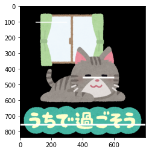
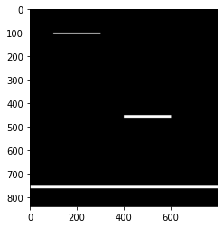
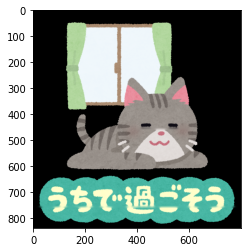

本記事はQrunchからの転載です。
___

画像に汚れがついたり、傷がついているケースの修復には、最近ではディープラーニングを使った手法が色々出ていますが、画像処理の範囲でもできることがあります。
今回はOpenCVで修復をおこなってみます。

# OpenCVでやってみる

次の画像にノイズをのせていきます。


次のようなコードで画像にノイズをのせていきます。

```Python
cv2.rectangle(img, (100,100),(300,105),(255,255,255), -1)
cv2.rectangle(img, (400, 450),(600,460),(255,255,255), -1)
cv2.rectangle(img, (0, 750),(800, 760),(255,255,255), -1)
plt.imshow(img[:, :, ::-1])
plt.show()

mask = np.zeros(img.shape[:2], dtype=np.uint8)
cv2.rectangle(mask, (100,100),(300, 105),(255), -1)
cv2.rectangle(mask, (400, 450),(600,460),(255), -1)
cv2.rectangle(mask, (0, 750),(800, 760),(255), -1)
plt.imshow(mask)
plt.gray()
plt.show()
```


　　　　　　ノイズがのった画像　　　　　　　　　　　　　ノイズ部分のmask画像


OpenCVのinpaint関数を使うと、このノイズがのった画像をある程度復元できます。
次のように利用します。

```Python
inpainted = cv2.inpaint(img, mask, 3, cv2.INPAINT_NS)
```

第一引数に復元したい画像を指定し、第二引数に復元したい箇所をあらわしたマスク画像を指定します。第三引数が復元時に周辺のピクセルをいくつ利用するかを指定します。第四引数に復元のアルゴリズムを指定します。INPAINT_NS（Navier Stokes法）かINPAINT_TELEA（Alexandru Telea法）を指定できます。

　　　　　　　Navier Stokes法　　　　　　　　　　　　　　Alexandru Telea法


どちらも結構いい感じに復元できています。右図のほうが文字の部分などはきれいに復元できている気がします。

ちなみにAlexandru Telea法で第三引数を10まで大きくしてみると、以下のようになります。


ちょっと復元した箇所が滲んだような感じになってしまってます。大きくしすぎには注意ですね。
