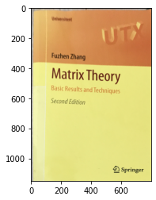

本記事はQrunchからの転載です。
___

# 透過変換とは？

透過変換はアフィン変換よりも柔軟な変換になっていまして、アフィン変換ではできない台形への変換が可能です。また台形から長方形への変換も可能です。
つまり、斜めに写っているものを上から見たような感じに変換ができるというわけです。

# OpenCVでやってみる

次の画像を長方形の画像に変換することを考えます。  


やりたいこととしてはこの本が斜めに（台形に）写っているので、これを長方形にすることです。

まず変換行列を作る必要があります。
これには次のようにgetPerspectiveTransformを使えば簡単にできます。

```Python
src = np.array([[830, 675], [26, 2872], [2579, 2852], [2350, 455]], 
               dtype=np.float32) 
dst = np.array([[0, 0], [0, 1150], [800, 1150], [800, 0]],
               dtype=np.float32)
perspective_mat = cv2.getPerspectiveTransform(src, dst)
```

これはsrcで指定した4つの座標がdstで指定した4つの座標に変換されるような変換行列を作ってくださいと関数に依頼しています。
srcで指定している4点は本の4隅の座標です。dstの1150と800という数値は実際の本の縦横比から適当に決めました。

この行列を使い、次のように変換をおこないます。

``` Python
transformed = cv2.warpPerspective(img, perspective_mat, (800, 1150))
plt.imshow(transformed[:, :, ::-1])
plt.show()
```



それっぽく長方形になりました。
ちょっと文字などが斜めになっていますが、本の表紙が浮いているせいかもしれません。
