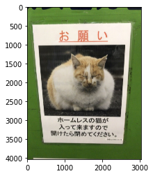
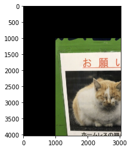
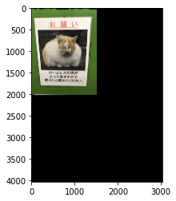

本記事はQrunchからの転載です。
___

アフィン変換といえば、普通は2次元上の点や図形を拡大縮小したり、回転したり、平行移動したりといった変換をさします。
式の話をすると、ある2次元上の点$(x,y)$の$(x', y')$へのアフィン変換は次のようにして表現できます。
$$\begin{pmatrix}x' \\\ y'  \\\ 1 \end{pmatrix} =\begin{pmatrix} a & b & c\\\ e & f & g \\\ 0 & 0 & 1  \end{pmatrix} \begin{pmatrix}x \\\ y \\\ 1 \end{pmatrix}.  $$
$a,b,e,f$の値によって拡大縮小、回転をおこなうようにできますし、$c,g$の値によって平行移動が可能です。

今回はこのアフィン変換をOpenCVを使っておこないます。

# アフィン変換のやり方

OpenCVでは次のようにしてアフィン変換をおこないます。

``` Python
transformed_img = cv2.warpAffine(img, affine_mat, (width, height))
```

affine_matとしているのが、アフィン変換で用いる行列です。
widthとheightは変換後の画像のサイズになります。

以下では次の画像に対するアフィン変換の例を示します。


# 平行移動

平行移動をするときは次のようなアフィン変換になります。
$$\begin{pmatrix}x' \\\ y'  \\\ 1 \end{pmatrix} =\begin{pmatrix} 1 & 0 & c\\\ 0 & 1 & g \\\ 0 & 0 & 1  \end{pmatrix} \begin{pmatrix}x \\\ y \\\ 1 \end{pmatrix}.  $$
もう少し式を書きくだせば、
$$\begin{eqnarray}x' &=& x + c, \\\y'&=&y+g\end{eqnarray}$$
となるので、平行移動だとわかりますね。

$x$と$y$を1000ずつ動かすとすると、コードでは次のようになります。

```Python
affine_mat = np.array([[1, 0, 1000], [0, 1, 1000]], dtype=np.float)
transformed_img = cv2.warpAffine(img, affine_mat, (width, height))
```



# 拡大・縮小

拡大・縮小をするときは次のようなアフィン変換になります。
$$\begin{pmatrix}x' \\\ y'  \\\ 1 \end{pmatrix} =\begin{pmatrix} a & 0 & 0\\\ 0 & e & 0 \\\ 0 & 0 & 1  \end{pmatrix} \begin{pmatrix}x \\\ y \\\ 1 \end{pmatrix}.  $$
もう少し式を書きくだせば、
$$\begin{eqnarray}x' &=& ax \\\y'&=&ey\end{eqnarray}$$
となるので、縮小だとわかりますね。

大きさを半分にする場合は次のようなコードになります。

```Python
affine_mat = np.array([[.5, 0, 0], [0, .5, 0]], dtype=np.float)
transformed_img = cv2.warpAffine(img, affine_mat, (width, height))
```



# 回転

$\theta$だけ回転をするときは次のようなアフィン変換になります。
$$\begin{pmatrix}x' \\\ y'  \\\ 1 \end{pmatrix} =\begin{pmatrix}\cos\theta & -\sin \theta & 0\\\ \sin \theta & \cos \theta & 0 \\\ 0 & 0 & 1  \end{pmatrix} \begin{pmatrix}x \\\ y \\\ 1 \end{pmatrix}.  $$
これでなぜ回転になるかわからない方は**回転行列**などでぐぐってください。
45度時計回りに回転させるときのコードは以下のようになります。

```Python
affine_mat = np.array([[1 / 1.4142, -1 / 1.4142, 0], 
                       [1 / 1.4142, 1 / 1.4142, 0]], 
                       dtype=np.float)
transformed_img = cv2.warpAffine(img, affine_mat, (width, height))
```


