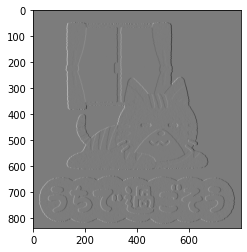

本記事はQrunchからの転載です。
___

OpenCVのfilter2Dを使うのは良いのですが、分離可能フィルタのときには**sepFilter2D**を使うことで、**高速化**できます。
今回はこのsepFilter2Dを扱います。

# 分離可能フィルタ

分離可能フィルタとは2つのベクトルの畳み込みであらわされるフィルタのことを指します。

## 分離可能フィルタの具体例1

Sobelフィルタは分離可能フィルタです。
X方向のSobelフィルタは以下であらわされます。  


これは次のような2つのベクトルの畳み込みとしてあらわされます（$\ast$は畳み込みをあらわしています）。
$$
\begin{pmatrix} 1 \\\ 2 \\\ 1 \end{pmatrix} \ast	 \begin{pmatrix} -1 & 0 & 1 \end{pmatrix}.
$$

## 分離可能フィルタの具体例2

平滑化フィルタは分離可能フィルタです。
3×3のサイズの平滑化フィルタは次のような2つのベクトルの畳み込みとしてあらわされます。
$$
\begin{pmatrix} \frac{1}{3} \\\ \frac{1}{3} \\\ \frac{1}{3} \end{pmatrix} \ast	 \begin{pmatrix} \frac{1}{3} & \frac{1}{3} & \frac{1}{3} \end{pmatrix}.
$$

# 分離可能フィルタで高速化できる理由

行列形式のサイズ$n$のカーネルを使う場合には1回の畳み込み演算に$n^2$のオーダーの計算量が必要です（実際、掛け算は$n^2$回、足し算は$n^2-1$回です）。これを画像のピクセルの数$S$だけおこなうとすると、$n^2S$のオーダーの計算量がかかります。

次に分離した2つのベクトルであらわされたカーネルを2回適用するケースを考えます。このカーネルの1回の畳み込みには$n$のオーダーの計算量がかかります。これをすべてのピクセルに2回適用すると、計算量のオーダーは$2nS$です。

以上から$n$が大きくなると、計算量に大きな違いがでることがわかります。

# 実際にsepFilter2Dを試す

sepFilter2Dは以下のようにして利用できます。

```Python
sep_filter_res = cv2.sepFilter2D(img, ddepth=cv2.CV_16S, 
                                 kernelY=col_kernel, kernelX=row_kernel)
```

kernelXに行ベクトルのカーネルを指定し、kernelYに列ベクトルのカーネルを指定しています。

実際にSobelフィルタを適用することを考えます。

```Python
col_kernel = np.array([1, 2, 1]).T
row_kernel = np.array([-1, 0, 1])
sep_filter_res = cv2.sepFilter2D(img, ddepth=cv2.CV_16U, 
　　　　　　　　　　　　　　　　　　　　kernelY=col_kernel, kernelX=row_kernel)
plt.imshow(sep_filter_res)
plt.gray()
plt.show()
```



結果自体は次のようにfilter2Dを使ったSobelフィルタと等しいです。

``` Python
kernel = np.array([[-1, 0, 1], [-2, 0, 2], [-1, 0, 1]])
filter_res = cv2.filter2D(img, ddepth=cv2.CV_16S, kernel=kernel)
print((sep_filter_res - filter_res).sum()) # output: 0
```

## 速度比較

上記のSobelフィルタを適用したときの速度を、Jupyter notebookの%%timeitを使って比較してみます。
ついでにcv2.Sobelも比較してみます。

| 関数        | timeitの結果              |
| ----------- | ------------------------- |
| sepFilter2D | 240 µs ± 12.3 µs per loop |
| filter2D    | 523 µs ± 18.9 µs per loop |
| cv2.Sobel   | 231 µs ± 12 µs per loop   |

$n=3$でこれだけ差がつきました。$n$が大きいときにはsepFilter2Dを使うといいですね。
当たり前ですが、用意されているSobelフィルタはsepFilter2Dと同程度の速さです。
