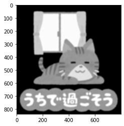

本記事はQrunchからの転載です。
___

OpenCVではいろいろなカーネルによる演算が用意されていますが、自分で定義したカーネルを使いたいこともあります。
そんなときにはfilter2Dが活躍します。

# filter2Dの使い方

filter2Dのシンプルな利用例としては次のようになります。

``` Python
res = cv2.filter2D(img, ddepth=cv2.CV_8U, kernel=kernel)
```

ddepthに返り値の型を指定します。ここでは符号なしの8ビット整数を指定しています。
kernelに自分で定義したカーネルを指定します。

# filter2Dを使ってみる

次の画像にfilter2Dを使った平滑化を適用してみます。  


```Python
ksize = 11
kernel = np.ones([ksize, ksize]) / (ksize ** 2)

res = cv2.filter2D(img, ddepth=cv2.CV_16U, kernel=kernel)
plt.imshow(res)
plt.gray()
plt.show()
```



一応、cv2.blurと等しいかを調べてみます。
次のようにすると等しい結果になったかが分かります。

``` Python
blur = cv2.blur(img, ksize=(ksize, ksize))
print((blur - res).sum()) # output: 0
```
