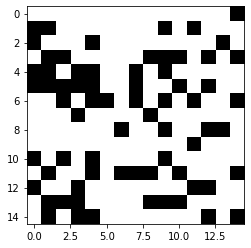
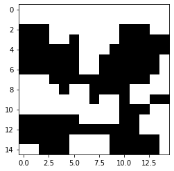
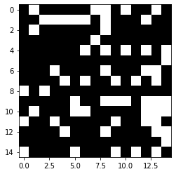
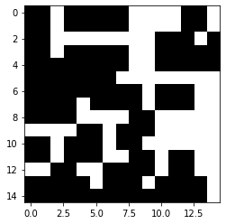

本記事はQrunchからの転載です。
___

画像に対する膨張と収縮の組み合わせによって、openingとclosingという2つの操作が実現できます。
openingは周辺よりもピクセル値が大きい点を取り除くことができ、closingは周辺よりもピクセル値が小さい点を取り除くことができます。これによってノイズの除去や連結した領域を分割したり、逆に連結させたりできます。

# opening

openingは収縮(erode)の後に膨張(dilate)をおこなうことで実現できます。
例えば次のような画像を考えます。

```Python
np.random.seed(0)
A = (np.random.rand(15, 15) > 0.3) * 255
A = A.astype(np.uint8)
```


これの画像に対して、次のようにopeningの操作をおこないます。

``` Python
kernel = np.ones([2, 2], np.uint8)
erosion = cv2.erode(A, kernel, iterations=1)
dilation = cv2.dilate(erosion, kernel, iterations=1)
plt.imshow(dilation)
plt.gray()
plt.show()
```



周辺よりもピクセル値が大きい点を取り除けていることが分かるでしょうか。

ちなみに次のようにしてもopeningをおこなえます。結果は上記と全く同じになります。

``` Python
opening = cv2.morphologyEx(A, cv2.MORPH_OPEN, kernel)
plt.imshow(opening)
plt.gray()
plt.show()
```

# closing

closingは膨張(dilate)の後に収縮(erode)をおこなうことで実現できます。
例えば次のような画像を考えます。

```Python
np.random.seed(0)
A = (np.random.rand(15, 15) > 0.7) * 255
A = A.astype(np.uint8)
```



この画像に対して、次のようにopeningの操作をおこないます。

``` Python
kernel = np.ones([2, 2], np.uint8)
dilation = cv2.dilate(A, kernel, iterations=1)
erosion = cv2.erode(dilation, kernel, iterations=1)
plt.imshow(erosion)
plt.gray()
plt.show()
```



openingと同様に次のようにしてもclosingをおこなえます。結果は上記と全く同じになります。

``` Python
closing = cv2.morphologyEx(A, cv2.MORPH_CLOSE, kernel)
plt.imshow(closing)
plt.gray()
plt.show()
```
