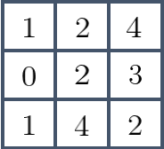
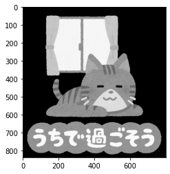
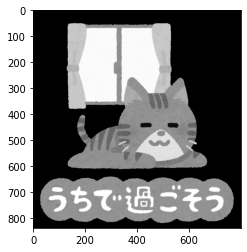

本記事はQrunchからの転載です。
___

# erodeによる収縮

erodeは指定した局所領域内の最小値を取るような操作になります。

具体的な例で説明していきます。
次のようなピクセル値をもった3×3の画像があったとします。  



erodeの処理で2×2の局所領域を指定すると、次のような手順で計算がおこなわれていきます。
オレンジ色の枠が注目している局所領域になります。
まず、次のように最初の局所領域に左上のピクセルしか含まれていないので、この局所領域の最小値は1として扱います。  


次に局所領域を右にスライドさせると、今度は1と2が局所領域に含まれますので、この局所領域の最小値は1となります。  


次の局所領域では最小値は2です。  


局所領域を下の段に下げていき、上記の操作を続けていくと以下のような画像を得られます。  


# OpenCVでerode

OpenCVでのerodeは次のようにおこないます。

```Python
kernel = np.ones([5, 5], np.uint8)
erosion = cv2.erode(img, kernel, iterations=1)
```

kernelが局所領域をあらわし、iterationsは収縮の操作を何度おこなうかをあらわします。

## 先程の例に適用

先程の例の画像でerodeを試してみましょう。

```Python
A = np.array([[1, 2, 4], [0, 2, 3], [1, 4, 2]], dtype=np.uint8)
```

とし、以下を実行します。

```Python
kernel = np.ones([2, 2], np.uint8)
erosion = cv2.erode(A, kernel, iterations=1)
```

erosionの値は以下のとおりです。さきほどの計算例と一致するのがわかります。

```Python
array([[1, 1, 2],
       [0, 0, 2],
       [0, 0, 2]], dtype=uint8)
```

## kernelを変わり種にする

kernelの値を1つだけ0にして、局所領域に含めないようにしてみます。具体的には以下のようにします。

```Python
kernel = np.ones([2, 2], np.uint8)
kernel[0, 0] = 0
erosion = cv2.erode(A, kernel, iterations=1)
```

この結果は以下のとおりです。

```
array([[1, 1, 2],
       [0, 0, 2],
       [0, 1, 2]], dtype=uint8)
```

局所領域をいじったため、$(3,2)$の要素が$1$になりました。

## 画像へ適用

以下の画像に5×5の局所領域でのerodeを適用してみます。  


|iterations=1|iterations=2|
|--|--|
|||

文字の部分をみるとわかりやすいですが、だいぶ小さくなっています。
目の部分はピクセル値が小さいので、ここは逆に膨張しています。
