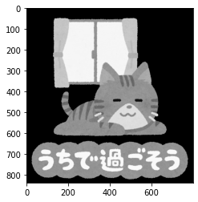
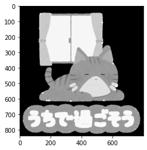

本記事はQrunchからの転載です。
___

OpenCVで用意されているdilateを使うことで、画像の中の物体などを膨張させることができます。
ただ膨張させるだけだとあまり使いみちがあるのかよく分かりませんが、収縮などと組み合わせることで色々な用途があります。

# dilateについて

dilateは指定された局所領域の中で最大値のピクセル値に置き換えていくような処理になります。
このため、例えば背景よりも物体のほうがピクセル値が大きければ、その物体の端の部分が膨らんでいくような処理がおこなわれます。

dilateは次のようにして利用します。

```Python
kernel = np.ones((5,5),np.uint8)
dilation = cv2.dilate(img, kernel, iterations=1)
```

ここでkernelは局所領域をあらわしており、5×5の局所領域がdilateに利用されています。
また、iterationsは何回同様の処理をおこなうかをあらわします。複数回実行することで、より膨張を促すことができます。

実際に試した結果が以下のとおりです。

|元画像|iterations=1|iterations=2|
|--|--|--|
||||

猫が太っていっているのがわかるでしょうか？文字のほうがわかりやすいかもしれませんが。
iterations=2のときのほうが1のときよりも膨張していることがわかります。
