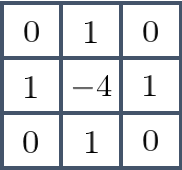
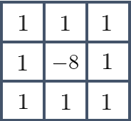
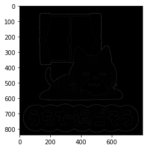
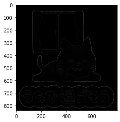

本記事はQrunchからの転載です。
___

今回はLaplacianを扱います。

# そもそものLaplacian

Laplacianの復習的な話ですが、2階偏微分可能な関数$f(x,y)$に対して以下をLaplacianといいます。
$$ \Delta f = \frac{\partial^2 f}{\partial x^2} + \frac{\partial^2 f}{\partial y^2}.  $$

これを画像に適用することで、ピクセル値の極小値あるいは極大値となるピクセルを見つけることが可能になります。これはエッジ検出に利用可能だということがわかるかと思います。

# Laplacianのフィルタ

Laplacianのフィルタの最も基本的なものは以下で定義されます。  



これを使った畳み込み演算によってLaplacianができるという主張ですが、このフィルタの導出は以下のとおりです。

$(x,y)$の位置にあるピクセルの1階の偏微分の近似は以下のようにあらわされます。

$$ \frac{\partial f}{\partial x} \approx f(x + 1, y) - f(x,y ).$$
これを利用すると、2階の偏微分は

$$\begin{aligned} \frac{\partial^2 f}{\partial x^2} &\approx& f(x+1,y ) - f(x, y) - (f(x,y ) - f(x-1,y )) \\\ &=& f(x+1, y) - 2f(x, y) + f(x-1,y ).\end{aligned}$$
同様に
$$  \begin{aligned} 
 \frac{\partial^2 f}{\partial y^2} &\approx& f(x,y+1) - f(x, y) - (f(x,y ) - f(x,y-1 )) \\\ &=& f(x, y+1) - 2f(x, y) + f(x,y-1 ).
\end{aligned}$$
よって、
$$  \begin{aligned} \Delta f &= \frac{\partial^2 f}{\partial x^2} + \frac{\partial^2 f}{\partial y^2} \\\ &= f(x+1,y ) - 2f(x,y ) + f(x-1,y ) + f(x,y+1 ) - 2f(x,y ) + f(x,y -1)\\\ &= f(x+1,y ) + f(x-1,y ) + f(x,y+1 ) + f(x,y -1) - 4f(x,y ) . \end{aligned} $$
以上から先程のようなフィルタになることが理解できたでしょうか？

このフィルタを使うと、ノイズにも強く反応することが予想されます。
そのため、場合によっては平滑化によりノイズを軽減する必要です。

# 斜めも考慮したLaplacian

また、斜め方向も考慮したlaplacianのフィルタが以下のようになります。（これって導出あるんでしょうか？）




# OpenCVでLaplacianを試す

OpenCVでは以下のように利用できます。

``` Python
laplacian = cv2.Laplacian(img, ddepth=cv2.CV_16S, ksize=1)
```

ddepthに出力されるlaplacianの型を指定します。CV_16Sは符号付きの16ビット整数です。
ksizeにフィルタ（カーネル）の大きさを指定します。最初に示したフィルタを使うためにはksize=1を指定します。2つ目に示したフィルタはksize=3になります。

ksizeを変えて2パターン実行した結果が以下のとおりです。
描画の都合上、laplacianに絶対値を取ったものを表示しています。

ksize=1のとき  


ksize=3のとき  

