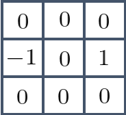

本記事はQrunchからの転載です。
___

よくある画像処理のオペレーターとして、画像の微分があります。
いくつかやり方はありますが、今日はSobel微分を取り上げます。

# Sobelフィルタ

Sobel微分はSobelフィルタを使った畳み込みをすることで実現できます。
例えば、3×3のSobelフィルタは以下のようなカーネルになります。

<u>x方向の微分用のSobelフィルタ</u>


<u>y方向の微分用のSobelフィルタ</u>


これらのフィルタは何をあらわしているんでしょうか？
実はSobelフィルタは微分と平滑化をあわせもったフィルタになっています。
ここでいう微分のフィルタとはx方向の場合には以下を指します。


これは$(x,y)$座標のピクセルに注目しているときに、その左右にあるピクセルの差を取る演算を示しています。いわゆる中心差分と呼ばれる微分の計算方法になります。

次に平滑化ですが、これは以下のフィルタです。


ガウス平滑化に似たように中心の重みが大きい平滑化になります。

ここまでで定義した微分のフィルタに対して平滑化のフィルタによる畳込みを計算すると、実はSobelフィルタと同じものがあらわれます。つまり、画像に対して微分のフィルタを適用した後に平滑化のフィルタを適用することとと、画像に対してSobelフィルタを適用することは等しいです。

以上がSobelフィルタが何をしているかの話になります。

# Sobelフィルタを適用

OpenCVでは以下のようにすることで、Sobelフィルタを適用できます。

```Python
soblex = cv2.Sobel(img, ddepth=cv2.CV_16S, dx=1, dy=0, ksize=3)
```

第二引数のddepthにSobelによる返り値を格納する型を指定します。CV_16Sは符号付きの16ビット整数です。
第三、第四引数のところは微分する次数を指定します。dx=1、dy=0とすると、x方向のSobelフィルタを使うことになりますし、dx=0、dy=1とするとy方向のSobelフィルタです。
最後のksizeはカーネルサイズになります。一応31まで指定が可能なようです。

次の画像にSobelフィルタを適用してみます。


x方向のSobelフィルタの適用

``` Python
soblex = cv2.Sobel(noise_img, ddepth=cv2.CV_16S, dx=1, dy=0, ksize=3, )
```


正の勾配は白色、負の勾配は黒色で描画されています。

y方向のSobelフィルタの適用

``` Python
sobley = cv2.Sobel(noise_img, ddepth=cv2.CV_16S, dx=0, dy=1, ksize=3, )
```


これも同様に正の勾配は白色、負の勾配は黒色で描画されています。

なお、それぞれのSobelフィルタの適用結果を足し合わせると次のようになります。

