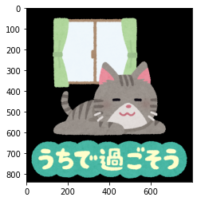

本記事はQrunchからの転載です。
___

画像をpngなどからjpgに変換したいときに、ぱっと思いつくのはファイルを読み込んで、それをjpgの拡張子で書き込みした後に再度読み込みなおすことです。
1度動かすならばそれでも良いのですが、何度も繰り返しおこなう場合にはファイルの読み書きの時間が気になります。

OpenCVではファイルへの読み書きをおこなうことなく、**メモリ上でファイル形式を変更**できる（jpgへの圧縮などができる）ような方法が提供されています。

流れとしては、**imencodeでメモリ上にファイル形式を変更したバイト列を作成**し、それを**imdecodeで画像に変換**するという流れになります。imencodeがファイルへの書き込み、imdecodeがファイルの読み込みに対応する感じになります。

# imencode

画像を他のファイルを形式に変更するimencodeは次のようにして利用します。

``` Python
ret, encoded = cv2.imencode(".jpg", img, (cv2.IMWRITE_JPEG_QUALITY, 10))
```

1つめの引数がどの拡張子に変換するかをあらわす文字列で、ここではjpgを指定しています。

3つめの引数に指定した拡張子に変換するときのパラメータを指定します。
例えばjpgの場合には画像の質を指定できますので、それをタプルの形式で与えており、ここではjpgの質を10で圧縮するようにしています。

imencodによって生成されたjpgになった画像の情報はencodedに格納されています。

# imdecode

メモリ上の画像データを読み込むimdecodeは以下のようにします。

``` Python
decoded = cv2.imdecode(encoded, flags=cv2.IMREAD_COLOR)
```

第一引数はimencodeの出力です。
flagsは何かしら指定しないといけないのですが、これはどう読み込むかをあらわすフラグです。
BGRの3channelで読み込む場合には**cv2.IMREAD_COLOR**を指定し、Gray scaleの1channelで読み込む場合には**cv2.IMREAD_GRAYSCALE**を指定します。

# 適用結果

jpgのqualityを10にしてimencodeした後にimdecodeした結果を元の画像と比較してみます。

　　　　　　　　元画像　　　　　　　　　　　　　　　　　　imdecode後の画像


右側の画像はノイズがのっていることが分かるでしょうか？ちゃんとjpgの形式で圧縮されたようです。
