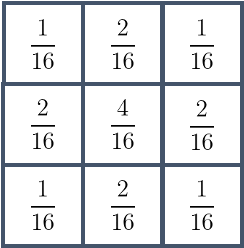
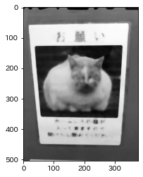

本記事はQrunchからの転載です。
___

今日はなにかとサンプルコードで使われるガウス平滑化です。

#  ガウス平滑化とは

前々回取り上げた単純平滑化は局所領域の平均をとることで、平滑化をおこないました。これは局所領域内の各ピクセルの重み付けがすべて等しいともいえます。
ガウス平滑化では二次元のガウス分布を離散化した値を重みとして利用するような平滑化になります。
$$g(x,y) = \frac{1}{2\pi\sqrt{\sigma^2}}\exp\left(-\frac{x^2 + y^2}{\sigma^2}\right).$$

# 単純平滑化との違いは？

具体的なカーネルの比較の例は以下のとおりです。

|単純平滑化|ガウス平滑化|
|--|--|
|||

ガウス平滑化の場合には中心の重みが大きく、そこから遠ざかるほど、重みが小さくなっていきます。

画像に与える影響の違いとしては、単純平滑化よりも中心の重みが大きいことで、平滑化後のボケが少ないことが挙げられます。

# 単純平滑化とガウス平滑化の違いを実験

OpenCVでガウス平滑化を使う場合は以下のようにすればOKです。

```Python
blur = cv2.GaussianBlur(img, ksize=(9, 9), sigmaX=2, sigmaY=2)
```

ksizeはカーネルの大きさ（局所領域のサイズ）、sigmaXはガウス分布のx方向の分散、sigmaYはy方向の分散になります。分散は0を入れると、デフォルト値を計算し、それを利用してくれます。

次のようなノイズを乗せた画像を用意しました。  


それぞれの平滑化の適用結果が以下のとおりです。すべてカーネルサイズは9×9です。
|単純平滑化|メディアンフィルタ|ガウス平滑化|
|--|--|--|
||||


単純平滑化とガウス平滑化を比べると、ガウス平滑化のほうが若干ノイズが多めの気がしますが、ボケが少ないです。
メディアンフィルタはノイズは取れますが、もとの情報が結構落ちてますね。
