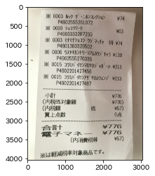
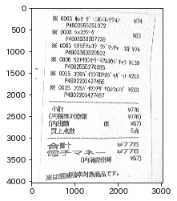

本記事はQrunchからの転載です。
___

画像処理で結構シビアなのが、照明環境です。
例えば次の画像のように、画像の中で明暗が異なると、大津の二値化ではうまくいきません。
入力画像


大津の二値化適用


とはいえ、アプリケーションによっては撮影者に常に気をつけてもらうことも難しかったりします。
そんなときにはAdaptiveThresholdが役に立ちます。

# AdaptiveThresholdとは？

OpenCVで使えるAdaptiveThresholdには2パターンあるのですが、まずは簡単な局所領域での平均を利用する方から説明します。

## 局所領域での平均を用いたAdaptiveThreshold

この方法では、ある座標$(x,y)$のピクセルの二値化をおこなうときには、$(x,y)$を中心としたある大きさの局所領域内の各ピクセルのグレースケール値の平均値を計算します。
この平均値から指定した定数を引いた値をしきい値$T(x,y)$とします。
もし$(x,y)$のグレースケール値が$T(x,y)$を超えれば255に置き換え（255以外にもこの値は指定できます）て、$T(x,y)$以下であれば、$0$にします。

ざっくり言えば、$(x,y)$の周辺領域の平均値を二値化のしきい値にするということになります。

こうすると何が良いかといえば、周辺領域が暗ければ、しきい値は暗い方に設定されますし、周辺領域が明るければ、しきい値は明るい方に設定されます。つまり、局所領域内である程度明暗がわかれていれば、きちんと二値化ができるということです。すごいですね。

この方法は、次のようにcv2.adaptiveThresholdによって利用可能です。

```Python
gray_img = cv2.cvtColor(img, cv2.COLOR_BGR2GRAY)
bi_img  = cv2.adaptiveThreshold(gray_img, 255, 
                                cv2.ADAPTIVE_THRESH_MEAN_C, 
                                cv2.THRESH_BINARY, 11, 5)
plt.imshow(bi_img)
plt.gray()
plt.show()
```



ちゃんとそれっぽく二値化されてます！

adaptiveThresholdの各引数は以下のとおりです。
局所領域は$(x,y)$を中心とした領域になるため、**領域の大きさは奇数で指定**しなければいけないことに注意してください。

| 引数 | 意味                                                         |
| ---- | ------------------------------------------------------------ |
| 1    | 入力画像                                                     |
| 2    | ここで説明した方法を使うことをあらわす値                     |
| 3    | threshold typeでこれは前々回説明したものと同じ               |
| 4    | 周辺領域の大きさで、11ということは11×11の領域で平均値を計算している |
| 5    | しきい値を決めるときに平均値から引かれる定数                 |

## 局所領域でのガウス分布による重み付を用いたAdaptiveThreshold

先程の平均値は局所領域内は平等に扱うような方法でしたが、問題によっては、局所領域の中心$(x,y)$に近いほど重要視して、遠ざかるほど影響を小さくしたいなぁと思うときがあります。
そんなときにはガウス分布による重み付けを利用することができます。

OpenCVで利用するときにはさきほどの第二引数を**cv2.ADAPTIVE_THRESH_GAUSSIAN_C**に変えるだけでOKです。

```Python
gray_img = cv2.cvtColor(img, cv2.COLOR_BGR2GRAY)
bi_img  = cv2.adaptiveThreshold(gray_img, 255, 
                                cv2.ADAPTIVE_THRESH_GAUSSIAN_C, 
                                cv2.THRESH_BINARY, 11, 5)
plt.imshow(bi_img)
plt.gray()
plt.show()
```


こちらも上手くいっています。

# おわりに

問題設定によっては平均の方だと上手くいかず、ガウス分布の重み付けのほうは上手くいったりしますので、そのあたりの使い分けは試行錯誤するしかないかなと思います。


