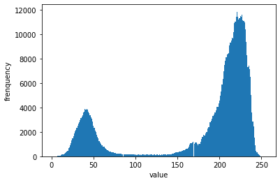
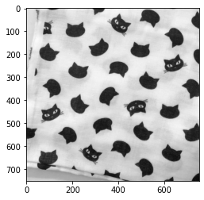
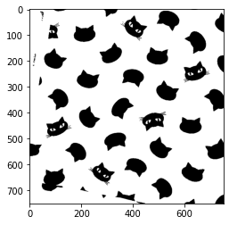

本記事はQrunchからの転載です。
___

# 大津の2値化とは？

シンプルな二値化では、何かしらのしきい値を決めてあげる必要がありました。

人間がグレースケール値のヒストグラムを見てしきい値を決めたり、試行錯誤するというのも良いですが、場合によってはしきい値を自動で決定したくなります。

そのような方法として有名なのが大津の2値化です。
大津の2値化を使うことで、ある意味での最適なしきい値を決定してくれます。

# 大津の2値化の中身は？

大津の2値化では、グレースケールのヒストグラムを描いたときに、山が2つ存在するケースを想定しています。例えば次のようなヒストグラムです。


つまり、画像の白い部分と黒い部分の区別がある程度はっきりとつくようなケースを指しています。
白いところ、黒いところ、それらの間くらいの色の3種類が多数を占めているような、ヒストグラム上で山が3つできるような状況は想定されていません（アプリケーションによっては、それでも上手くいくかもしれませんが）。

さて、ヒストグラムが2つの山をもつようなグレースケールの画像が与えられたとして、大津の2値化はどのようにしきい値を決めているのでしょうか？

大津の2値化では、しきい値以下のグレースケール値としきい値より大きい値のグレースケール値の2つのグループにわけ、それぞれの分散をそれぞれ計算した後、それらの重み付きの和を考えます。しきい値はこの分散の重み付き和が最小になるように決められます。

式であらわせば、グレースケール値のしきい値$t$、しきい値$t$以下のグループの分散$\sigma-2_1(t)$、しきい値より大きいグループの分散$\sigma^2_2(t)$、しきい値以下の値の個数$q_1(t)$、しきい値より大きい値の個数$q_2(t)$を用いて以下のようになります。

$$ \sigma^2(t)=p_1(t) \sigma^2_1(t) + p_2(t) \sigma^2_2(t).$$ 

大津の2値化では$\sigma^2(t)$を最小化するようなしきい値$t$を見つけます。

直感的には分散が最小になるようなしきい値を見つけるのは良い方法のように思えます。
なぜかといえば、谷の部分からしきい値を動かしていき、どちらかの山の一部が他方のグループに取り込まれると、取り込まれた分が与える分散の増加分が非常に大きいと予想できるからです。

# 大津の2値化の適用結果

大津の2値化を実際に適用してみます。
次のようなグレースケールの画像が与えられたとします。


この画像のグレースケール値のヒストグラムは以下のとおりです（先程のヒストグラムと同じものです）。


大津の2値化を適用する際にはThreshoold typeのところにcv2.THRESH_OTSUを追加します。

```Python
ret, bin_img = cv2.threshold(gray, 0, 255, cv2.THRESH_BINARY + cv2.THRESH_OTSU)
```

上記のようなコードを実行すると、大津の2値化によって2値化された画像が得られます。

```Python
img = cv2.imread("ex_img.jpg")
gray = cv2.cvtColor(img, cv2.COLOR_BGR2GRAY)
ret, bin_img = cv2.threshold(gray, 0, 255, cv2.THRESH_BINARY + cv2.THRESH_OTSU)
plt.imshow(bin_img)
plt.gray()
plt.show()
```


しきい値が自動で適切に設定され、キレイに二値化できてますね。

# ガウシアンフィルタとの組み合わせ

ここでは詳しくは述べませんが、ノイズが多い画像では、ガウシアンフィルタで平滑化することでノイズが軽減され、ヒストグラムの山がよりシャープになりえます。

そうすると、大津の2値化後の結果がより人間の感覚にあったものとなったりします。
