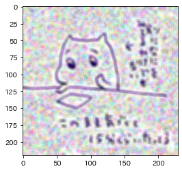

本記事はQrunchからの転載です。
___

単純平滑化の場合には、局所領域内での平均を取るため、周辺とは大きく異なるピクセル値をもつピクセルがあると、その影響が大きすぎて上手くいかない場合があります。
そのようなケースでは中央値を使うようにすると、上手くいくかもしれません。

# medianBlur

OpenCVではmedianBlurという関数で局所領域内の中央値を使うような平滑化をおこなえます。

以下がmedianBlurを実際に実行したコードになります。

```Python
import cv2
import matplotlib.pyplot as plt

image = cv2.imread('noro-min.jpeg')

blur = cv2.medianBlur(img, ksize=5)
blur = cv2.cvtColor(blur, cv2.COLOR_BGR2RGB)
plt.imshow(blur[:, :, ::-1])
plt.show()
```

人工的に画像にノイズを乗せて、blurとmedianBlurを適用した結果を比べてみます。
|ノイズを乗せた画像|blurを適用した画像|medianBlurを適用した画像|
|--|--|--|
||||


中央値を使うことで、ノイズを上手く取り除くことができています。
ただし、文字の部分などは結構ボケるようになりました。中央値を使うと、白い背景と近い部分のピクセルはすべて白に置き換えられてしまうからです。
