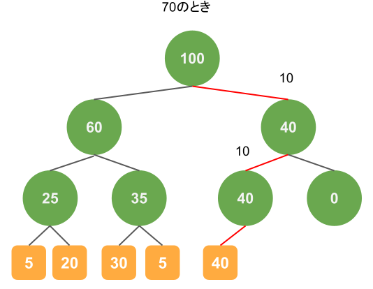
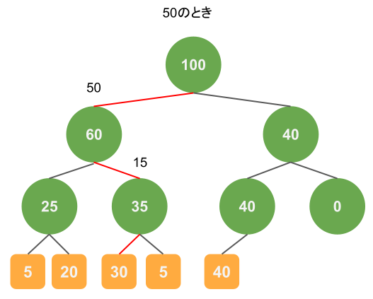

# 問題設定
次のような設定でサンプリングをしたいことはよくあると思います。
```
3つのデータがあり、それぞれに重みがつけられているとする。
それぞれ、データ1の重みは10、データ2の重みは20、データ3の重みは30である。
このときに各データの重みと全体の重みの和の比を確率としてサンプリングをしたい。
つまり、データ1は10/60、データ2は20/60、データ3は30/60の確率でサンプリングすることになる。
```

# シンプルな方法
さきほどの問題設定のとき、簡単にサンプリングする方法は正規化された重みの和を順に足していき、一様分布からサンプリングした乱数がその和を超えたときのデータを取得するという方法です。
手順は次のようになります。
1. 0~1の乱数を生成する。
1. i=0、sum=0とし、生成した乱数をsumが超えるまで以下を実行する。
    1. i番目のデータの重みを全体の重みの和で割る。
    1. 1.で計算した重みをsumに足す。
1. i番目のデータをサンプリングされたデータとする。

この方法は簡単に実装でき、理解も容易ですが、データの重みを順に足していくため、$O(n)$の計算量がかかります。


# Sum Tree
Sum Treeを用いれば、計算量のオーダーを$O(\log n)$にできます。


## 概要
### 木の構成
Sum Treeでは二分木を作成し、各ノードがもつ重みを用いてサンプリングの処理をおこないます。
各ノードの重みはそのノードにぶら下がっている葉の重みの和になります。

図をもちいて具体例を示します。  
データは5つで重みはそれぞれ5、20、30、5、40としたときには以下のような木が作られます。


緑色の丸はノード、オレンジは葉になります。葉の数値はデータの重み、ノードの数値はノードにぶら下がっている葉の重みの和です。

### サンプリング
サンプリングはシンプルです。
1. 0からrootノードの重みの間の乱数を生成する。これをvとおく。
1. rootノードから葉にたどり着くまで、以下の処理を繰り返す。
    1. 左の子の重みがv以上ならば、左の子のノードに移動する。
    1. 左の子の重みがv以上でなければ、右の子のノードに移動する。またv=v-（左の子の重み）とする。
1. たどり着いた葉をサンプリングされたデータとする。

これだけだとよく分からないと思うので次から例をみていきます。
#### サンプリングの例1
1つめのサンプリングの例は次のとおりです。乱数が70のときは以下の赤のような経路を通ります。


処理をおっていくと、はじめにrootノードが100という重みをもっているので、70を生成したときは右の子ノードに移ります。
このとき、左側の子ノードの重みを生成した値から引くことで、右側のノードの重み(40)以下の値になることが保証されます。
ノードの重みで引いた値が10になるため、次に左側のノードにいき、結果として40の重みをもつデータがサンプリングされています。  
この葉にたどり着く確率は$$\frac{40}{100} \times \frac{40}{40} \times \frac{40}{40} = \frac{40}{100}$$となりますので、狙い通り40%の確率でサンプリングできます。

また、見てわかるように、二分木を使うことで葉の重みを個別には見ずに和を利用するため、計算量を減らすことができています。  

#### サンプリングの例2
また別の例として乱数が50のときも示します。


重み30の葉にたどり着いていますが、そうなる確率は
$$\frac{60}{100} \times \frac{35}{60} \times \frac{30}{35} = \frac{30}{100}$$です。

### サンプルコード
Python実装を最後に示します。

```Python
import numpy as np
from typing import List, Optional, Union


class Node:
    def __init__(self, weight, parent):
        self.weight: int = weight
        self.left: Optional[Node, Leaf] = None
        self.right: Optional[Node, Leaf] = None
        self.parent: Optional[Node, Leaf] = parent


class Leaf:
    def __init__(self, parent):
        self.weight = 0
        self.val = 0
        self.parent: Optional[Node] = parent


class SumTree:
    def __init__(self, max_leaves):
        self._root: Node = Node(weight=0, parent=None)
        self._max_leaves: int = max_leaves
        self._leaf_index: int = 0
        self._reached_limit: bool = False
        self._all_leaves: List[Leaf] = []
        self._init_tree()

    def _init_tree(self):
        hierarchy = int(np.ceil(np.log2(self._max_leaves)))
        pre_hierarchies = [self._root]
        for _ in range(1, hierarchy):
            new_hierarchies = []
            for pre_hierarchy_node in pre_hierarchies:
                left_node = Node(0, paent=pre_hierarchy_node)
                right_node = Node(0, parent=pre_hierarchy_node)
                pre_hierarchy_node.left = left_node
                pre_hierarchy_node.right = right_node
                new_hierarchies.append(left_node)
                new_hierarchies.append(right_node)
            pre_hierarchies = new_hierarchies

        for node in pre_hierarchies:
            node.left = Leaf(parent=node)
            node.right = Leaf(parent=node)
            self._all_leaves.append(node.left)
            self._all_leaves.append(node.right)

    def _update_node_weight(self, node: Node):
        while node:
            weight_sum = 0
            if node.left:
                weight_sum += node.left.weight
            if node.right:
                weight_sum += node.right.weight

            node.weight = weight_sum

            node = node.parent

    def __len__(self):
        return self._max_leaves if self._reached_limit else self._leaf_index

    def __getitem__(self, item):
        if item >= self.__len__():
            raise Exception("index out of range")

        if not self._reached_limit:
            idx = item
        else:
            idx = self._leaf_index + item
            if idx >= self._max_leaves:
                idx -= self._max_leaves
        return self._all_leaves[idx]

    def add(self, val, weight):
        target_leaf = self._all_leaves[self._leaf_index]
        target_leaf.val = val
        target_leaf.weight = weight 

        self._leaf_index += 1
        if self._leaf_index >= self._max_leaves:
            self._leaf_index = 0
            self._reached_limit = True

        self._update_node_weight(target_leaf.parent)

    def sample(self):
        target_val = np.random.random() * self._root.weight
        target_node = self._root
        while True:
            if target_node.left.weight > target_val:
                target_node = target_node.left
            else:
                target_val -= target_node.left.weight
                target_node = target_node.right

            if isinstance(target_node, Leaf):
                break

        return target_node

```

次のように使用します。
```Python
st = SumTree(max_leaves=10)

st.add("a", 5)
st.add("b", 20)
st.add("c", 30)
st.add("d", 5)
st.add("e", 40)

st.sample()
```

次のようにして、サンプリングが上手くいっているかどうかを確認できます。
```Python
count_dict = {"a": 0,
               "b": 0,
               "c": 0,
               "d": 0,
               "e": 0}
               
for i in range(100000):
    count_dict[st.sample().val] += 1
print(count_dict)
# {'a': 4941, 'b': 19941, 'c': 29892, 'd': 5234, 'e': 39992}
```

