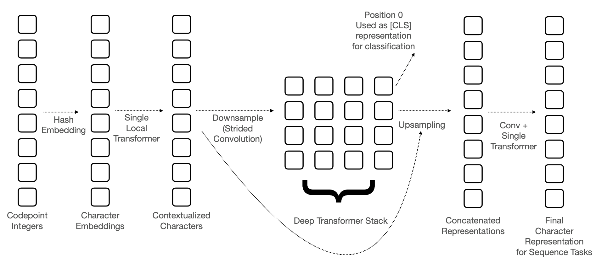

BERTの系列でCharacterレベルでのembedding手法であるCANINEが提案され、これに似たような手法が盛んになるのではという考えのもと論文を読んだメモを書いておきます。
CANINEってなんて読むべきなんでしょう？

論文はこちら：[https://arxiv.org/pdf/2103.06874.pdf](https://arxiv.org/pdf/2103.06874.pdf)

# エンコーダーのアーキテクチャ
CANINEのアーキテクチャは以下のようになっています。

以下では各々の詳細について述べます。
## 入力の作り方
### 文字列から数値列への変換

エンコーダーへの入力は文字単位でおこないます。

各文字はunicodeの番号に変換され、それがエンコーダーの入力になります。Pythonであれば、ord関数を使うだけで良いです。

unicodeを使うことで、簡単に入力文を数値列に変換できるうえ、各文字にIDを振って辞書を作成するような手間が不要になります。

### 文字のembedding

文字はunicodeの番号に変換されたあと、embedding（ベクトル）に変換されます。
BERTなどはsubwordに対応したベクトルを参照すれば良いですが、CANINEの場合に同じことをしようとすると、14万3000個の文字ごとに768次元のベクトルを用意する必要があるために難しいです。
このため、CANINEではword hash embedding trickというものを利用します。

これは、ある文字のunicodeの番号を$x_i$としたとき、次のようにベクトルを生成します。

$$\bold{e}_i = \oplus_k^K {\rm LOOKUP}_k(\mathcal{H}_k(x_i)\\ \\% \\  B, d')$$

ここで${\rm LOOKUP}_k(x, d)$はベクトルの一覧の中から、与えられた値$x$に対応した$d$次元のベクトルを返す関数をあらわします（つまり$\mathbb{R}^{B \times d'}$のサイズの行列の特定行を返すような関数）。また$\oplus$	はベクトルの結合を、$\mathcal{H}_k$はハッシュ関数を、$B$は与えられた自然数をあらわします。論文中では$K=8, B=16k, d'=768/K(=96)$となっています。

unicodeの番号のハッシュ値に応じて得られた96次元のベクトルを結合することで、768次元のベクトルを生成しています。この処理によって生成されうるベクトルの種類は$16 \times 32 \times \dots \times 2048 \approx 1.1529215 \times 10^{18}$なので、豊富な表現力をもつこととなります。

## ダウンサンプリング
BERTでも同じことがいえますが、文字単位で入力を与えると入力の数が多くなるため計算量が多くなってしまいます。Transformerで行われる行列積は入力長の二乗のオーダーの計算量になるため、入力長を小さくすることは計算量削減に大きく寄与します。
そのためCANINEではダウンサンプリングを用いて、後続のネットワークへの入力を少なくする方法を提案しています。

ダウンサンプリングは以下のようにおこなわれます。
1. 文字のembeddingに対してblock単位でのTransformerを1度だけ適用する。
    * これは128字単位で文字を区切り、その中でself-attentionを実行することを指します。blockに区切ることで計算量削減ができます。
1. strideのサイズが4のConvolutionを実行する。

1つめのTransformerで文字レベルのembeddingから局所的な情報を得ており、そのあとにstrideが4のConvolutionを実行することで、情報を集約して入力長を1/4に減らすことができます。  
論文では最大で2048字を入力できるようにしていますが、strideのサイズが4のConvolutionを利用することで後続の処理には最大で512個のシーケンスが与えられることになります。

ダウンサンプリング後のシーケンスは、BERTなどのようにTransformerを重ねたネットワークへ与えられます。

## アップサンプリング
固有表現抽出やQAなどのタスクを解くために、入力と同じ長さの出力が必要になります（分類問題は[CLS]に対応するトークンを利用すれば良い）。
このため、次のようにしてアップサンプリングをおこない、入力と同じ長さの出力を得ます。

1. Transformerの出力のシーケンスをダウンサンプリングのstrideの分だけ複製し、ダウンサンプリング前の入力長と一致するようにする。
    * 出力のシーケンスが$(o_1,o_2,\dots)$のときに$(o_1, o_1,o_1,o_1, o_2,o_2,o_2,o_2,\dots)$とすることを指しているはず。
1. 1のシーケンスとダウンサンプリングでのblock単位でのself-attentionでの出力を結合する。
    * つまり、各ベクトルは高度な文脈情報と局所的な文脈情報をもつことになります。
1. 結合されたシーケンスへConvolutionを適用することで倍になった次元を結合前の次元に戻す（論文ではkernel sizeは4）。
1. 最後にTransformerを一度適用する。

## 学習
CANINEの事前学習のタスクには文字単位とsubword単位がありますが、性能は問題によって少しだけ変わります。
各タスクの詳細は以下のとおりです。
### 文字単位のタスク
入力されるテキストを単語単位で選択し、その単語を文字単位でmaskし、maskされた文字を予測するタスクです。  
予測するときには文字を左から順に予測するなどのような順番が決まっておらず、maskされているなかからランダムな順番で予測をすることになります。

### サブワード単位のタスク
こちらのタスクではsubword単位で選択し、そのsubwordを文字単位でmaskし、maskされたsubwordを予測するタスクです。  
予測するときにはmaskしたsubwordに含まれる文字に対応する出力をランダムに選択し、その出力からsubwordを予測します。

# 実験
実験はTYDI QAデータセットを用いておこなわれています。

## 他手法との比較
mBERTとの比較が次のテーブルになります。

CANINE-Sはサブワード単位のタスクで事前学習したとき、CANINE-Cは文字単位のタスクで事前学習したときをあらわします。一番右の2つの列はタスクの性能で、F1スコアで計算されているため大きいほうが良いです。
結果を見るとmBERTに大きな差をつけていることがわかります。
また、Example/secの列をみると、mBERTは文字単位の入力にすると非常に推論が遅いですが、CANINEはそれに比べると非常に速いです。とはいえ、mBERTのsubword単位の入力の場合に比べると当然遅いです。
## ablation study
ablation studyです。

個人的に気になったところとしては、ダウンサンプリングのときによりstrideをもっと大きくすると計算量が減るのですが、この結果をみるとstrideを大きくすることで結構性能が下がってしまっています。これは残念。
embeddingの次元も小さくすると性能が結構下がっていますね。

