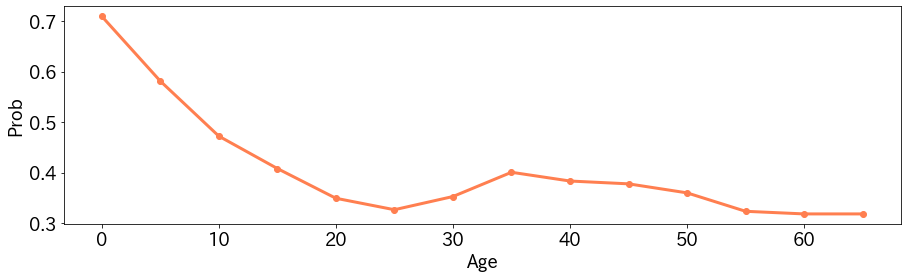
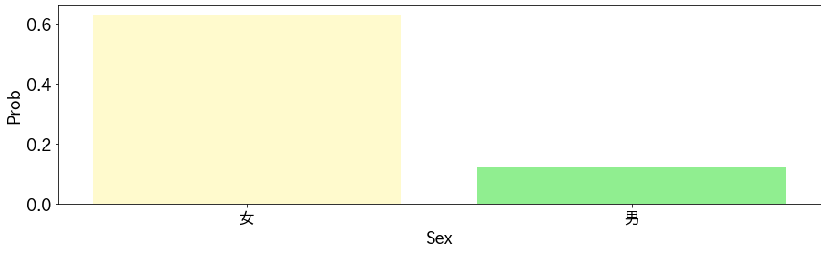

Partial Dependence Plotは任意のモデルのある特徴量に対するglobalな挙動を確認できる手法です。  
例えば、特徴量が大きくなるにつれ、モデルの出力がどういった変化をするかがわかります。

# Partial Dependence Plotの概要
学習済みのモデル$f$へ入力する特徴量$x$のうち、$i$番目の特徴量の変化に対する$f$の出力の挙動の変化を確認したいとします。  
このとき、次のようにモデルの出力の期待値を計算します。
$$ E_{X_C}[f(x_i, X_C)] = \int p(X_C) f(x_i, X_C) dX_C .$$ 
ここで$X_C$は$x_i$以外の特徴量になっていまして、$x_i$の値だけを固定し、それ以外の特徴量について積分をしています。  
こうすることで、$x_i$の値により、おおよそどれくらいの出力の差が出るのかがわかります。

注意点として、$x_i$と$X_C$は独立でなければいけません。  
独立でないときには$x_i$は$X_C$の関数としてあらわされるため、期待値の計算において$X_C$の変化にともない、$x_i$が変化することになります。こうなると、$x_i$が固定という前提と一致しなくなります。

# Partial Dependence Plotの実験
kaggleのtitanicの問題でPartial Dependence Plotを試してみます。
モデルはLightGBMの勾配ブースティング法を利用しています。

期待値の計算は訓練データの特徴量$X_{C_{j}},j=1,2,\cdots,n$を用いて以下のように近似値を利用しています。
$$ E_{X_C}[f(x_i, X_C)] = \int p(X_C) f(x_i, X_C) dX_C \approx \frac{1}{n} \sum_{j=1}^n f(x_i,X_{jC}) .$$ 


## 年齢に対するPartial Dependence Plot
年齢を$0,5,10,\cdots,65$と変化させてみた結果が以下のとおりです。


年齢が低いほうが、生存しやすかった傾向が読み取れます。また35歳にピークがありますので、なにか理由がありそうです。例えば、年齢があがるほど客室のクラスが良くなりやすいのかもしれません（そうだとすると年齢と客室のクラスは独立ではないのかという話になりますので、実際にはここの考察が必要になりそうです）。

## 性別に対するPartial Dependence Plot
性別についても結果を示します。

女性のほうが生存しやすかったという傾向が見て取れます。

## 実装
実装は次のとおりです。
```python
import numpy as np
from typing import List

def get_partial_dependence_func_val(model, 
                                    x:np.ndarray,
                                    target:str,
                                    candidates:List) -> List[float]:
    
    expecteds = []
    replaced_x = x.copy()
    for replaced_val in candidates:
        replaced_x[target] = replaced_val
        preds = model.predict(replaced_x)
        expecteds.append(preds.mean())
        
    return expecteds

candidates = range(0, 70, 5)
target = "Age"
ppd = get_partial_dependence_func_val(model, 
                                      train_x,
                                      target=target,
                                      candidates=candidates)

```

# まとめ
Partial Dependence Plotは実装が簡単で、わかりやすい結果が得られます。  
ただし、特徴量間が独立でないときは仮定が崩れますので、注意が必要です。
