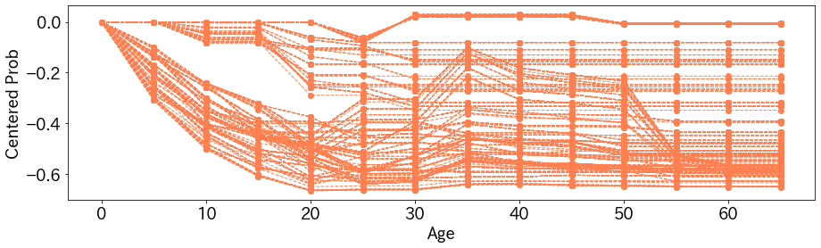

Individual Conditional Expectation(ICE)は任意のモデルのある特徴量に対するデータごとの挙動を確認する手法です。  
例えば、ある特定のデータのある特徴量が大きくなるにつれ、モデルの出力がどういった変化をするかを見ます。

PDPの記事を先に見ると、理解がはやいかと思います。  
[Partial Dependence Plotの解説記事](https://opqrstuvcut.github.io/blog/posts/partial-dependence-plot/)

# Individual Conditional Expectationの概要
ICEは冒頭に述べたとおりなので、あまり細かい話をする必要がないのですが、Partial Dependence Plot(PDP)との違いを述べておきます。  
PDPはデータの集合の全体に対して、ある特徴量の値を順に変化させていき、そのときのモデルの出力の平均値をみる方法でした。  
一方で、ICEはモデルの出力の平均値を取らず、データごとに変化をみます。そのため、PDPだと一本の曲線がプロットできますが、ICEではデータの数だけ曲線がプロットできます。

# Individual Conditional Expectationはの実験
kaggleのtitanicの問題でIndividual Conditional Expectationを試してみます。
モデルはLightGBMの勾配ブースティング法を利用しています。

## 年齢に対するIndividual Conditional Expectation 
年齢を$0,5,10,\cdots,65$と変化させてみた結果が以下のとおりです。縦軸はタイタニックに乗った乗客の生存確率の予測値です。1つ1つの曲線が1つの乗客に対応します。  
  
これを見ると、傾向として年齢が大人になるくらいまでは、年齢とともに生存確率が下がっていきます。これは直感に合った結果です。
変わったところでいくと、生存確率が年齢の変化とともに変わらない人がいます。  
生存確率が0.7以上であり続けた人のデータを軽く確認したところ、性別は全員女性でした。PDPのときもそうでしたが、女性の生存確率が高いモデルになっているのがここからもわかります。

また、ICEでは左端の値をすべてのデータで揃えることで見やすくすることがあります。  
各データごとに、0歳のときの予測値でそれぞれの予測値を引いてみた結果が以下のとおりです。
  
データの変化の比較がしやすくなりましたね。

## 実装
実装は次のとおりです。
```python
import pandas as pd
from typing import List

def individual_conditional_expectation(model, 
                                       x:pd.DataFrame,
                                       target:str,
                                       candidates:List) -> np.ndarray:
    
    replaced_x = x.copy()
    ice_vals = np.empty((len(x), len(candidates)), dtype=float)
    for i, replaced_val in enumerate(candidates):
        replaced_x[target] = replaced_val
        preds = model.predict(replaced_x)
        ice_vals[:, i] = preds
        
    return ice_vals

candidates = range(0, 70, 5)
target = "Age"

ice = individual_conditional_expectation(model, 
                                         train_x,
                                         target=target,
                                         candidates=candidates)
```

# まとめ
PDPのようにICEも実装が簡単で、わかりやすい結果が得られます。  
