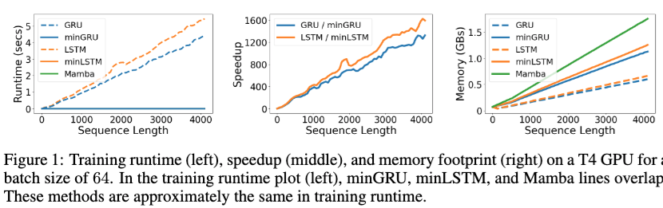
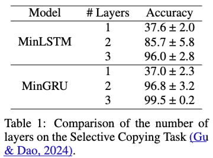
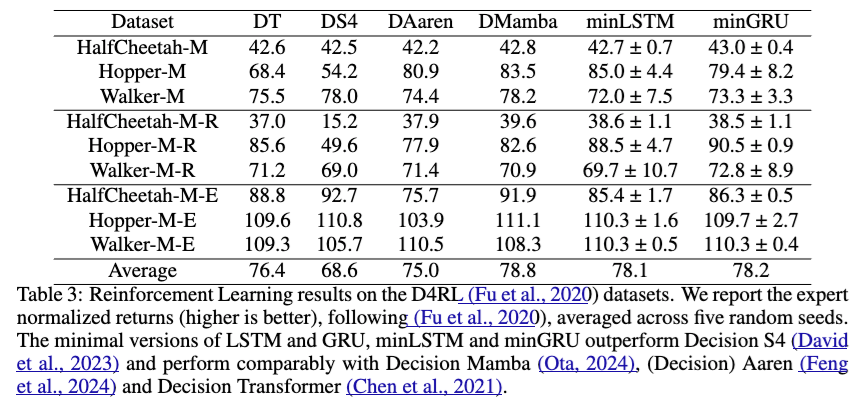
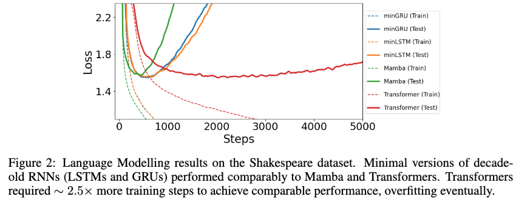

Were RNNs All We Needed?を読んだので、その内容をまとめておきます。  
https://arxiv.org/abs/2410.01201

## 概要
Transformerを用いたアーキテクチャの場合、推論に時系列長の二乗に比例した計算量が必要となるため、単純には非常に長い時系列データを扱うことはできません．  
ちょうど一年前くらいにMambaという状態空間モデルベースの手法が提案されており、このMambaならば時系列長に比例した計算量となるため計算量的にはMambaが好ましいです．また学習も効率良くおこなえるうえ、精度的にも良い性能が得られることが分かってきており、有望な手法の1つです．

旧来のLSTMやGRUといったRNNベースの手法の場合はMambaとも似ているように思えますが、BPTTをおこなって学習をしていく必要があり、この点が長い時系列の学習においてネックとなります．というのも、BPTTでは時系列を遡って順に計算をおこなっていく必要があり、これは時系列長の分だけ深いネットワークを利用しているようなもので、どうしても計算時間が長くなってしまいます．
一方でTransformerはBPTTが不要で、必要な計算は並列化して効率よく学習ができます．  
本論文では状態空間モデルベースの手法からインスパイアされた、LSTMやGRUを修正して効率的に学習をおこなえるようにした手法を提案しています．

## Mamba
Mambaをさらっと説明すると、次のように入力 $x_t \in \mathbb{R}$ と1つ前の時刻の隠れ状態 $h_{t-1} \in \mathbb{R}^n$ を用いて、次の時刻の隠れ状態 $h_t$と出力$ y_t \in \mathbb{R}$ を計算するモデルです． 

$$
\begin{align*}
h_t &= A_t h_{t - 1} + B_t x_t \\\
y_t &= C_t h_t
\end{align*}.
$$
ここで、 $A_t \in \mathbb{R}^{n\times n}, B_t \in \mathbb{R}^n, C_t \in \mathbb{R}^{1 \times n} $ です．

上記の隠れ状態の更新と出力値の計算方法より、
* 時系列長に比例した計算量で推論が可能
* 時系列長に依存しないメモリ使用量

とわかります．  

### 選択メカニズム
Mambaの大事なポイントとして、係数$A_t \in \mathbb{R}^{n\times n}, B_t \in \mathbb{R}^n, C_t \in \mathbb{R}^{1 \times n} $ は入力$ x_t $に依存する値です．これにより、Selective Copying TaskとInduction Heads Taskを解けるようになっています．これは隠れ状態へ入力に関する情報を取り込むかどうか、あるいは隠れ状態の情報を捨てるかを入力値に依存して動的に変えることでモデルの性能が高まったということを意味します．  
また、これはRNNのゲート機構を内包した形になっていることも論文中で示されています．   
詳しくは[Mambaの論文](https://arxiv.org/abs/2312.00752)を参照して下さい．

### 効率的な実装
MambaではGPUを効率的に利用できるようなParallel Scanアルゴリズム（Parallel Scan自体は一般的なアルゴリズムです）を提案しています。これにより、逐次的な更新式であるにも関わらず、学習のときには高速に順伝搬と逆伝播を計算できます．  
こちらも詳しくは[Mambaの論文](https://arxiv.org/abs/2312.00752)を参照して下さい．

## 提案手法
### 時系列モデルの学習の効率化の方針
LSTMやGRUといったRNNベースの手法もMambaのように長い時系列長に対しても効率よく学習ができると嬉しいです．  
ここで手がかりになるのが、次のような形の更新式であれば[Heinsenの手法](https://arxiv.org/abs/2311.06281)を用いて並列計算により高速化できるというものです．
$$
\begin{align}
v_t = a_t v_{t-1} + b_t,
\end{align}
$$
ここで$v_t, a_t, b_t \in \mathbb{R}$です．
詳しい説明は省きますが、この方法のキモは、累積和の計算については一般に高速に並列に実行する方法が存在するため、$\log v_t$を累積和を用いる形であらわすように式変形を施していく部分になります．

もしLSTMやGRUをうまく上式の形に修正できれば、高速な学習ができるようになります．論文ではそのような形に修正したLSTMをminLSTM、GRUをminGRUと呼んでいます．

### minGRU
GRUは次のように計算がおこなわれます．
$$
\begin{aligned}
h_t &= (1 − z\_t) \odot h\_{t-1} + z_t \odot \tilde{h}\_t \\\
z_t &= \sigma({\rm Linear} ([x_t, h_{t-1}])) \\\
r_t &= \sigma({\rm Linear} ([x_t, h_{t-1}])) \\\
\tilde{h}\_t &= \tanh({\rm Linear} ([x_t, r_t \odot h_{t-1}]))
\end{aligned}
$$

$h_t$の更新式を式(1)の形に修正する必要があるため、大胆に次のようにします．
$$
\begin{align*}
z_t &= \sigma({\rm Linear} (x_t)) \\\
\tilde{h}\_t &= {\rm Linear} (x_t) \\\
h_t &= (1 − z_t) \odot h_{t-1} + z_t \odot \tilde{h}_t
\end{align*}
$$

式(1)の変数との対応は$a_t$が$1-z_t$、$b_t$が$z_t \odot \tilde{h}\_t$、$v_t$が$h_t$と考えれば、Heinsenの手法が適用できる形になっています．なお、$z_t$と$\tilde{h}\_t$から1つ前の時刻の隠れ状態$h_{t-1}$への依存をなくす形にしてしまったため、リセットゲートの$r_t$が不要になりました．  
また、$\tilde{h}_t$から$\tanh$が消えていますが、これはもともと$h_t$と$\tilde{h}_t$のスケールを合わせて学習を安定させるためのものでした．しかし、$\tilde{h}\_t$が$h\_{t-1}$に依存しなくなり、一般には$x_t$がすでに正規化が施されていることを考えると、$\tanh$でスケールをわざわざ調整しなくても問題がないという理解です（ちょっと自信がないですが）．

このような修正をしてしまって良いのかなと思うのですが、前の時刻の状態$h_{t-1}$と入力に関する情報$\tilde{h}_{t}$の取捨選択を入力のみに依存しておこなっているという解釈ができ、これってMambaとやろうとしていることは似ているのですよね．ということで、実は性能にはそれほど悪い影響はないのかもしれません．

### minLSTM
LSTMは次のように計算がおこなわれます．
$$
\begin{aligned}
h_t &= o_t \odot \tanh(c_t) \\\
o_t &= \sigma({\rm Linear}([x\_t, h\_{t-1}])) \\\
c_t &= f_t \odot c_{t-1} + i_t \odot \tilde{c}_t \\\
f_t &= \sigma({\rm Linear}([x\_t, h\_{t-1}])) \\\
i_t &= \sigma({\rm Linear}([x\_t, h\_{t-1}])) \\\
\tilde{c}_t &= \tanh({\rm Linear}([x\_t, h\_{t-1}]))
\end{aligned}
$$

こちらも式(1)の形に修正する必要があるため、大胆に次のようにします．
$$
\begin{aligned}
h_t &= f_t' \odot h_{t-1} + i_t' \odot \tilde{h}_t \\\
f_t &= \sigma({\rm Linear}(x\_t)) \\\
i_t &= \sigma({\rm Linear}(x\_t)) \\\
\tilde{h}_t &= {\rm Linear}(x\_t) \\\
f_t'&= \frac{f_t}{f_t + i_t} \\\
i_t'&= \frac{i_t}{f_t + i_t} \\\
\end{aligned}
$$

式(1)の変数との対応は$a_t$が$f_t'$、$b_t$が$i_t' \odot \tilde{h}_t$、$v_t$が$h_t$と考えれば、Heinsenの手法が適用できる形になっています．
LSTMにはの出力ゲートの$o_t$がありましたが、$h_t$ のスケールを変化させてしまうため、minLSTMでは削除したうえで$h_t = c_t$としています．

結局、minLSTMもminGRUのように現在の状態と入力に関する情報の取捨選択を入力に依存しておこなう形になります．minGRUでは取捨選択の重み付けのために$z_t$を計算していましたが、minLSTMでは$f_t$と$i_t$の2つを別個に計算しているのが異なる点になります．このため、少しだけminGRUのほうが計算量が少なくなります．

## 実験
### 速度
以下の図が無事にLSTMやGRUと比べて提案手法が高速に学習ができるようになったことをあらわずものです．

左から順に時系列長毎の訓練時の実行時間、スピードアップの比率、メモリ使用量になります．長い時系列であるほど提案手法の恩恵を受け高速になっていることがわかります．またメモリ使用量については、Parallel Scanのために計算結果を冗長にメモリに保持する必要があることから少し増加しています．Mambaのメモリが少し大きいのは$h_t$の係数が行列であることが理由ですかね？

### 精度
#### Selective Copying Task
次の表はSelective Copying TaskをMinLSTMとMinGRUで学習したときの精度になります．

一層だけのときはあまりTaskを解くことができません．これは、一層目については入力$x_t$を線形変換してその結果を重みに従って$h_t$に足し合わせていっているだけなので、contextを加味した処理というのがおこなわれていないためです．
層を重ねていくことでcontextを加味して複雑な情報を扱うことができるようになっています．  
またminLSTMの精度が少し低く分散も大きいですが、これは$f_t$と$i_t$を別個に学習するために最適化が難しいためです．個人的にはGRUのように$z_t$1つだけを計算して重み付けするほうが自然な気もします．

#### 強化学習
次は強化学習のデータセットに対してDecision Transformerなどの手法との比較になります．

各スコアは大きいほうが良いですが、Decision Transformerを平均的には超えています．Mambaよりもちょっとだけ低いくらいですね．

#### 言語モデル
最後に言語モデルのタスクについてTransformerとの比較になります．データセットはシェークスピアのデータセットです．

言語モデルのタスクでも良い結果が得られています．
特にTransformerと比べると、ステップで比較すれば収束が非常に速くTestのLossは同程度です（図だと分かりづらいですが、TestのLossはminGRUが1.548、minLSTMが1.555、Mambaが1.575、Transformerが1.547とのことです）．
ただ、学習の実行時間の比較も欲しかったですね…。

## 感想など
Parallel Scanの枠組みのなかで手法を考えればこれほど高速な時系列モデルになるのが驚きました．  
精度面ではなぜこれほど良い結果になるのかイマイチ分かりませんでした．素のLSTMやGRUも学習の困難さがもし取り除けたとすれば、同じような高い精度になるのでしょうか？大規模データセットやScaling Lawが成り立つのかなどは今後に注目だと思います．
いずれにせよ、一旦はこのタイプの手法の研究が多くなりそうだなと思いました．実務者としては理想的には少ないGPUで学習ができ、小さめのリソースの本番環境で動かせると嬉しいので、この方向で研究が進むと嬉しいです．
