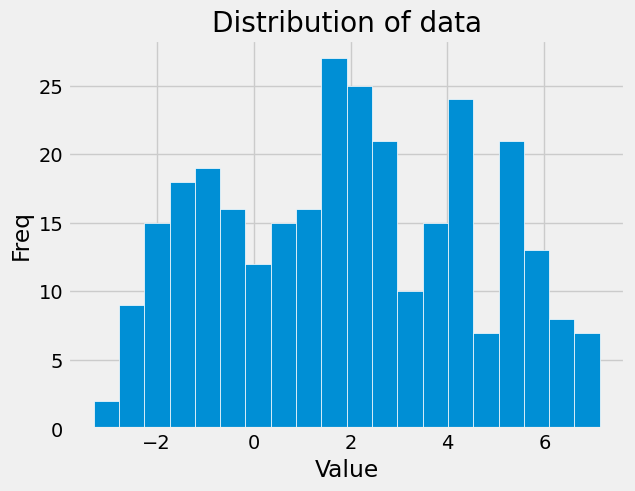
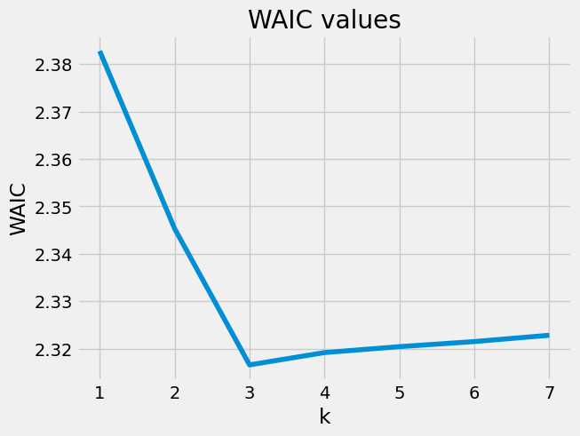

かなり前に「渡辺澄夫ベイズ理論100問 with R/Stan」を読み終わったのもあり、忘れないうちにWAICを自分なりにまとめておきます．

## WAIC

### WAICの適用範囲

情報量基準のAICやTICは正則性を仮定していますが、実際には正則性が成り立たないケースが多いです．  
WAICは正則性を仮定せずとも利用できる情報量基準になっていて、適用範囲が広いです．ただし、どんなケースでもOKかといえばそうではなく、次の条件を満たしている必要があります（「渡辺澄夫ベイズ理論100問 with R/Stan」の(1.21)）．

> $$
> \mathbb{E}_X \left[\left \\{ \log \frac{p(X| \theta\_{&#42;})}{p(X|\theta)} \right \\}^2 \right] \leq c \mathbb{E}_X \left[\log \frac{p(X| \theta\_{&#42;})}{p(X|\theta)}  \right].
> $$

上記の$c>0$は定数、$\theta$はモデルのパラメーター、$\theta\_{*}$は真の分布$q$とのKLダイバージェンスを最も小さくするモデルのパラメーターをあらわします．

この条件を満たすとき、統計モデル$\\{p(\cdot|\theta)\\}_{\theta \in \Theta}$および真の分布$q$に対して対数尤度比関数が相対的に有限な分散をもつといいます．これが意味するところを考えてみます．  
左辺は対数尤度比の二乗の期待値ですが、
$V[X] = \mathbb{E}[X^2] - \mathbb{E}[X]^2 \leq \mathbb{E}[X^2]$ですから、

$$
V_X \left[\log \frac{p(X| \theta&#42;)}{p(X|\theta)}  \right] \leq c \mathbb{E}_X \left[\log \frac{p(X| \theta&#42;)}{p(X|\theta)}  \right].
$$

といえます．このため、対数尤度比の分散は期待値に比例した値以下になるという解釈で良さそうです．  
「相対的に」の意味は書籍からははっきりとは読み取れなかったのですが、（右辺の期待値に対して）相対的に有限ということなのかなと思っています．

### WAICの定義

さて、WAICはどうやって計算するのかという話になりますが、以下のようにWAICが定義されています．

$$
{\rm WAIC_n} := T_n + \frac{1}{n}V_n.
$$

上記の$T_n$は経験損失をあらわし

$$
\begin{align*}
T_n &:= - \frac{1}{n}\sum_{i=1}^n \log r(x_i|x_1,\cdots, x_n), \\\\
r(x|x_1,\cdots,x_n) &:= \int_{\Theta} p(x|\theta) p(\theta|x_1,\cdots,x_n) {\rm d}\theta
\end{align*}
$$

です．また、$V_n$は負の対数尤度の事後分散の和であり、

$$
\begin{align*}
V_n &:= \sum_{i=1}^n \mathcal{V}(x_i), \\\\
\mathcal{V}(x) &:= \int_{\Theta} (-\log p(x|\theta) - \mathcal{E}(x))^2 p(\theta|x_1,\cdots,x_n) {\rm d}\theta,\\\\  \mathcal{E}(x) &:= \int_{\Theta} -\log p(x|\theta) p(\theta|x_1,\cdots,x_n) {\rm d}\theta
\end{align*}
$$

になります．

これらの式をみてわかるように、AICやTICあるいはBICのような頻度論的なモデル向けの手法とは異なり、WAICはベイズモデル向けの話になっています．

### WAICの意味

AICは、手元にあるデータを用いてモデルの未知のデータへの予測性能を推定しようとしています．AICは負の対数尤度の平均にパラメータ数/データ数を足したものを計算することになりますが、これは未知のデータに対する予測性能を平均的には正しく推測するための補正項を負の対数尤度に足しているという見方ができます．

WAICの場合も似たような格好になっていまして、$V_n/n$を経験損失に足すことで、平均的には経験損失を用いて汎化損失を推定することができるようになります．
理論的には$V_n/n$の部分が汎化損失に近づけるための補正の項になっています．$V_n/n$が補正の役目をおこなえることは、相対的に有限な分散を持つという仮定を用いて示されます（「渡辺澄夫ベイズ理論100問 with R/Stan」の命題38）．

また、式の別の解釈も考えていきます．  
AICの場合には尤度とパラメータ数の2つの項からなっており、前者はモデルのデータへの適合度合い、後者はモデルの複雑さをあらわしていました．このため、AICは適合度と複雑さの良い塩梅を取るようなものと考えることができます．
WAICの場合も同じように、経験損失はデータへの適合度合いをあらわし、事後分散の部分はモデルの複雑さをあらわしていると言えます．一般的なバイアス・バリアンスの話のように、モデルが複雑なほど事後分散が大きくなりやすいですから、このように解釈ができると思います．

### WAICの計算

次に実際に計算方法について見ていきます．

pymcなどでサンプリングした対数尤度をあらわす(MCMCのサンプル数, データ数)のshapeの行列があるとします． そのとき、下記のようにWAICを計算できます．特に難しいことをやっておらず、式の通りの計算になっています．

```python
import numpy as np


def T_n(log_likelihood: np.ndarray) -> np.ndarray:
    return -np.mean(np.log(np.mean(np.exp(log_likelihood), axis=0)))


def V_n(log_likelihood: np.ndarray) -> np.ndarray:
    return np.sum(np.mean(log_likelihood**2, axis=0) - np.mean(log_likelihood, axis=0) ** 2)


def WAIC(log_likelihood: np.ndarray) -> np.ndarray:
    return T_n(log_likelihood) + V_n(log_likelihood) / log_likelihood.shape[1]
```

#### 実験

最後に実際に、混合ガウス分布に対して実験をおこなってみます．

まず以下のようにデータを生成します．
```python
import numpy as np
np.random.seed(42)
n = 300
means = np.array([-1., 2, 5.])
cs = np.random.choice(3, n, p=[0.3, 0.4, 0.3])
y = np.array([np.random.normal(means[c], 1, 1) for c in cs]).reshape(-1)
```

分布は以下のようになっています．  



以下のようにしてモデリングをしたうえで、各データの対数尤度を得ます．
```python
import pymc as pm
import arviz as az

traces = []

clusters = list(range(1, 8))
for k in clusters:
    with pm.Model() as model:
        p = pm.Dirichlet("p", np.ones(k))
        means = pm.Normal("means", mu=np.linspace(y.min(), y.max(), k), sigma=10, shape=k)
        sd = pm.HalfNormal("sd", sigma=10, shape=k)
        category = pm.Categorical("category", p=p, shape=len(y))
        likelihood = pm.Mixture(
            "likelihood",
            w=p,
            comp_dists=pm.Normal.dist(mu=means, sigma=sd),
            observed=y,
        )

        trace = pm.sample(3000, tune=1000, chains=4, idata_kwargs={"log_likelihood": True})
        traces.append(trace)
```

次のようにWAICを計算し結果を描画してみます（ちなみにarvizのwaicとは符号が逆になっています）．
```python
waics = [WAIC(trace.log_likelihood["likelihood"].values.reshape(-1, n)) for trace in traces]
```


このケースでは、$k=3$のケースでWAICが最小値を取っていますので、平均的に汎化損失を最小にすると推定されるのはクラスタ数を3としたときになります．


## 書籍の感想
前々からWAICをある程度理解してみたいなと思っていたので、「渡辺澄夫ベイズ理論100問 with R/Stan」はそれにピッタリで非常に良い書籍でした．全体的に親切な記述で演習問題も良いレベル感でした．  
ただ、情報系出身者からすると6章はだいぶ読むのがしんどいです．多様体のイメージを掴めるところまでは勉強しておくと、苦労が少ないとは思います．松坂先生の「多様体の基礎」の最初のほうを読むといいかもしれません．  広中の定理は理解できたような、できていないような、多分少ししか理解できていないんだろうなというレベル感です．
