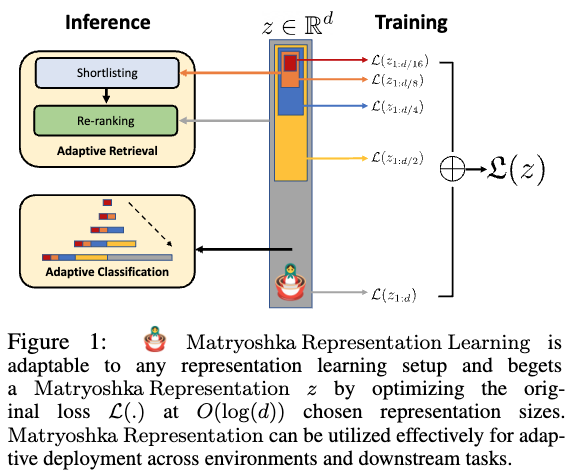
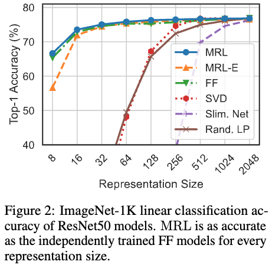
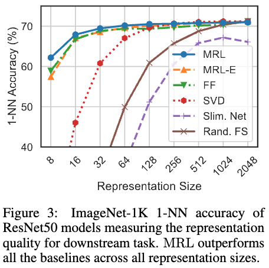
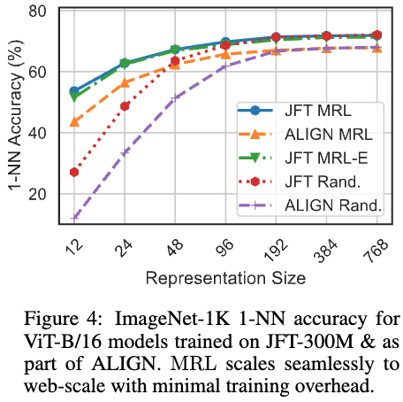
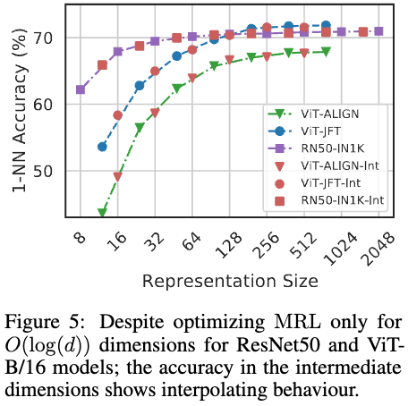
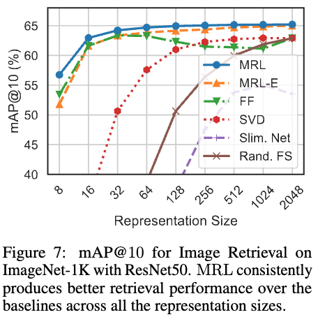
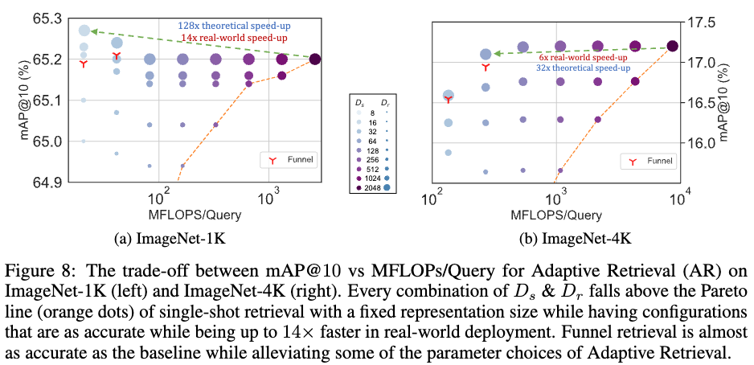

一般には、分類問題向けに学習させたディープラーニングモデルから得られる特徴量の次元はあとから変更することはできず、学習のときに固定されてしまいます．
もしも、学習後に精度をあまり落とさずに次元を小さくできるのであれば、計算リソースやサービスの要求に応じた次元を選択できるため非常に便利です．
それを実現するための方法として[Matryoshka Representation Learning（マトリョーシカ表現学習）](https://arxiv.org/abs/2205.13147)があります．  
なお、マトリョーシカ表現学習はAzureのAI Searchのベクトル検索で利用可能になっています．

## マトリョーシカ表現学習の概要

### 学習
一般にはディープラーニングモデルを用いて$L$クラス分類問題を解くとき、入力データ$x$に対してembedding $z \in \mathbb{R}^d $を計算し、それに対して重み$W \in \mathbb{R}^{L \times d}$を用いて
$$
W z
$$
を計算します。その後、$Wz$の値から分類問題が解けるようにモデルの学習を進めていきます．$z$は$d$次元であることを前提にしていますので、残念ながら学習後に先頭から$m$次元目までを切り取った$z_{1:m}$のようなembeddingの一部をみても良い特徴量にはなりません．

マトリョーシカ表現学習(MRL)ではこれを解決するため、事前にembeddingの次元の集合を$\mathcal{M}$を定義しておき（例えば$\mathcal{M}=\\{8,16,\cdots,1024, 2048\\}$）、各次元ごとにembeddingを切り出してそれを用いて分類問題が解けるように学習をしていきます．  
具体的には、データセットを$\mathcal{D} = \\{(x_1,y_1),\cdots,(x_N, y_N) \\}$、各$\mathcal{M}$の要素$m$ ごとに用意した重みを$W^{(m)} \in \mathbb{R}^{L \times m}$、スケーリングのパラメータを$c_m$、分類用のLossを$\mathcal{L}$としたとき、以下の最小化問題を解くように学習をおこないます．
$$
\begin{align*}
\min_{\\{W^{(m)}\\}_{m \in \mathcal{M}}, \theta_F} \frac{1}{N} \sum\_{(x\_i, y\_i) \in \mathcal{D}} \sum\_{m \in \mathcal{M}} c\_m \cdot \mathcal{L} \left(W^{(m)} \cdot F(x\_i;\theta\_F)         \_{1:m};y\_i  \right  )
\end{align*}
$$
ここで、embeddingがモデルのパラメータ$\theta_F$に依存していることを明示するため、$x_i$に対応するembedding $z_i \in \mathbb{R}^d$を$F(x_i;\theta_F)$とあらわしています．  
この式であらわしているように、小さい次元のembeddingでも分類問題が解けるようにすることで、そのような一部のembeddingだけでも良い特徴量になることを期待しています．このように、embeddingがマトリョーシカのように入れ子の形になっているためマトリョーシカ表現学習という名前になっています．  
また、もしかすると$c_m$の調整が少し面倒なのかな？と思いましたが、論文ではすべて$c_m=1$としているようです．  

この手法で少し気になってくるのは、重み行列$W^{(m)}$をそれぞれの$m$ごとに用意するとメモリ使用量が増えることです．  
これに対しては、共通の重み行列$W$を1つ用意し、$W^{m} = W_{1:m}$のように$W$の1行目から$m$行目までを切り出すという形で定義する方法が提案されています．これをEfficient Matryoshka Representation Learning（MRL-E）と呼んでいます．

## 実験
### 実験条件
モデルとデータ、$d$, $\mathcal{M}$の組み合わせは以下のとおりです．

| データセット | モデル                                  | d    | M                                |
|--------------|-----------------------------------------|------|----------------------------------|
| ImageNet 1K  | ResNet50                                | 2028 | 8,16,32,64,128,256,512,1024,2048 |
| JFT-300M     | ViT-B/16                           | 768  | 12,24,48,96,192,384,768          |
| ALIGN        | ViT-B/16 + BERT                        | 768  | 12,24,48,96,192,384,768          |

また、MRLとの比較のため、各次元ごとにモデルを用意して独立に学習したケース（FF）と学習後に特異値分解（SVD）で次元圧縮したケースなどがあります．ただし、大事なのはFFとの比較になるかと思います．

### 分類
#### 比較

図2はImageNet-1Kでの教師あり学習の分類問題での各embeddingの次元と分類の正解率をあらわしています（SVDは一度学習してから重み行列を低ランク近似することをあらわしているようです）．  
分類精度はMRLの次元が小さくてもあまり劣化していないことがわかります．また、MRL-Eもそれほど大きく変わらないという結果になっています．重み行列を共有していることを考えるとかなりうまくいっているのではないでしょうか．  

図3はデータセットからクエリとなるデータのembeddingを学習済みモデルで取得し、それをもとに1-NNで見つけたデータが同じクラスに属していれば正解とする分類問題です．  
こちらも同じような結果が得られています．

Vit-B/16モデルでの1-NNの精度を図4に示しています．  
こちらでも、MRLとMRL-Eは次元の減少に対して、精度の劣化が少ない結果が得られています．

#### 次元の柔軟性

学習したモデルの次元とは異なる次元（図の赤印）でembeddingを切り出し、1-NNの精度をみているのが図5です．
びっくりする話ですが、学習した次元以外でembeddingを切り出しても、図の精度のcurveに沿ったものになっています．一部に制約をつけて学習させることで、全体としてマトリョーシカ的な表現のembeddingが得られているということのようです．各次元がその前までのembeddingを適切に補う形になっていると考えればよいのでしょうか．

### 検索
#### 比較

図7はImageNet-1Kで学習したモデルを用いて最近傍検索をおこない、mAP@10で評価した結果です．  
これもMRLでは64次元くらいまでは大きく精度が悪くなることがありません．128次元や256次元のembeddingを用いたとして、2048次元のときに比べたら検索の計算時間が大きく変わり得ますから、おれは非常に良い結果です．

#### 適応的検索
最後に適応的検索の設定で評価をおこなう話になります．  
これは、クエリが与えられたらまずは低次元$D_s$のembeddingで検索をおこないデータベースから200件のデータを選択する．そのあとに高次元$D_r$のembeddingを用いて類似度順に順位付けをおこなうというものです．イメージ的には速くおおまかに検索してから、丁寧に類似性が高いもの順に並び替えていくというものになります．  
データベースのデータが非常に多いことが現実では考えられますから、この部分を小さい次元のembeddingでおこなえることは非常に高速化に寄与します．実際、次の図8の(a)のように$D_s$（色が薄いほど低い次元で検索）が小さく、$D_r$（大きいほど順序付けでの次元が大きい）を大きく設定すると、精度の劣化はなく（逆になぜかあがっていますね）、かつ14倍も高速になっています．ただし、(b)はImageNet-4Kを評価用に使っていて問題が難しいため、高速化は6倍に留まっています．

