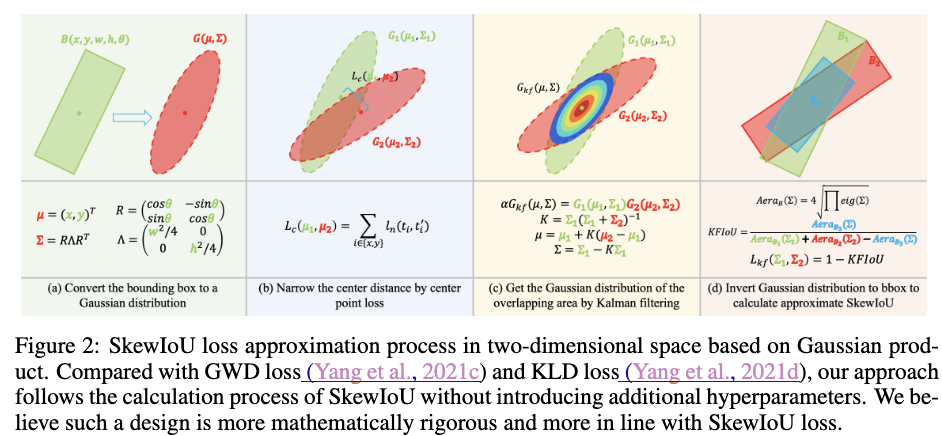

## 従来手法の問題点
回転しているBounding Box向けの微分可能なIoUの計算というのは簡単ではありません．既存手法としてGWDやKLDがありますが、問題ごとにハイパーパラメータの調整が必要になります．これを解決してより扱いやすく性能が高い手法になったのが[KFIoU](https://arxiv.org/abs/2201.12558)になります．

## KFIoU
### Bounding Boxの正規分布への変換
KFIoUを計算するための前段階として、正解のBounding Boxと予測されたBounding Boxを正規分布に変換します．  
具体的には、Bounding Boxが中心を$(x, y)$、横幅と縦幅を$w, h$, 回転角度を$\theta$としたときに次で定義される平均$\mu$、共分散行列$\Sigma$の正規分布に変換します．
$$
\Sigma = R \Lambda R^T, \ \mu = \begin{pmatrix}x, y\end{pmatrix}.
$$

ここで
$$
R = \begin{pmatrix} \cos \theta & -\sin \theta \\\ \sin \theta & \cos \theta  \end{pmatrix}, \Lambda = \begin{pmatrix} \frac{w^2}{4} & 0 \\\ 0 & \frac{h^2}{4}  \end{pmatrix}
$$

です．  回転しているBounding Boxのそれぞれの辺に沿ったベクトルが$R$の列になっています．
一見、なぞの変換ではあるのですが、このように定義すると以下のようにしてBounding Boxの面積$\mathcal{V_B}(\Sigma)$を求めることができます．

$$
\mathcal{V_B}(\Sigma) = 2^2 |\Sigma|^{1/2}.
$$

$R$が回転行列であることを用いれば
$$
|\Sigma| = |R \Lambda R^T| = |R| |\Lambda| |R| = |\Lambda| = \frac{w^2h^2}{16}
$$
ですので、$\mathcal{V_B}(\Sigma)=wh$ となり、無事にBounding Boxの面積に一致します．

### 重なった面積の近似
#### 方針
さきほどの変換の話ではBounding Boxを正規分布に変換しても、もとのBounding Boxの面積を得ることができるという話でした．  
これを利用すると、順序を逆にしてBounding Boxよりも正規分布が先に得られているときに、そこから対応するBounding Boxの面積を求めるということも考えられます．  
KFIoUでは、2つのBounding BoxのIoUを求めたいときに、それらの正規分布の積の関数（スケールを調整すれば確率分布）を求め、そこから重なった部分の面積を求めるということをします．つまりBounding Boxに対応する2つのガウス分布$\mathcal{N}(x|\mu_1, \Sigma_1), \mathcal{N}(x|\mu_2, \Sigma_2)$に対し、
$$
\begin{align}
\mathcal{N}(x|\mu_1, \Sigma_1) \mathcal{N}(x|\mu_2, \Sigma_2)
\end{align}
$$
もスケールを除けば正規分布の形になりますので、この分布を2つのBounding Boxが重なった部分を表現した正規分布として考えて面積を計算するということをします．ただし、一般には実際に重なった部分は矩形にはならないですが、ここでは矩形で近似していることに注意が必要です．  

#### カルマンフィルタ
次に正規分布の積がどういう形になるのか？という話ですが、論文ではカルマンフィルタを利用した結果を示しています．  とはいえ、よくある計算のようにそのまま平方完成してもOKです．  
ここではカルマンフィルタに沿った話をしていくことにします．カルマンフィルタでいうところの状態変数$x_{k}$と観測値$y_{k}$は
$$
\begin{align*}
x_{k+1} &= x_k + v_k \\\
y_k &= x_k + w_k
\end{align*}
$$
というふうにモデリングしていることになります．ここで$x_0$は平均$\mu_0$、分散$P_0$の正規分布、$v_k$は平均$0$、分散$Q_k$の正規分布、$w_k$は平均$0$、分散$R_k$の正規分布に従っているとしています．  
この定義をもとにして$p(x_0|y_0)$を求めていくと、 $ p(x_0|y_0) = \mathcal{N}_x(\mu, \Sigma)$ となります．
$\mu$と$\Sigma$の定義は以下のとおりです．
$$
\begin{align*}
\mu &= (I - K) \mu_0 + K y_0 = \mu_0 + K(y_0 - \mu_0), \\\
\Sigma &= (I - K) P_0, \\\
K &= P_0 (R_0 + P_0)^{-1}.
\end{align*}
$$
ここで、$K$はカルマンゲインと呼ばれる値になります．  
ベイズの定理より、$p(x_0|y_0) \propto p(y_0|x_0) p(x_0) = \mathcal{N}(y_0|x_0, R_0) \mathcal{N}(x_0| \mu_0, P_0)= \mathcal{N}(x_0|y_0, R_0) \mathcal{N}(x_0| \mu_0, P_0)$ですから、この形はもともと考えていた式(1)と同じ形式になっています．よって上記の$\mu, \Sigma, K$を対応する変数に置き換えれば2つのBounding Boxの重なっている部分に対応する正規分布が求まります．  
具体的には、
$$
\begin{align}
\alpha \mathcal{N}(x|\mu, \Sigma) = \mathcal{N}(x|\mu_1, \Sigma_1)\mathcal{N}(x|\mu_2, \Sigma_2)
\end{align}
$$
となり、左辺の$\mu$と$\Sigma$はそれぞれ
$$
\begin{align*}
\mu &= \mu_1 + K(\mu_2 - \mu_1), \\\
\Sigma &= (I - K)\Sigma_1,\\\
K &= \Sigma_1(\Sigma_1 + \Sigma_2)^{-1}
\end{align*}
$$
になります．また、$\alpha=\mathcal{N}(\mu_1|\mu_2, \Sigma_1 + \Sigma_2)$となる定数です．このスケールを調整する$\alpha$が存在するため、式(2)を$x$について積分しても1にならないことに注意してください．

### KFIoUの定義
ここまでの話でKFIoUを定義するための道具は出揃いました．  
KFIoUは以下のようにして2つのBounding Boxの重なり具合を推定します．

$$
\begin{align*}
{\rm KFIoU} = \frac{\mathcal{V_B(\Sigma)}}{\mathcal{V_B(\Sigma_1)} + \mathcal{V_B(\Sigma_2)} - \mathcal{V_B(\Sigma)}}.
\end{align*}
$$
式自体は難しいところがないかと思いますが、次の点に注意が必要です．
1. KFIoUの定義式自体はスケール$\alpha$が関係しない形（なんなら分散だけで計算できる）になっています．$\alpha$は2つのBounding Boxの中心位置のズレをあらわしている部分になっていますが、このズレをあらわす役割は別途L1 Lossに任せ、KFIoUの計算をおこなうときには2つのBounding Boxの中心が一致しているというふうに考えて計算してしまいます．
2. KFIoUの最大値は1/3になります．2つのBounding Boxがピッタリ重なっているとき($\Sigma_1=\Sigma_2$)が最大値になりますが、そのときは$K=\frac{1}{2}I$より、$\Sigma=\frac{1}{2}\Sigma_1$です．このとき、
$$
\begin{align*}
{\rm KFIoU} = \frac{\frac{1}{2} \mathcal{V_B}(\Sigma_1)}{\mathcal{V_B}(\Sigma_1) + \mathcal{V_B}(\Sigma_1) - \frac{1}{2}\mathcal{V_B}(\Sigma_1) } = \frac{1}{3}
\end{align*}
$$
が成り立つとわかります．一応、KFIoUを3倍すると最大値を1にするように調整できますが、Lossに用いるときは3倍しないほうが良いという結果になったようで、特に係数の調整をしないものが利用されています．

ここまでの話がまとまっているのが次の図2になります．

### Loss
KFIoUを用いた場合のLossはBounding Boxのクラス分類のLoss、KFIoUの分のLoss $L_{kf} = e^{1-{\rm KFIoU}} - 1$、Bounding Boxの中心位置の誤差についてのLoss $L_c$の3つの和を用いることが提案されています．ここで$L_c$は以下の2パターンあります．
1. 通常どおりのL1 Loss
1. 既存手法のKLDで提案されているLoss $L_c(\mu_1, \mu_2, \Sigma_1) = {\rm ln}((\mu_2 - \mu_1)^T \Sigma_1^{-1} (\mu_2 - \mu_1) + 1) $ 

## 実験
論文の中から他の手法との性能比較に関する結果を紹介します．

Table4はDOTAというデータセットでの精度比較になっています．Box Def.の列によって回転の情報の定義が異なるのですが、一旦無視して話を進めます．  
KFIoUは他手法と比べて高い性能を出すことができています．GWDやKLDではハイパーパラメータのチューニングをしたうえでこの数値になっていますが、KFIoUはそういったチューニングがなく高い性能を出すことができています．また、Bounding Boxの中心位置の回帰をおこなうLossについては、L1 LossよりもKLDで使われているLossを使うと良いと言えそうです（他の実験結果でもおおよそ精度の向上が見られています）．
