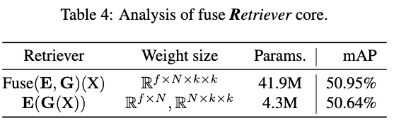

YOLO-RD (Retriever-Dictionary) は、物体検出の分野で定番となっているYOLO（You Only Look Once）シリーズの最新研究です.
今回は、ICLR2025で発表されたYOLO-RD(https://arxiv.org/abs/2410.15346)について解説します.

## 従来手法の限界と問題意識

現在の画像系のモデルのアプローチは大きくわけて2種類です.

1. CNN: 畳み込みによって得られる局所情報を組み合わせて推論
1. Transformer: 画像内の広範な相互作用を活用して推論

これらも現在ではかなり高い精度を達成できるようになりましたが、「入力画像とモデル内で計算される情報」しか活用できません（当たり前なのですが）.  
もしRAGのように入力画像に応じて外部からの情報を参照することができれば、モデルの推論性能が向上するのでは？というのがYOLO-RDの発想になります.  
人間も、例えば犬のような動物を見たときに、犬ってこういう形だなぁと連想し、それから確かに目の前の動物は犬だと判断したり、あるいは犬じゃない他の動物かも？と判断していると思います．このように適宜情報を連想するという話に近いのかなと思います．

## YOLO-RDの概要

YOLO-RDは推論時に外部の知識（特徴量）を参照する仕組みを組み込んだYOLOです.  
これにより、モデルが画像からは直接取得できない情報を補い、パラメータ数を大きく増やすことなく高精度化を実現しています.

上図はYOLO-RDの全体像をあらわした図です.
バックボーンから得られた特徴量をもとにして、辞書内の特徴量(atomというようです)ごとの重みを決めるというのをRetrieverでおこないます.  
得られた重みによる重み付き和を辞書内のatomに対して計算し、Neck層に渡すという流れになっています.

式であらわすと次のようになっています.  
バックボーンから得られた$(w,h)$の位置のピクセルの特徴量$X_{w,h} \in \mathbb{R}^f$を用いて、

$$
Y_{w,h} = \lambda \cdot X_{w,h} + (1 - \lambda) \cdot \sum_{i=1}^N c'_{i,w,h} \cdot \alpha_i.
$$

を新たな特徴量とします.ここで

- $\alpha_i  \in \mathbb{R}^f$ は2-ノルムが1のatom
- $c'_{i,w,h} \in \mathbb{R}$はatomの取捨選択を表現している係数
- $\lambda \in \[0, 1\] $はハイパーパラメータ
- $N \in \mathbb{N}$は辞書サイズ

をあらわします.

### Retriever

$(w,h)$上のピクセルの$i$番目のatomの係数$c'_{i,w,h}$は以下のようにして計算します.

1. 行列$W^G \in \mathbb{R}^{N \times f}$との内積によってベースとなるatomの重み$Y   \in \mathbb{R}^{N \times W \times H}$を計算
   $$Y = G(X) = W^G \cdot X. $$
2. depthwise convolutionをおこない、近傍ピクセルの情報の取り込み($i$はチャネル)
   $$c_i = E(Y^{(i)}) = W^{E^{(i)}} * Y^{(i)}.$$
3. 学習を適切に進めるためにPositional Normalizationを適用（$\gamma,\beta$は学習するパラメーター）
   $$
   \begin{align*}
   c^{\prime}\_{i,w,h} &= \frac{c_{i,w,h} - \mu_{c_{w,h}}}{\sqrt{\sigma_{c_{w,h}} + \varepsilon}} \cdot \gamma + \beta,\\\
   \mu_{c_{w,h}} &= \frac{1}{N} \sum_{n=1}^N c_{n,w,h},\\\
   \sigma_{c_{w,h}} &= \frac{1}{N}\sum_{n=1}^N (c_{w,h} - \mu_{c_{w,h}})^2.
   \end{align*}
   $$

1と2は一度のconvolutionにまとめることができますが、計算コストのためにこのようになっています.  
また、3についてはatomの重み付き和が$X$と同じになってしまうことを防ぐためにおこなわれています.バックボーンから得られる特徴量が良い特徴量であるという前提にたつと、そこに学習初期にはノイズに近いような値になっている辞書情報を足すことにメリットがありません.そして、辞書情報側のパラメーターをうまく活用してlossを下げるよりも、バックボーンと同じ特徴量がNeck層に渡るほうが早くlossを下げられるため、結果的に辞書が意味をなさなくなります.Normalizationを入れることで、$X$をそのままコピーするような出力が難しくなるため、適切に学習が進むようになります.

### Dictionaryの初期化

atomの初期値には以下の3パターンが提案されています.

1. Vision model:
   YOLOv9のバックボーンから得られた学習データの特徴量を辞書の初期値にする.
1. Vision language model:
   学習データの画像の各パッチに対するCLIPから得られる特徴量を辞書の初期値にする.
1. Large language model:
   MSCOCOデータセット、ImageNet21kのクラス名とMSCOCOのキャプション（説明文）をGPTに与えたときに得られる特徴量を辞書の初期値にする.

学習データなどから得られる特徴量をそのまま利用すると辞書のサイズが大きすぎるため、k-meansを用いてクラスタリングし、クラスタの中心を辞書内のatomにするようにします.

### Dictionaryの圧縮

モデルが適切に学習されたとしても、実はあまり参照されることがないatomが存在するかもしれません.  
こういったatomを削減するために蒸留をおこなうことを提案しています.  
具体的にはもとの辞書を用いて得られる特徴量 $z^{rm RD}\_{i,w,h}$ が小さい辞書を用いて得られる特徴量 $z^{\rm rd}\_{i,w,h}$ と近くなるよう、以下のlossを最小化して小さな辞書を学習していきます.

$$
\begin{align*}
\mathcal{L}\_{i,w,h} = -\log \frac{\exp ({\rm sim}(z^{\rm rd}\_{i,w,h}, z^{\rm RD}\_{i,w,h})/\tau) }{\sum\_{j=1}^B \sum\_{w',h'}^{W,H} \exp ({\rm sim} (z^{\rm rd}\_{i,w,h}, z^{\rm RD}\_{i,w,h})/\tau) }.
\end{align*}
$$

この蒸留により、性能を下げることなく50%のatomを削減できているようです.

## 実験

### 提案手法の効果

以下は提案手法の効果を示した表です.

ParamsとLatencyをみると提案手法ではわずかな追加コストで済んでいますが、各スコアが向上し、YOLOv9で1%以上の向上を達成しています.  
[YOLOv9のレポジトリ](https://github.com/WongKinYiu/yolov9)をみてみると、サイズがCからEになると、計算量は102.1GFlopsから189.0GFlopsになり、パラメーター数は25.3Mから57.3Mになり、${\rm mAP}\_{.5}^{val}$は2.6%あがっています.一方で、例えばVMのケースだと0.2Mのパラメーターの追加、0.16のLatencyの増加で1.46%向上しています.非常にコスパよく性能があがっていることがわかります.

### 他タスクへの利用

他タスクへも提案手法を適用した結果が次の表になり、きちんと効果があることが示されています.

### 既存手法との比較

以下は既存の他手法との比較になります.

上記のうち、KDはYOLOv9-EからYOLOv9-Cへの蒸留をあらわしています.  
これらの手法と比較してみても、やはり提案手法は効率よく性能を上げられていることがわかります.

### Ablation Study

以下はRetrieverの計算方法の違いをあらわしており、1行目は1度の畳み込みでatomの重みを計算してしまう方法、2行目は提案手法で使われている方法です.

提案手法に比べ、1度のCNNに置き換えることで性能が0.3%程度あがるものの、パラメーター数は10倍近く増えてしまいます.このため、パラメーターあたりの性能向上の効率は非常に悪いことがわかります.

### 可視化

#### atomの係数の可視化

以下では入力画像とatom、係数の関係を可視化しています.  
(a)の矩形部分がモデルへの入力、(b)がバックボーンからの特徴とatomとの相関（類似度を計算？）、(c)が各atomの係数となっています.

どちらも高い領域に存在するatomに対応する画像は(c)と(d)の矩形部分になっており、きちんと関係のあるatomを参照することができています.
一方で、(b)において相関が低く、係数が0に近いatomは(e)と(f)のように入力画像とは関係のないものになっています.

#### 提案手法の有無によるバックボーンからの特徴量の比較

以下は左図が入力画像、中央がバックボーンから得られた特徴量、右が提案手法の辞書を用いて得られた特徴量になります.

バックボーンからの特徴量はあまり標識の特徴量を捉えられておらず、また背景の情報を大きく失われています.提案手法ではこれらがうまく特徴量として保持されていることがわかります.

## 感想
追加の計算コストが少なく精度をあげられるのはかなり魅力的です.実問題でも、あと一押し精度あげたいなというときにはかなり良いのではと思います. YOLO-RDのように外部知識を利用するという発想は今後色々なところで使われていくかもしれません.
