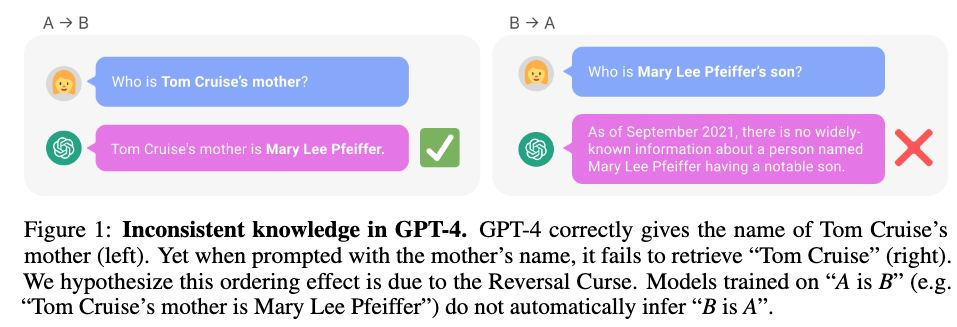
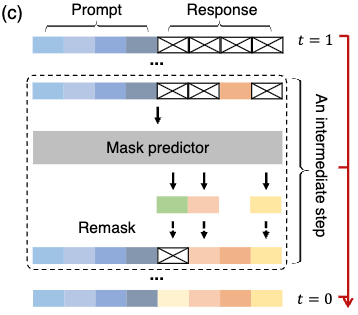
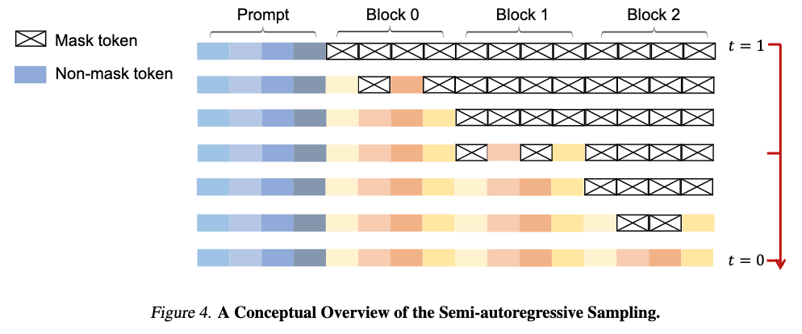
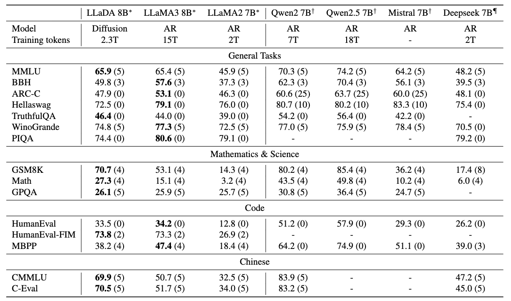
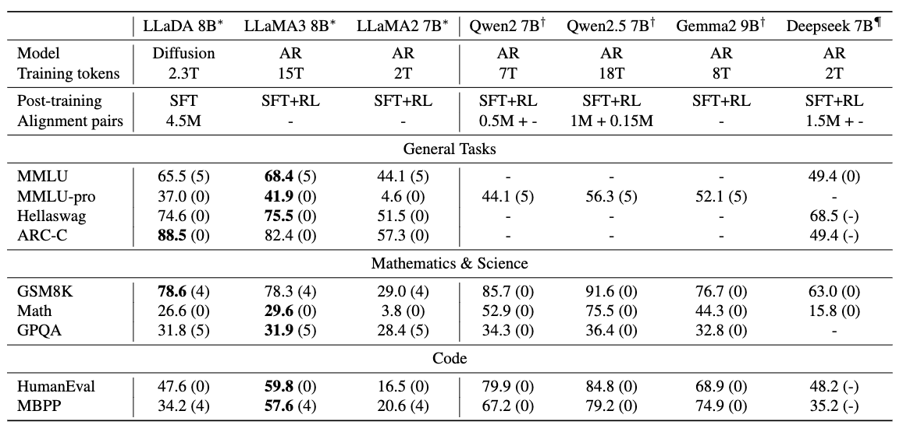
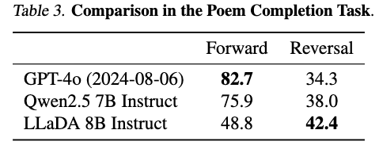

# BERTを拡張した生成モデル？拡散型LLM「LLaDA」の概要と可能性

2025年に入り、拡散モデルを用いた大規模言語モデル（LLM）が注目されています.特に「Gemini Diffusion」や「LLaDA（Large Language Diffusion with mAsking）」といった新しいアプローチは、従来の自己回帰型（autoregressive）モデルとは異なる性質を持ち、今後のLLMのあり方を変える可能性すらあります.
提案手法のLLaDAとLLaMAを比較したものが以下で、提案手法は遜色ない性能が出ています.

本記事では、拡散モデルベースのLLMであるLLaDAについて、その背景、構造、実験結果などを解説します.

---

## 自己回帰型モデルの限界

従来のLLM（例：GPT系）は自己回帰型モデルに分類され、トークンを一つずつ順番に生成していきます.しかし、この方式には次のような課題があります：

- 逐次処理のため推論効率が悪い
- 「Reversal Curse」に弱い（参考：[THE REVERSAL CURSE: LLMS TRAINED ON “A IS B” FAIL TO LEARN “B IS A”](https://arxiv.org/pdf/2309.12288）)
  - Reversal Curseは次の例のようにトム・クルーズの親については回答できても、メアリー・リー・ファイファーの子どもは誰かを答えることができないという問題です.学習データにはそういったデータがないため、このようなことが起こるようです.

## 従来のLLMのアプローチ

LLMでは一般に次の左式か右式の問題を解けるようにモデルのパラメーター$\theta$を学習していきます.

$$
\max\_{\theta} \mathbb{E}\_{p\_{data}(x)} \log p\_\theta(x) \Leftrightarrow \min\_\theta {\rm KL}(p\_{data}(x)||p\_\theta(x)).
$$

特に自己回帰モデルの場合は、過去のトークンをもとにして次のトークンを予測する問題を解く形になっています.

$$
p_\theta(x) = p_\theta(x^1) \prod_{i=2}^L p_\theta(x^i|x^1,\dots,x^{i-1}).
$$

## LLaDAのアプローチ：拡散モデル型のLLM

LLaDAは、自己回帰ではなく**拡散モデル**のアプローチを採用しています.これはBERTのようなマスク予測タスクに近く、以下のような構成です.

### 事前学習（Pretraining）

事前学習ではBERTのようにマスクされた単語を当てるタスクを解きます. ただし、BERTは15%をマスクするようにしていましたが、提案手法では0~100%のランダムな割合だけマスクするようになっています.

損失関数は次の通りです：

$$
\mathcal{L}(\theta) := -\mathbb{E}\_{t,x\_0,x\_t} \left[\frac{1}{t} \sum\_{i=1}^L \textbf{1}[x_t^i =M]\log p\_\theta(x\_0^i|x\_t) \right].
$$

この損失関数を小さくできるモデルはたしかに言語を学んでいると言えそうですし、実際BERTは分類問題や固有表現抽出などで高い性能を出すことができます.  
しかし、言語モデルとしてもともと解きたかった問題

$$
\max\_{\theta} \mathbb{E}\_{p\_{data}(x)} \log p\_\theta(x)
$$

についてもうまくいくモデルなのかは謎です.  
これについては、[既存研究](https://arxiv.org/abs/2408.08252)で以下が成り立つことがわかっています.

$$
\mathbb{E}\_{p\_{data}(x\_0)}[\log p\_\theta(x\_0)] \geq -\mathcal{L}(\theta).
$$

マスクされた問題に関する損失関数にマイナスを付けた式により下から最大化したい式を抑えられることをあらわしているので、損失関数を小さくできるほど言語モデルの意味で良いモデルで良いモデルと言えます.

### Fine Tuning

事前学習後はFine Tuningをして命令に従えるように学習をしていきます.  
データセットとしてプロンプト（指令）と期待される出力のペアが用意されていて、モデルには出力部分の一部をマスクして入力をし、マスクされた部分を予測するように学習させます.

論文で用いているデータセットには以下の問題が含まれているようです.

- コード生成
- 数学問題の解答
- 会話応答

この学習により、LLaDAもGPTのような指令に従うような機能を獲得できます.

### 推論（Inference）

ここまで学習しても、困るのが推論です（ちなみに昔紹介したBERTで文を生成する方法の[論文](https://arxiv.org/abs/1902.04094)ではトークンを順番にマスクして生成というのを繰り返すギブスサンプリングの形を取っていました）.

LLaDAの推論は以下のようにして徐々にキレイな文章を生成していきます.

1. 出力部分をすべてマスク
1. マスクされたトークンを推論
1. ランダムなトークンを一部 or 確信度が低いトークンを選択して再度マスク
1. 所定回数まで2～3を繰り返す

一部のトークンを固定してそれ以外を再生成といったプロセスを繰り返しますので、ノイズを徐々に取り除いていく拡散モデルのようなことをしているイメージにはなっています.
このように推論することで、文全体を一気に生成するよりも安定した品質が得られているのだと思います.

なお、推論したい部分全体に対して上記の処理をしていく方法の他、semi-autoregressiveという推論したい部分をいくつかのBlockに分けて、左のBlockから上記の処理をおこなっていく方法も提案されています. Blockを小さくしていくと、より自己回帰モデルに近いものになっていきます.

## 実験

### スケーラビリティ

まず投下計算量（モデルのサイズ、学習トークン数）に対して順当に性能が向上するかを確認した結果が以下になります（ちなみにFLOPsはモデルのパラメーター数を$N$、学習データのトークン数を$D$としたときに$6ND$で計算されています）.

オレンジの提案手法でもスケーラビリティが成り立っており、MMLU（一般知識を問う問題）やGSM8K（算数の文章問題）では自己回帰型モデルよりも優位な結果が得られています.

### 他モデルとの比較

#### 事前学習モデル

以下は事前学習モデルでの各タスクの推論性能をあらわしています.

学習データが異なるのですが、LLaDAはLLaMA2と比較するとほとんどのタスクで上回っています.LLaMA3とはほぼ互角かやや劣る感じですね.とはいえ、拡散言語モデルの可能性を十分に感じさせる結果です.  
論文では特に言及がなかったと思うのですが、こうやって比較するとQwenは性能高いですね. 全然勝てていません.

#### ファインチューニング済モデル

ファインチューニングした場合の性能比較した結果は以下のとおりです.

ファインチューニングしたもの同士で比較するとLLaMA3には劣っているかなという印象ですが、一部のタスクでは上回ることができています. MMLUでは性能が下がっているのですが、Fine Tuning用のデータセットと合っていない可能性が指摘されています.

### Reversal Curseへの耐性

中国語の詩のデータセットを作り、与えられた詩の前後の句を当てる問題を解かせた結果が以下になります.

入力された詩の後の句を当てる問題（Forward）はGPTとQwenは高い精度で当てることができていますが、前の句を当てる問題（Reversal）は半分以下しか当たらなくなります. 一方で、提案手法はあまり性能を落とさずに推論できています（とはいえ少し精度が低くはなっていますので解決とは言いづらいですね）.

論文にはあまり考察がなかったと記憶しているのですが、提案手法はBidirectionalな処理をおこなうため、前後問わずに詩の周辺にはあるトークンの並びが出やすいという傾向を得ることができているのかもしれません.

### サンプリング戦略とその影響

LLaDAでは以下のようなトークン再マスク戦略が検討されました：

- ランダム
- 確信度ベース
- Block単位の逐次生成（semi-autoregressive remasking）

それらを比較した結果が以下のとおりです.

Fine Tuningまで考えると、低い確信度を再度マスク & semi-autoregressiveが良いという結果になっています.  
semi-autoregressiveを使わずに低い確信度を再度マスクする方法を採用した場合に、ファインチューニング済モデルでは非常に低い性能になっています. ファインチューニングのときに|EOS|トークンでトークン列にパディングをしており、そこの確信度が低いため|EOS|以外の部分のトークンが再マスクされず文の改善がおこなわれないのが理由のようです.
これに対して、semi-autoregressiveを用いて左のBlockから順に生成していくことでパディング部分の悪さを回避できています.

### 推論のサンプリングのステップ数

提案手法はサンプリング回数を増やせばより性能が良くなりそうですが、実際どうなのでしょうか？それをあらわしたのが次の図です.

横軸が対数スケールなのですが、ステップ数（NFEs）を増やすごとに性能が上がっていくのが分かります. とはいえ1024回もモデルの推論を実行するのは計算コストが大きすぎますね.

### 推論の過程

推論の過程をあらわしたのが次の図で、色が薄いほど推論のステップのなかで先にトークンが固定され、濃いほどあとの方にトークンが固定されたことをあらわします.

少しおもしろいのが答えの72よりも後に埋まっている部分があることです（同じように計算式の答えよりも後に式が埋まっていたりしますね）.  
人間の思考とは異なる結果にはなっているのですが、再度サンプリングしても同じトークンが得られている（=実はステップによってあまり改善が必要でない例）ということもあるかと思うので、これだけだとちょっと考察しづらいですね.  
ただ、ぼやっとした考えみたいなものを明確にしていっていると捉えると人間に近いとも言えるのかもしれません.

## 感想

LLaDAのアイデア自体はBERTに近く、マスク予測の延長線上にあります.  
BERTでも文章が作れるのでは？と思っていましたが、世の中的にはなかなか芽が出ていなかったところにこういった手法が出たことは嬉しく思います.  
最近になってようやくこの種の手法がうまくいったのは計算量やデータ量の違いなんでしょうか. 自己回帰モデル型で培われたノウハウのおかげなのかもしれませんね.

Gemini Diffusionは非常に高速で話題になりましたが、今回の提案手法だとサンプリングが多く速度は速くないはずなので、Gemini Diffusionがどうやっているのか気になるところです（実際、論文では推論速度については言及が特にないはずです）.素のモデルの性能が非常に高くてサンプリングステップが少ないのかもしれませんね.
