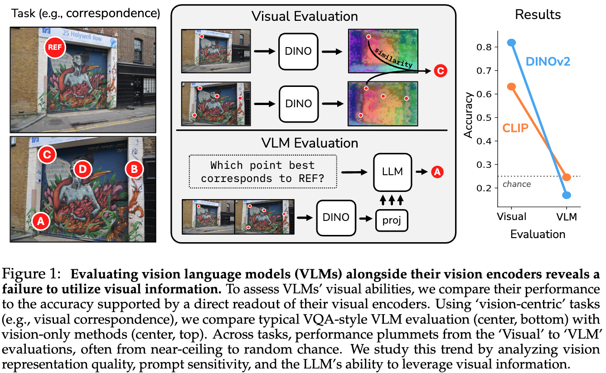
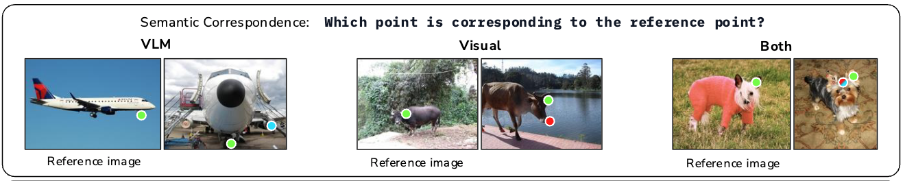
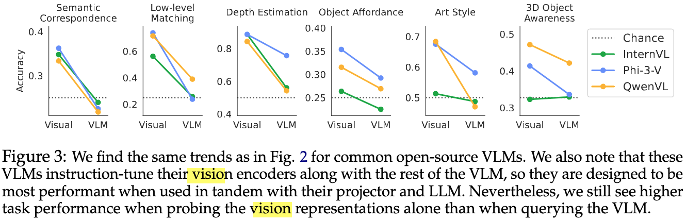

今回紹介するのは
[Hidden in plain sight: VLMs overlook their visual representations](https://arxiv.org/pdf/2506.08008)
です.

テキストの生成というよりも画像が中心となるタスクに対し、オープンソースのVisual Language Modelの性能について調査した論文になっています.
DINOやCLIPをLLMに組み込んだマルチモーダルモデルは、単体のViT系のモデルよりも性能が**大きく下がる**ことを示しています.

例えば、次の図では左の2枚の画像が与えられ、上の画像の「Ref」と書かれている点と同じ点は下の画像のA~Dの4つの点のどれか？というのを当てる問題を解くことを考えます.  
DINOやCLIP単体によって問題を解いたとき、DINOでは80%、CLIPでは60%程度のAccuracyでしたが、VLMを用いるとチャンスレート（適当に答えたときの性能）よりも低くなってしまいます.

## LLaVAによるVLMの実現

まず、VLMはどのように実現されているかの話になります.  
本論文で扱われている[LLaVA](https://github.com/TRI-ML/prismatic-vlms)ではDINOのようなVisualモデルから得られた画像のトークン列をLLMのembeddingの空間にマッピングするようなProjector層を追加しています.

LLaVAでのファインチューニングは次の2段階の処理から構成されるようです.

1. Projector層単体ののファインチューニング
2. EndToEndのファインチューニング

## 比較実験の方法

LLaVAはEndToEndでファインチューニングしていますが、本論文ではProjector層のファインチューニングした場合のVLMとVisualモデルの比較を中心におこなっています.これは、VLMのVisualモデルの重みを固定しておくことで、VLMとVisualモデル単体との正確な比較をおこなうようにするためです.  
ただし、VLM用にEndToEndでファインチューニングされた既存のオープンソースのVisualモデルでさえも性能悪化の傾向があることを示すため、 QwenやPhi-3などでも一部の実験をおこなっています.

---

## タスク

以下では扱っているタスクの一覧を示します.  
タスクの具体例をあらわす画像は論文のなかのVisualモデルとVLMが間違った例を用いています.

### カメラ距離を推定するタスク

どちらのBounding Boxのほうがカメラに近いかを判定するタスク.

- LLMにはPromptとBounding Box付きの画像を入力し、どちらのBounding Boxがカメラに近いかを出力させる.
- Visualモデルはそのままだと解くことができないため、NYUv2という深度を推定するタスクのデータセットを用いてVisualモデルにDPT Headを追加して訓練する.
  - DPT Headは奥行きの推定の出力部分

### 視覚的な類似箇所を推定するタスク

2枚の画像から視覚的に似ている箇所を見つけるタスク.

- Reference画像に1つの点があり、もう一枚の画像にはA,B,C,Dの4つの点を用意する.
- VLMにはどの点が対応するかを出力させる.
- Visualモデルではそのまま解くことはできないため、Reference画像の点の特徴量と一番類似度が高くなる特徴量に対応する点をA~Dから選ぶ.

### 機能的な類似箇所を推定するタスク

2枚の画像から機能的に似ている箇所を見つけるタスク.

問題の解き方は1つ前のタスクと同じです.

### 同じ位置を推定するタスク

2枚の照明条件や視点が異なる画像から同じ位置を見つけるタスク

問題の解き方は1つ前のタスクと同じです.

### 最も似ていない3Dオブジェクトを推定するタスク

4枚の画像から4枚の画像から4枚の画像から4枚の画像から最も似ていない3Dオブジェクトの画像を選択するタスク.

- VLMは4つのなかで一番似ていない画像を出力させる.
- VisualモデルはVisualモデルの[CLS]トークン部分の特徴量同士の類似度をもとに選択する.

### 似ている画風の絵画を選択するタスク

与えられた画像に似ている画風の絵画を2枚のなかから選択するタスク.

- VLMは3つの画像を与えて、似ている画風の画像を出力させる.
- Visualモデルの場合、画像のパッチの各特徴量からグラム行列を作ると画像のstyleを表現できることを利用し、Reference画像と比較対象画像のグラム行列の二乗誤差が小さいものを似ている画風であると選択する.

## 実験結果

### Visualモデルとprojector層をFTしたVLMの性能比較

- Visualモデル単体に比べてVLMは性能が悪化し、チャンスレートよりも低くなりうる.

### オープンソースのVLMとVisualモデル部分の性能比較

他のVLMでのVisualモデルとの性能比較.

- この結果でも、基本的にはVisualモデル単体のほうが性能が高い.
  - InternVLの3D Objectの問題のように、そもそもVisualモデルの性能が低い場合には改善することもある.

**以上の結果から、VLMは全く入力画像を正しく参照できていないかもしれない...**

### 目隠ししたケースでの性能

VLMが画像を参照できているのか確認をするため、通常の状態での出力の分布と入力画像を真っ白の画像にして問題を解かせたときの出力の分布を比較する.

- 入力画像のある場合（青）と目隠ししたケース（オレンジ）で出力の分布に大きな違いがない.
- もし、入力画像が真っ白である場合には出力がランダムになりそうだが、実際には大きな偏りがある.
  - LLMにバイアスがあり、それがどちらの分布にもあらわれているを思われる.

**以上の結果から、モデルは画像を適切に参照して出力ができておらず、もしかするとVisualモデルの情報が途中で失われている？**

### 中間層の特徴量の比較

VLMの層の途中でVisualモデルの情報が失われていないかを確認するための実験.
各層の特徴量ををもとにして類似箇所を見つけるタスクや位置の推定タスクを解く. もしうまく解けるようであれば、特徴量にVisualモデルからの情報が伝搬できている.

- グラフの領域内の左部分（白い領域）はVisualモデルの情報をそのまま利用している部分だが、そこから性能が落ち込んでいる様子はない.
  - つまりVisualモデルの情報が失われているわけではない.
- 問題・モデルによっては最終層に近いところで大きな性能悪化が見られる.
  - 自然言語の回答の生成の優先度が高くなり 画像の情報が失われる？
- Art StyleのIN-1kでは徐々に性能があがっているため、モデルによっては層を経ることで質の高い特徴量を作り出せている.
  - それにも関わらず先程のFigure3によると、モデルにテキストを生成させて回答させると高くても55%程度のAccuracyになる.

### プロンプトチューニング

プロンプトによって性能を改善できるのかを実験.
テキストのプロンプトの前に学習可能なembeddingを1、5、10トークン追加する.

- プロンプトにembeddingを1つ追加したときは性能が少し改善
- 1つより増やしても良い効果は得られていない

### LLM側のファインチューニング

LoRAによるLLM部分のFTによって性能を改善できるのかを実験.

- LLMのFT後は精度が向上（3Dの問題はあまり精度があがらないが、LoRAのパラメーター追加が少なすぎた？）.
- ViT部分やprojector層のFTはあまり効果がない.

また、FT前後でのAttentin Mapの差を可視化したのが以下の図.

- FT後は参照すべき箇所のAttentionが大きくなる.

### 出力の分布

以下で定義されるTotal Variation距離を正解ラベルの分布とモデルの出力分布から計算.

$$
{\rm TV} := \frac{1}{2} \sum_{i=1}^n |P(x_i) - Q(x_i)|.
$$

- 各ラベルの頻度の差を取っており、2つの分布が近いほど0に近づく.

- 全体の傾向として、Original（元のVLM）はTV距離が大きいが、LLMのFTによってTV距離が0に近づいており、モデルの出力分布が正解ラベルの分布に近づくことができている.
- ViTではほとんど改善されないが、projectorのFTでは改善されている.

## 感想
本論文ではVLLMが明確に苦手とするタスクがあり、なかなか改善が難しいという結果でした.
近年のAI活用ブームを考えると、従来のモデルをVLMで気軽に置き換えるというようにはいかないことが示されたのは有意義な内容かと思います.
