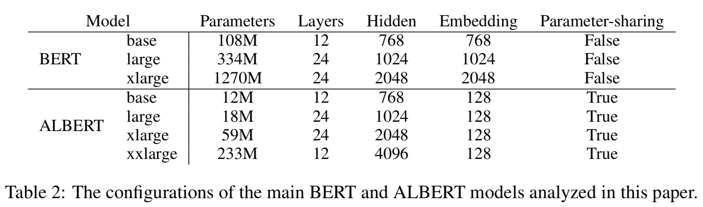
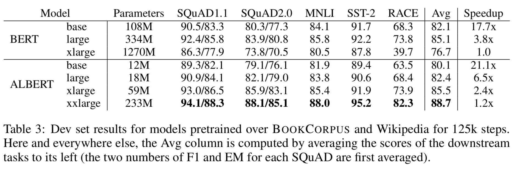

本記事はQrunchからの転載です。
___
[BERT](https://arxiv.org/abs/1810.04805)のパラメータの数を減らしたモデルであるALBERTについての概要を書いていきます。

参考論文：[ALBERT: A Lite BERT for Self-supervised Learning of Language Representations](https://arxiv.org/abs/1909.11942)

# 問題意識
2018年に提案されたBERTは自然言語界隈では非常に上手くいった手法です。先程論文の引用数を見たら、もう3000を超えていまして、この数字を見てもよくわかります。

BERTは高い性能で色々な問題に適用することができる汎用性の高いモデルですが、パラメータ数が多いという特徴があります。なんでパラメータ数が多いかといえば、全結合層が沢山使われるからです。これは内部的にはそれなりに大きな行列を沢山持っているような状態です。  
パラメータ数が多いことで以下のような問題が起こります。
* メモリにモデルが乗らない
* 計算量が多い（論文中で特に言われているのが、分散処理での通信のコストです。通信は遅いのであまりやりたくありません。）

また、パラメータ数を増やしていっても順調に性能が高まるわけではなく、逆に大きく性能を落とすことがあります。以下の表がそれを示しています。

BERT-xlargeというのがBERT-largeよりも隠れ層のパラメータ数を多くしたものですが、RACEを解いたときのAccuracyが大きく下がっているのがわかります（過学習のように思われますが、過学習だと明確にわかるようなサインが出ていないと論文には書かれています）。

# 提案手法
## 語彙の埋め込みの行列分解
英版のBERTでは30000の語彙が存在します。BERTではこの語彙の埋め込みベクトルの次元が隠れ層の次元と同じですので、BERT-largeの場合には30000×1024のサイズの行列をもつことになります。  

これに対してALBERTでは行列を分解して、語彙の埋め込みベクトルのサイズと隠れ層のサイズを別にしてしまいます。具体的には、語彙の数を$V$、語彙の埋め込みベクトルの次元を$E$、隠れ層の次元を$H$としたとき、語彙の埋め込みベクトルの行列のサイズは$V \times E$となり、それに$E \times H$のサイズの行列を掛けて$H$次元の空間に射影するようにします。そうすることで、もともとパラメータ数が$O(V \times H)$だったのが、$O(V \times E + E \times H)$となり、$E \ll H$のときには大きくパラメータ数が削減されることになります。

このようにしてしまって問題ないかと疑問が出てきますね。  
語彙のベクトル自体は文脈に依存しないベクトルで、その後の隠れ層を経て文脈を考慮したベクトルへと変わっていきます。この文脈に依存しないベクトルが持つ情報は大きくなく、次元を隠れ層ほど大きくする必要がないため、上記のようにしても問題がないということのようです。

## 層間のパラメータの共有
BERTではEncoderを何度も重ねる構造になっています。ALBERTでは各層の重みを共通にすることで、パラメータ数を大きく削減しています。

## NSPからSOPへの変更
BERTではMASKされたトークンを予測することと、与えられた2つの文が連続しているかどうかを予測するタスクであるnext-sentence prediction(NSP)を同時に解けるように学習していきます。  
NSPの学習のため、実際に連続した文を与えるケースとランダムに選ばれた2つの文を与えるケースを用意します。NSPの意図はBERTに文の一貫性の理解を促すためです。しかしながら、ランダムに選ばれた2つの文だと、そもそも文のトピックが異なるために、あまり文脈を理解できなくともNSPが解けてしまいます。NSPは問題が簡単すぎるということです。  

これを修正するため、ALBERTではsentence-order prediction(SOP)を提案しています。  
SOPは2つの連続した文の順番がそのままの順番か、逆になっているかを予測する問題です。これを解けるようにすることで、文の一貫性をモデルが理解できるようになるだろうという狙いです。トピックによって判断することができず、NSPよりも難しい問題設定になっていますね。

# 実験結果
実験で使われているALBERTのモデルは以下のとおりです。

ALBERTは隠れ層の次元が大きくてもBERTに比べて大きくパラメータ数が抑えられていますね。

## BERTとの比較
BERTとの比較実験です。
  

ALBERTではパラメータ数が減るだけではなく、性能も大きく向上しています。少しじゃなく結構良くなっている感じですね。
訓練時間の速度比が最後の列です。すべてBERTのxlargeに比べての速度比です。同じ隠れ層の大きさのBERTに比べれば速いですが、ALBERTのxlargeがBERTのlargeより速くなるというほどのスピードアップではないことに気をつけてください。

## 他の手法と比較
XLNetやRoBERTaとの比較です。

大体のタスクにおいて、ALBERTの性能が高いことがわかります。

# 感想
ALBERTはどれくらいのメモリや訓練時間が必要なのかが気になって読んでみました。
BERTに比べるとパラメータ数と訓練時間が減っていますが、まだまだ自分で学習をさせられるものではないなぁという印象です。

