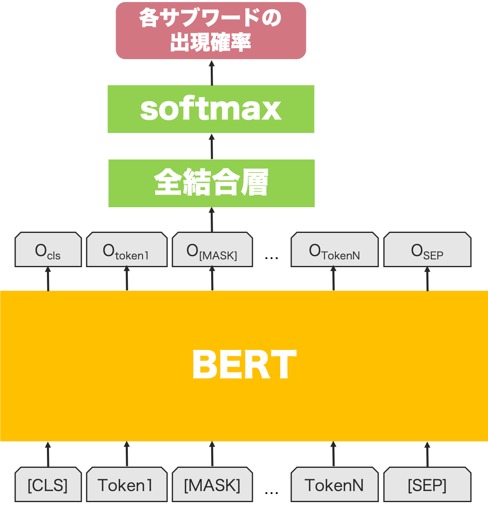

# 概要
自然言語界隈では非常によく話題になるBERTですが、BERTを使った文生成を実装してみたので今回はその話をします。BERTの事前学習モデルが文生成のタスクで使えたら、比較的少なめの学習データでもそれっぽく文生成できたりしないかなぁと思ってやってみました。

実験ではポケモンの説明文を学習させて、生成させてみました。ちなみに自分はポケモンはルビー・サファイアで止まってますので、あんまりポケモンは分からないです。（他に面白そうな題材が見つからず…。遊戯王の通常モンスターの説明文でやりたかったんですが、データ数が700弱と少なすぎて断念。）

参考にした論文：[BERT has a Mouth, and It Must Speak: BERT as a Markov Random Field Language Model](https://arxiv.org/abs/1902.04094)  
使用した事前学習モデル：[BERT日本語Pretrainedモデル](http://nlp.ist.i.kyoto-u.ac.jp/index.php?BERT%E6%97%A5%E6%9C%AC%E8%AA%9EPretrained%E3%83%A2%E3%83%87%E3%83%AB)  
実装したソースコード：[https://github.com/opqrstuvcut/BertMouth](https://github.com/opqrstuvcut/BertMouth)

# BERTでの文生成
## 学習
学習は以下のようなネットワークを使っておこないます。


ネットワークへの入力となる各トークンはサブワードになります。  
例えば今回のように京都大学の事前学習モデルを利用する場合には、「何日だってなにも食べなくても元気 ！背中のタネ にたくさん栄養があるから元気だ！」という文はJuman++で形態素解析された後、サブワードに分割され、
何/日/だって/なに/##も/食べ/なくて/も/元気/！/背中/の/タ/##ネ/に/たくさん/栄養/が/ある/から/元/##気/##だ/！
となります。

上記のネットワークを使って、ランダムにマスクした部分のサブワードの確率が予測できるように、以下の手順を繰り返して学習をすすめていきます。
1. ある文がN個のトークンから構成されているときに、ランダムに1つのトークンを[MASK]に置き換える（上の図の例だと2番目のトークンがこれに該当します）。
1. 1つのトークンを[MASK]に置き換えたトークン列をBERTに与える。
1. BERTの出力のうち、[MASK]に対応するトークンの出力O<sub>[MASK]</sub>に対して全結合層とsoftmaxを適用する（softmaxの結果が全サブワードの出現確率になります）。
1. 求められた[MASK]に対応する出現確率のうち、正解となるサブワードの確率が高くなるように、クロスエントロピーを用いて最適化する。

## 予測
予測は次のようにギブスサンプリングを使います。
1. 長さNのトークン列を初期化する。
1. 以下を適当な回数繰り返す。
    - 次を全トークンに対しておこなう。
        1. i番目(i=1,...,N)のトークンを[MASK]で置き換え、学習したネットワークに入力する。
        1. 出現確率が最大のサブワードで[MASK]のトークンを置換する。
        
トークン列の初期化には全サブワードから一様分布に従ってサンプリングしていますが、人間が適当な文を入れてあげてもいいですし、色々やりようはあるかと思います。

# 実験
## データ
学習には https://wiki.ポケモン.com/wiki/ポケモン一覧 のポケモンの説明文から、漢字が使われている文のみを利用しています。訓練データに使われたのは4730文で、例えば以下のような文が含まれます。
- 生まれたときから 背中に 不思議な タネが 植えてあって 体と ともに 育つという。
- トレーナーとの 絆が パワーの 源。 ジェット機を しのぐ 飛行能力を 誇る。

こんな感じのポケモンの説明文を自動で生成できたら面白いなぁと思ったので、このデータでやってみました。うまく行けば架空のポケモンが作れますね！

## 結果
学習したモデルで予測した結果を示します。ちなみに予測するときにサブワードの数をあらかじめ指定しますが、以下の例ではサブワードの数は20です。

<u>生成文1: 弱い獲物を一度捕まえると止まらない。毎日１８時間鳴くチビノーズ。</u>

弱い獲物をいたぶっているのか、猟奇的な感じがします。

<u>生成文2: この姿に変化して連れ去ることでお腹を自在に操るピィができるのだ。</u>

お腹を自由に操る…？化して連れ去るあたりは悪いポケモン感が出ていていいですね。

<u>生成文3: **ボールのように引っ張るため１匹。だが１匹ゆらゆら数は少ない。**</u>

ちょっと解釈が難しいです。孤高の存在？

<u>生成文4: **化石から復活した科学者を科学力で壊し散らす生命力を持つポケモン。**</u>

科学力で科学者に勝利するインテリポケモン。

<u>生成文5: **ただ絶対に捕まえないので傷ついた相手には容赦しない。なぜだか。**</u>

これは解釈が難しいですが、恐ろしいポケモン感がでてますね。「なぜだか。」がいいアクセントです。

# まとめ
それっぽい文はできたけども、意味があまり通らない文が多いかなという印象です。とりあえず学習データが少ないので、文が多い他のデータで実験します。気力のある方はぜひ自分でデータを用意して、学習してみて結果を教えて欲しいです！


# おまけ
今回自分が使った京都大学の事前学習モデルを利用して学習する場合は、以下の手順で学習データを用意できます。
1. 文を集めてきて、次のようなフォーマットのテキストファイルに保存する。
    ```
    文1
    文2
    
    文N
    ```
2. juman++、pyknp、mojimojiをインストールする。pyknpとmojimojiはpipでOKです。
3. レポジトリにあるpreprocess.pyを次のように実行して、形態素解析と前処理をおこなう。
    ```
     python ./preprocess.py \                                                                                                                                                                              
      --input_file 1で作ったテキストファイルのパス \
      --output_file 出力先のテキストファイルのパス \
      --model xxx/jumanpp-2.0.0-rc2/model/jumandic.jppmdl（jumanのモデルのパスが通っている場合は不要）
    ```

4. 出力されたファイルを訓練データと検証データに適当に分割する。
